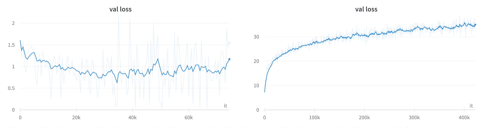

# 预训练是否确实优于元学习？

发布时间：2023年06月23日

`LLM理论` `机器学习` `人工智能`

> Is Pre-training Truly Better Than Meta-Learning?

# 摘要

> 在少量样本学习领域，普遍观点认为，固定预训练模型辅以评估时对最终层的微调，性能会超过传统元学习算法。本研究通过深入分析多样化数据集，重新审视了这一观点，并将预训练模型与模型无关的元学习（MAML）进行了对比。我们采用了相同的架构、优化器，并确保所有模型都经过充分训练，以实现公平比较。关键地，我们引入了效应量（Cohen's d）这一统计工具，以评估PT模型与MAML模型性能差异的实际重要性。此外，我们还利用多样性系数这一指标，量化了数据集的形式多样性。研究发现：在数据集形式多样性较低时，预训练模型通常优于MAML；而在多样性较高时，MAML则占据优势。尽管如此，根据经典统计标准，PT与MAML之间的平均性能差异并不显著（小于0.2）。这一发现挑战了预训练模型始终优于元学习模型的传统认知。我们的实验涵盖了21个少量样本学习基准，包括大规模的Meta-Data数据集，并未发现MAML与PT模型在Openwebtext上存在显著差异。因此，我们得出结论，预训练模型并非总是胜过元学习模型，数据集的形式多样性是影响性能的关键因素。

> In the context of few-shot learning, it is currently believed that a fixed pre-trained (PT) model, along with fine-tuning the final layer during evaluation, outperforms standard meta-learning algorithms. We re-evaluate these claims under an in-depth empirical examination of an extensive set of formally diverse datasets and compare PT to Model Agnostic Meta-Learning (MAML). Unlike previous work, we emphasize a fair comparison by using: the same architecture, the same optimizer, and all models trained to convergence. Crucially, we use a more rigorous statistical tool -- the effect size (Cohen's d) -- to determine the practical significance of the difference between a model trained with PT vs. a MAML. We then use a previously proposed metric -- the diversity coefficient -- to compute the average formal diversity of a dataset. Using this analysis, we demonstrate the following: 1. when the formal diversity of a data set is low, PT beats MAML on average and 2. when the formal diversity is high, MAML beats PT on average. The caveat is that the magnitude of the average difference between a PT vs. MAML using the effect size is low (according to classical statistical thresholds) -- less than 0.2. Nevertheless, this observation is contrary to the currently held belief that a pre-trained model is always better than a meta-learning model. Our extensive experiments consider 21 few-shot learning benchmarks, including the large-scale few-shot learning dataset Meta-Data set. We also show no significant difference between a MAML model vs. a PT model with GPT-2 on Openwebtext. We, therefore, conclude that a pre-trained model does not always beat a meta-learned model and that the formal diversity of a dataset is a driving factor.

[Arxiv](https://arxiv.org/abs/2306.13841)