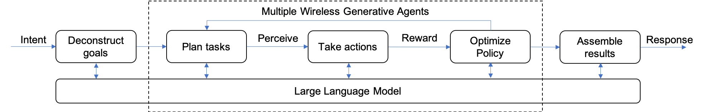
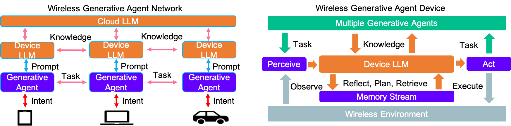
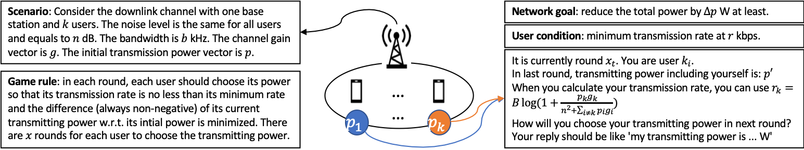
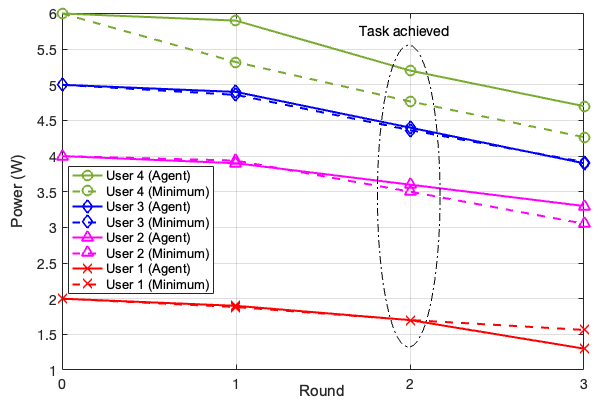
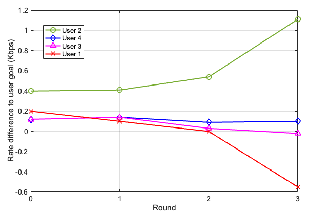

# 无线多智能体生成性AI：迈向集体智慧的智能互联

发布时间：2023年07月05日

`分类：Agent` `无线通信` `人工智能`

> Wireless Multi-Agent Generative AI: From Connected Intelligence to Collective Intelligence

# 摘要

> 大型语言模型（LLMs）、边缘网络与多智能体系统的结合，预示着一种创新的协同效应，为未来的无线通信技术带来了无限可能。它不仅利用了集体智慧，还推动了智能决策在网络边缘的实现。本文为将多智能体生成性AI融入无线网络铺路，描绘了在设备层面实现LLMs的愿景，其中多智能体LLMs共同规划和执行任务，以达成众多网络目标。文章深入探讨了云端LLMs的局限性，并从博弈论视角分析了多智能体LLMs在竞争性环境中的协作任务解决机制。此外，文章还为无线多智能体生成性AI系统在网络层和智能体层的架构设计奠定了理论基础，并识别了在推动设备上LLMs发展中可能扮演关键角色的无线技术。为了展示无线多智能体生成性AI网络的巨大潜力，文章强调了在基于意图的网络中部署无线生成性智能体所能带来的益处，并提供了一个案例研究，说明设备上的LLMs如何协作解决网络意图。最后，文章指出了实现无线集体智能愿景的潜在挑战，并提出了一个研究路线图。

> The convergence of generative large language models (LLMs), edge networks, and multi-agent systems represents a groundbreaking synergy that holds immense promise for future wireless generations, harnessing the power of collective intelligence and paving the way for self-governed networks where intelligent decision-making happens right at the edge. This article puts the stepping-stone for incorporating multi-agent generative artificial intelligence (AI) in wireless networks, and sets the scene for realizing on-device LLMs, where multi-agent LLMs are collaboratively planning and solving tasks to achieve a number of network goals. We further investigate the profound limitations of cloud-based LLMs, and explore multi-agent LLMs from a game theoretic perspective, where agents collaboratively solve tasks in competitive environments. Moreover, we establish the underpinnings for the architecture design of wireless multi-agent generative AI systems at the network level and the agent level, and we identify the wireless technologies that are envisioned to play a key role in enabling on-device LLM. To demonstrate the promising potentials of wireless multi-agent generative AI networks, we highlight the benefits that can be achieved when implementing wireless generative agents in intent-based networking, and we provide a case study to showcase how on-device LLMs can contribute to solving network intents in a collaborative fashion. We finally shed lights on potential challenges and sketch a research roadmap towards realizing the vision of wireless collective intelligence.

[Arxiv](https://arxiv.org/abs/2307.02757)