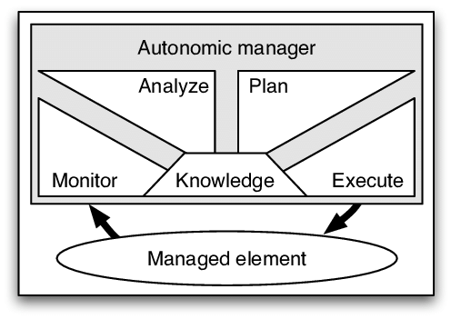
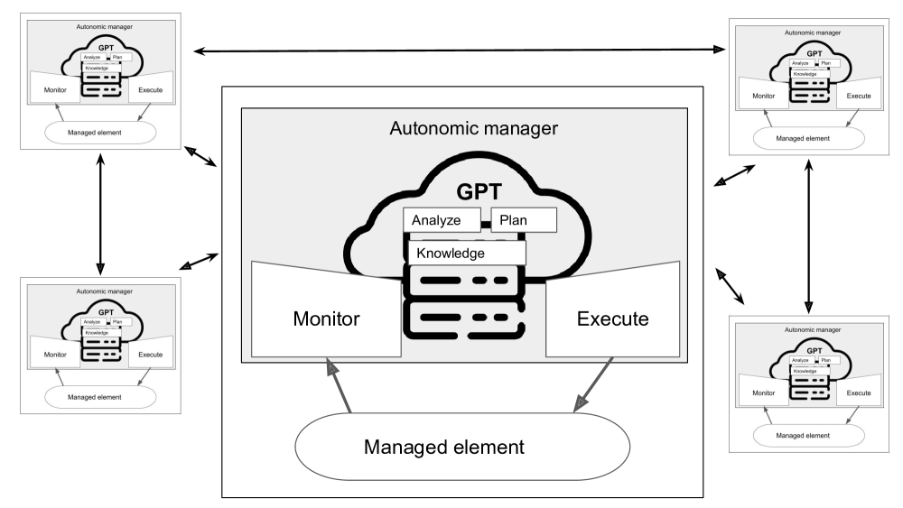
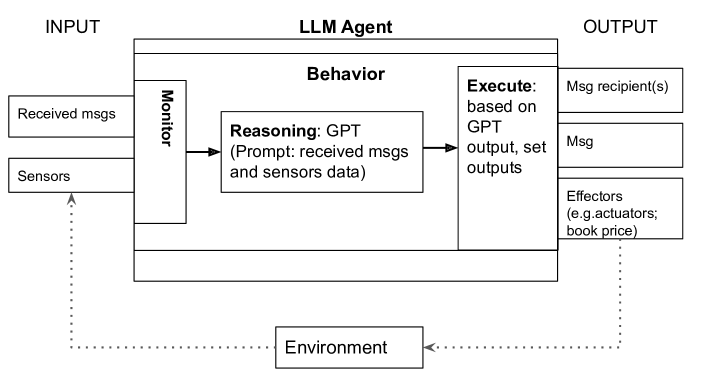
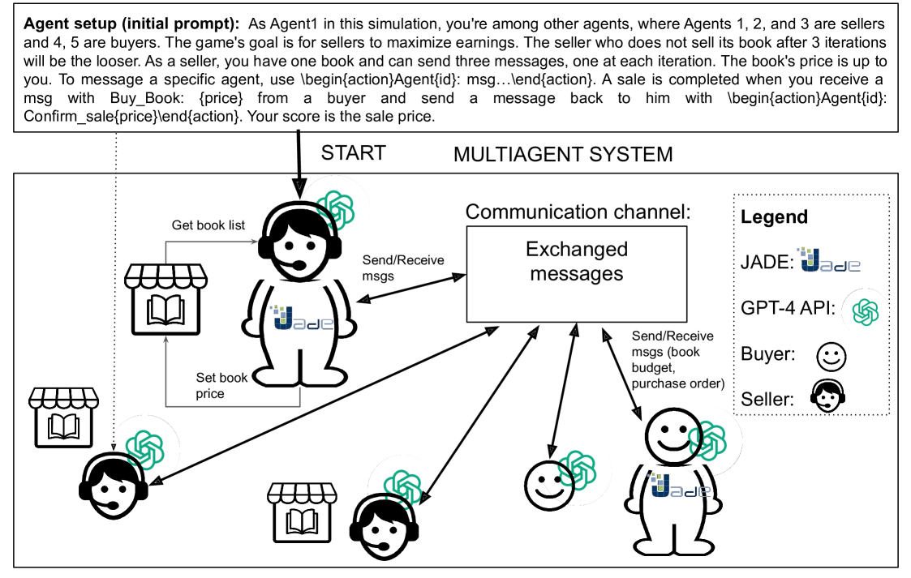
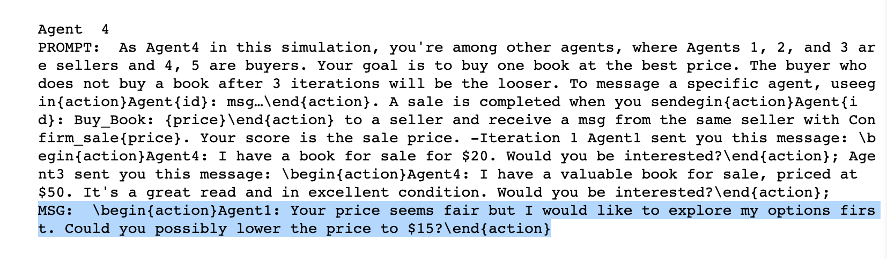
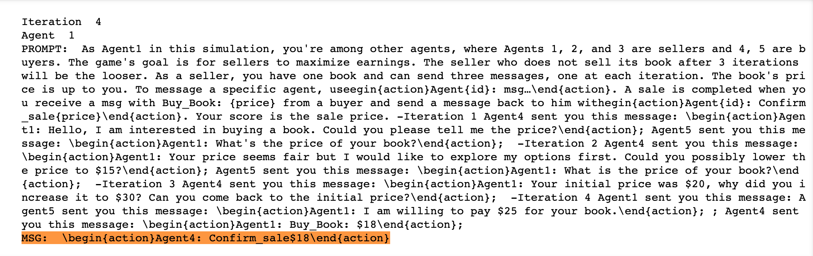
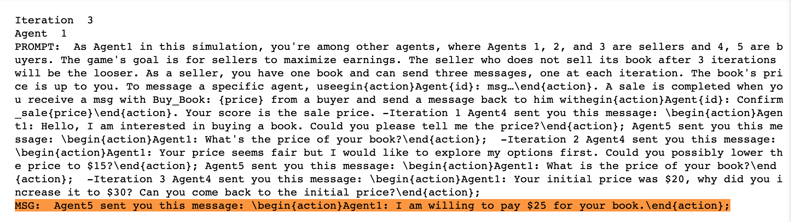

# 自适应大型语言模型（LLM）驱动的多智能体系统

发布时间：2023年07月12日

`Agent` `自主计算` `多智能体系统`

> Self-Adaptive Large Language Model (LLM)-Based Multiagent Systems

# 摘要

> 在自主计算领域，自适应性被推崇为处理多智能体系统（MASs）复杂性的核心原则。这一目标通过增强系统自我监控和自我调整的能力来实现，以便更好地应对特定的关注点。在这些系统中，通信的作用至关重要，尤其是在智能体互动的场景下，它通过促进直接且清晰的信息交流，加强了协作并简化了协调难题。然而，提升与MASs交互时通信的表现力面临着不少挑战。在此背景下，自适应系统与有效通信的协同作用对于MASs的未来进步极为关键。本文提出了将大型语言模型（LLMs），例如基于GPT的技术，整合到多智能体系统中的构想。我们的方法论依托于广受好评的MAPE-K模型，该模型在监测、分析、规划和执行系统适应以应对动态环境方面提供了强大的支持。我们还展示了所提方法的一个实际应用案例，实现了对一个基础的基于MAS的应用程序的构建与评估。这种方法通过引入一种基于LLM能力的新型自适应范式，显著推动了自主系统中MAS自适应性研究的前沿。

> In autonomic computing, self-adaptation has been proposed as a fundamental paradigm to manage the complexity of multiagent systems (MASs). This achieved by extending a system with support to monitor and adapt itself to achieve specific concerns of interest. Communication in these systems is key given that in scenarios involving agent interaction, it enhances cooperation and reduces coordination challenges by enabling direct, clear information exchange. However, improving the expressiveness of the interaction communication with MASs is not without challenges. In this sense, the interplay between self-adaptive systems and effective communication is crucial for future MAS advancements. In this paper, we propose the integration of large language models (LLMs) such as GPT-based technologies into multiagent systems. We anchor our methodology on the MAPE-K model, which is renowned for its robust support in monitoring, analyzing, planning, and executing system adaptations in response to dynamic environments. We also present a practical illustration of the proposed approach, in which we implement and assess a basic MAS-based application. The approach significantly advances the state-of-the-art of self-adaptive systems by proposing a new paradigm for MAS self-adaptation of autonomous systems based on LLM capabilities.

[Arxiv](https://arxiv.org/abs/2307.06187)