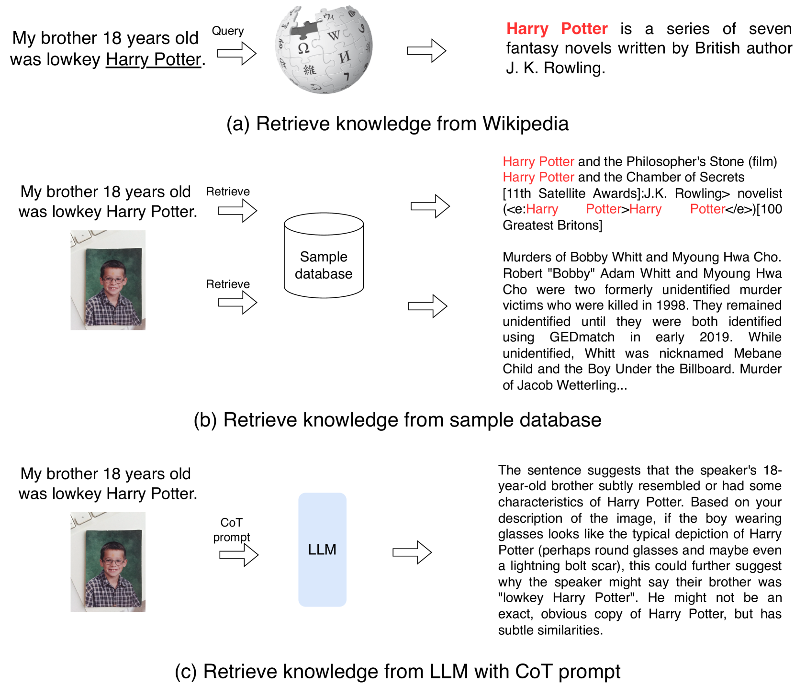
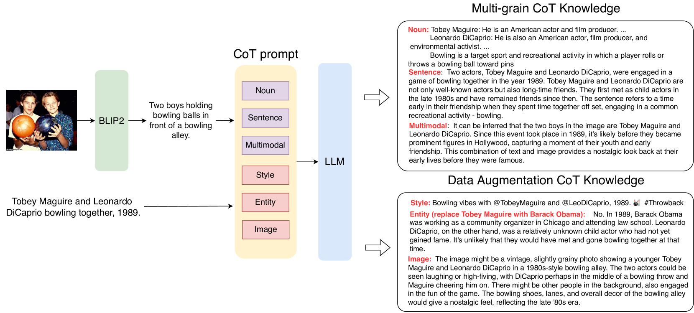
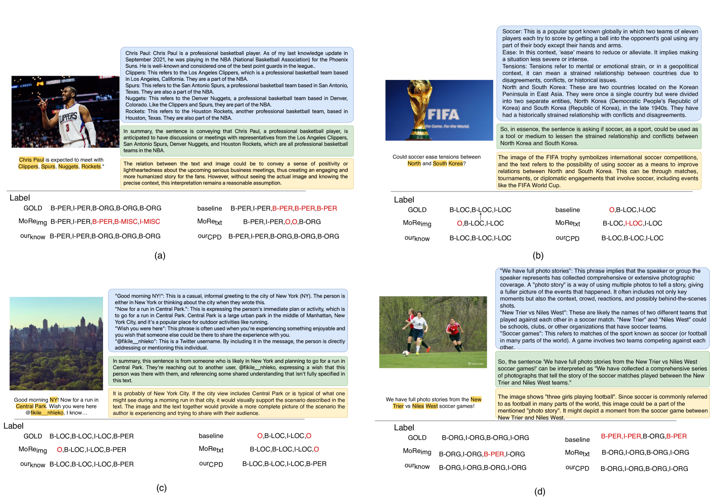

# 多模态实体与关系抽取的思维链提示蒸馏法

发布时间：2023年08月23日

`LLM应用

这篇论文探讨了如何将大型语言模型（LLMs）的复杂推理能力通过“思维链”（CoT）提炼至更精简的学生模型中。研究涉及了从LLMs中提取多粒度和数据增强维度的推理能力，并提出了一种条件提示蒸馏法来增强学生模型的常识推理能力。这种方法在实验中显示出了高准确性、可解释性、数据效率和跨域泛化能力。因此，这项研究属于LLM应用类别，因为它关注的是如何应用LLM的推理能力于其他模型中，而不是探讨LLM的理论基础或Agent的设计与应用。`

> Chain-of-Thought Prompt Distillation for Multimodal Named Entity Recognition and Multimodal Relation Extraction

# 摘要

> 本研究探讨了如何将大型语言模型（LLMs）的复杂推理能力通过“思维链”（CoT）——一系列推理步骤，提炼至更精简的学生模型中。我们首先通过CoT提示，从LLMs中提取多粒度（名词、句子、多模态）和数据增强（风格、实体、图像）维度的推理能力。接着，我们创新性地提出了一种条件提示蒸馏法，以增强学生模型在处理纯文本输入时的常识推理能力，无需依赖图像和CoT知识。实验结果显示，我们的方法在MNER和MRE数据集上不仅达到了顶尖的准确性，还展现了高度的可解释性、数据效率和跨域泛化能力。

> Multimodal Named Entity Recognition (MNER) and Multimodal Relation Extraction (MRE) necessitate the fundamental reasoning capacity for intricate linguistic and multimodal comprehension. In this study, we explore distilling the reasoning ability of large language models (LLMs) into a more compact student model by generating a \textit{chain of thought} (CoT) -- a sequence of intermediate reasoning steps. Specifically, we commence by exemplifying the elicitation of such reasoning ability from LLMs through CoT prompts covering multi-grain (noun, sentence, multimodality) and data-augmentation (style, entity, image) dimensions. Subsequently, we present a novel conditional prompt distillation method to assimilate the commonsense reasoning ability from LLMs, thereby enhancing the utility of the student model in addressing text-only inputs without the requisite addition of image and CoT knowledge. Extensive experiments reveal that our approach attains state-of-the-art accuracy and manifests a plethora of advantages concerning interpretability, data efficiency, and cross-domain generalization on MNER and MRE datasets.

[Arxiv](https://arxiv.org/abs/2306.14122)