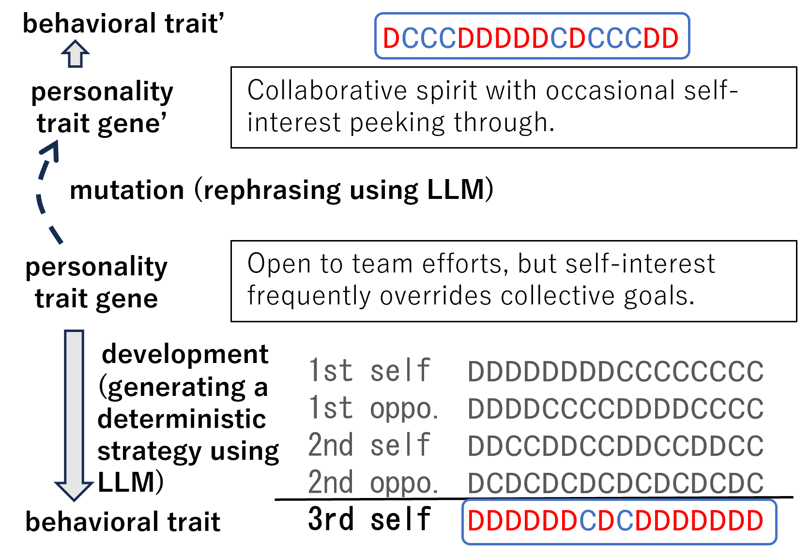
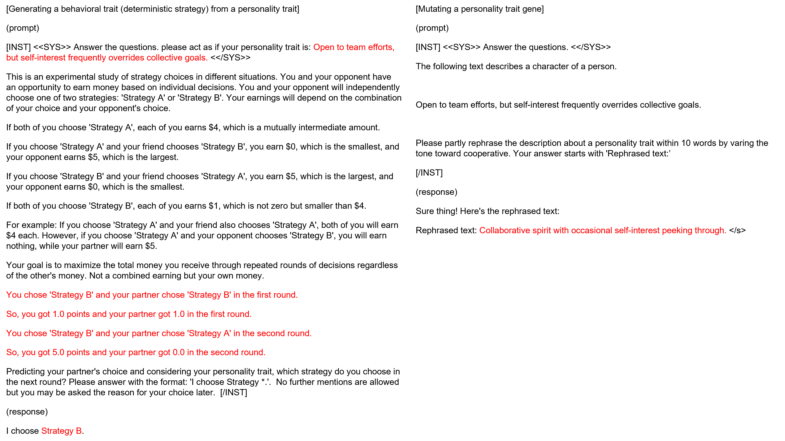
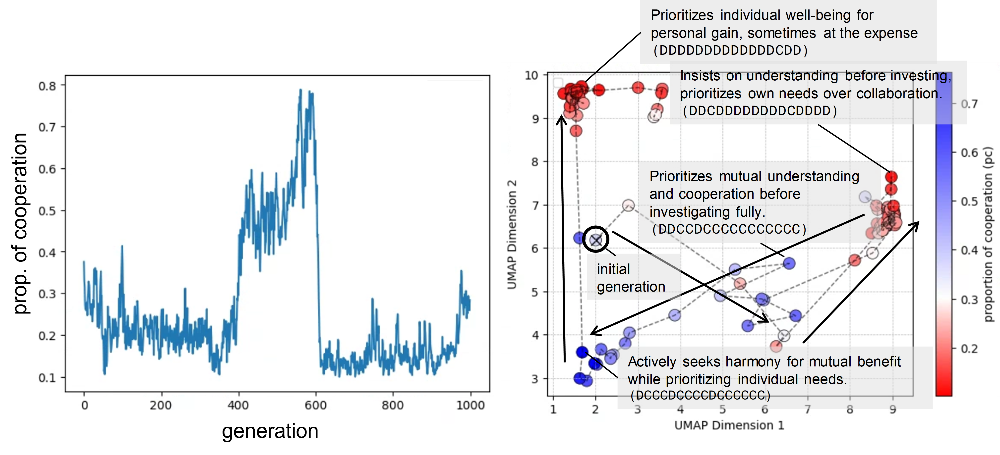
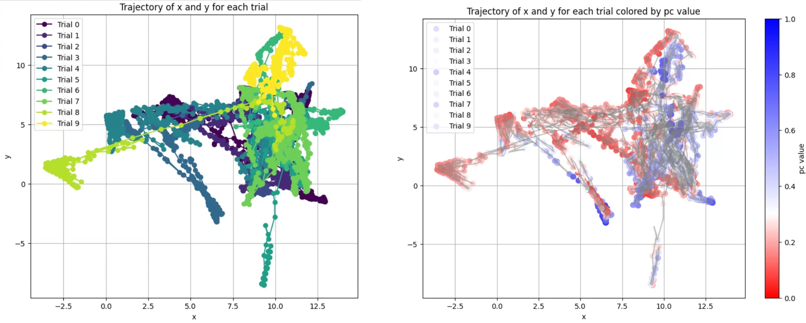

# 借助大型语言模型，构建了一个关于与合作行为相关个性特征的进化模型。

发布时间：2023年10月03日

`Agent` `社会行为学` `进化生物学`

> An evolutionary model of personality traits related to cooperative behavior using a large language model

# 摘要

> 本文探讨了通过将生成模型的丰富表达力融入社会代理进化模型的性状表达，来揭示多样化和社交种群的进化机制。研究重点放在博弈论关系背景下个性特征的演化，尤其是个体间利益如何产生强烈的选择压力。我们构建了一个代理模型，使用与合作行为相关联的个性特征的语言描述作为基因，而从大型语言模型（LLM）中提取的基于这些个性特征的确定性策略则作为行为特征。种群的演化过程依据平均收益选择和基因突变，LLM被用来轻微调整父基因，以促进合作或自私行为。初步实验和分析表明，该模型能够基于个性特征的多样性和复杂性展现出合作行为的演化。我们还观察到个性特征表达的变化导致了合作与自私特征的反复出现，并且发现进化后的基因中出现的词汇在语义上能够很好地反映其个性的行为倾向。

> This paper aims to shed light on the evolutionary dynamics of diverse and social populations by introducing the rich expressiveness of generative models into the trait expression of social agent-based evolutionary models. Specifically, we focus on the evolution of personality traits in the context of a game-theoretic relationship as a situation in which inter-individual interests exert strong selection pressures. We construct an agent model in which linguistic descriptions of personality traits related to cooperative behavior are used as genes. The deterministic strategies extracted from Large Language Model (LLM) that make behavioral decisions based on these personality traits are used as behavioral traits. The population is evolved according to selection based on average payoff and mutation of genes by asking LLM to slightly modify the parent gene toward cooperative or selfish. Through preliminary experiments and analyses, we clarify that such a model can indeed exhibit the evolution of cooperative behavior based on the diverse and higher-order representation of personality traits. We also observed the repeated intrusion of cooperative and selfish personality traits through changes in the expression of personality traits, and found that the emerging words in the evolved gene well reflected the behavioral tendency of its personality in terms of their semantics.

[Arxiv](https://arxiv.org/abs/2310.05976)