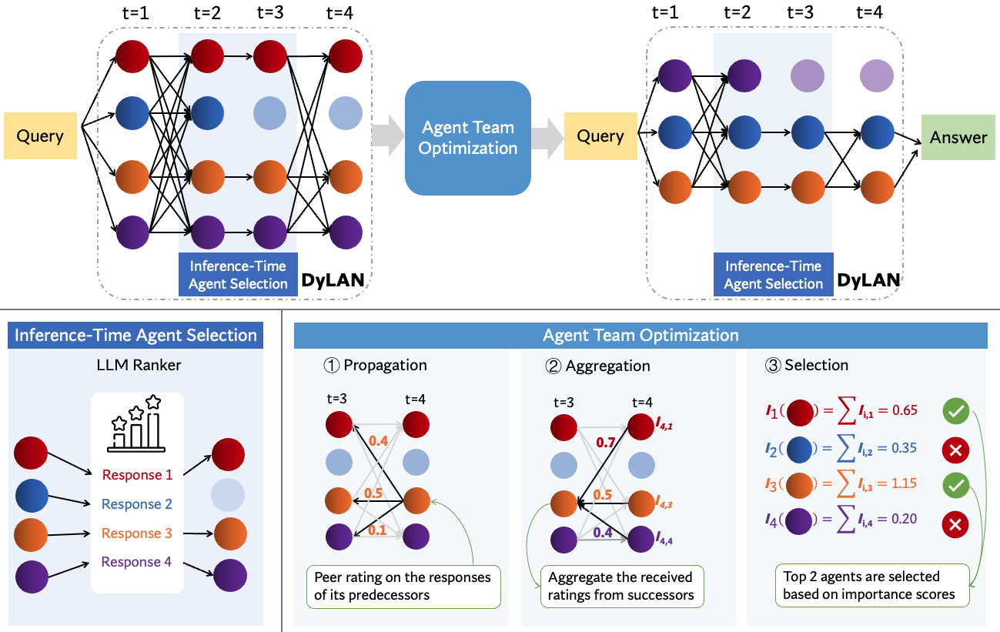
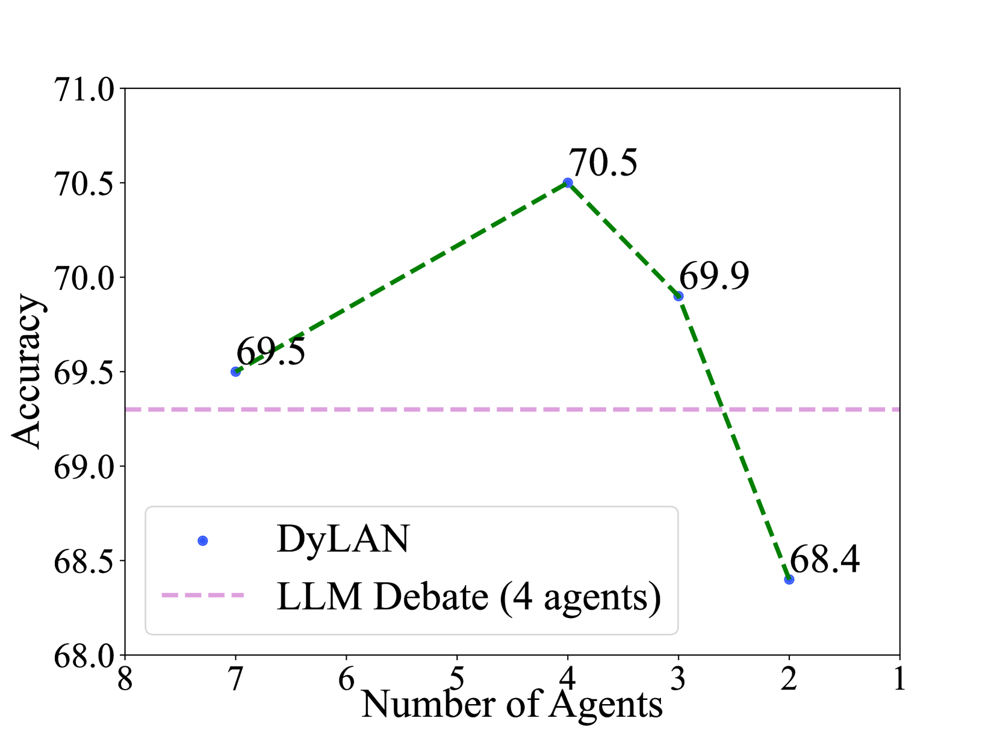
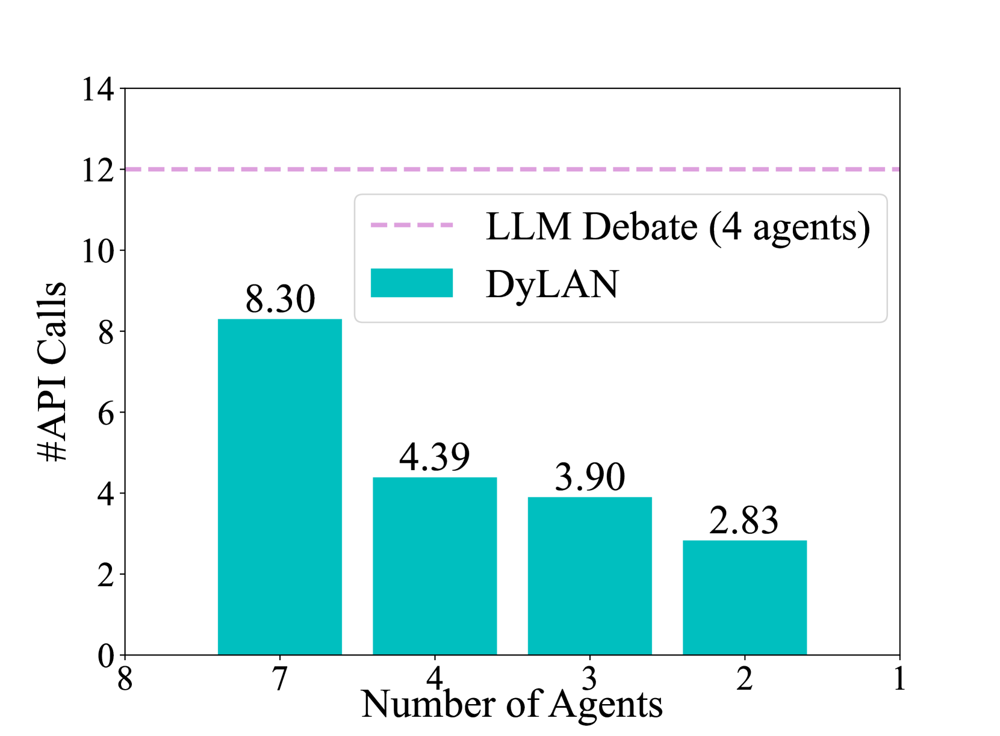
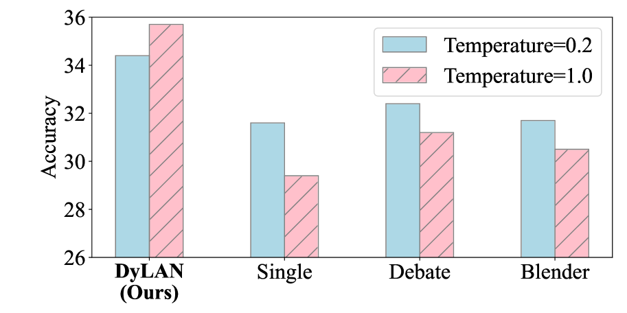
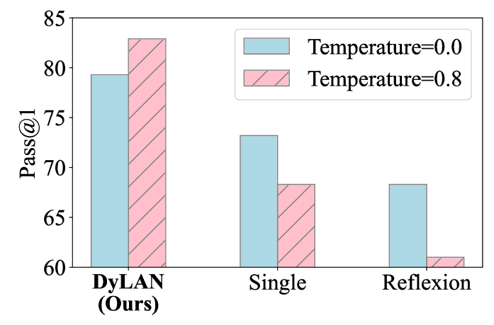
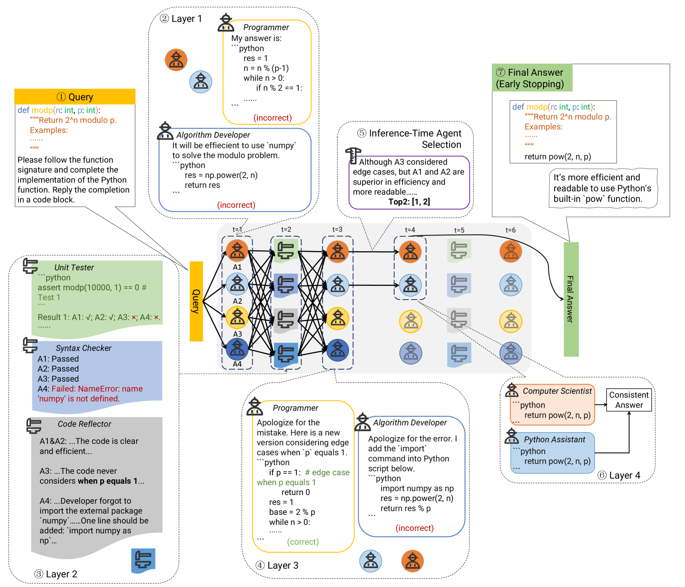
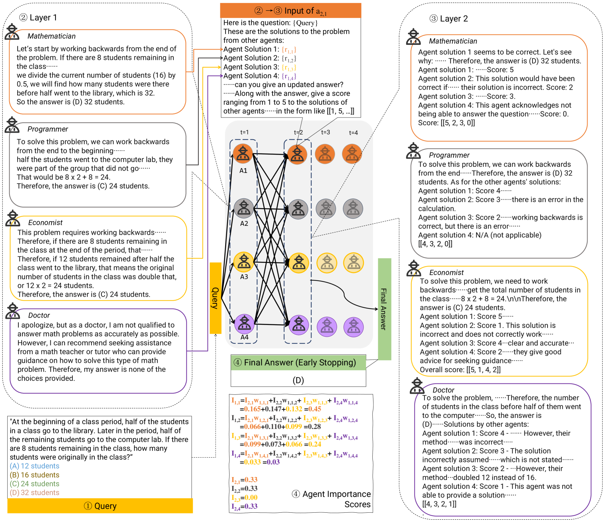

# 动态大型语言模型代理网络（Dynamic LLM-Agent Network）：构建了一个大型语言模型与代理之间的协作框架，并通过优化代理团队来提升整体性能。

发布时间：2023年10月03日

`Agent` `人工智能`

> Dynamic LLM-Agent Network: An LLM-agent Collaboration Framework with Agent Team Optimization

# 摘要

> 大型语言模型（LLM）代理在多样化任务中展现出卓越效能，通过组合多个LLM代理，效能得以进一步提升。然而，现有方法通常采用固定代理集合，在静态架构中进行互动，这不仅限制了任务适应性，也增加了设计时对人类先验知识的依赖。本研究提出了一种基于任务查询的动态交互架构，构建策略性代理团队。我们开发了一个框架——动态LLM代理网络（DyLAN），旨在促进LLM代理在复杂任务如推理和代码生成中的协作。DyLAN允许代理在动态架构中进行多轮互动，并通过推理时的代理选择及早期终止机制，优化了性能与效率。此外，我们设计了一种自动优化算法，通过“代理重要性得分”这一无监督指标，实现最佳代理团队的自动选择。实践证明，DyLAN在推理和代码生成任务上均有出色表现，且计算成本适中。与GPT-35-turbo单次执行相比，DyLAN在MATH和HumanEval任务上分别提升了13.0%和13.3%的效能。特别地，在MMLU的特定领域，DyLAN的代理团队优化将准确率提升了最多25.0%。

> Large language model (LLM) agents have been shown effective on a wide range of tasks, and by ensembling multiple LLM agents, their performances could be further improved. Existing approaches employ a fixed set of agents to interact with each other in a static architecture, which limits their generalizability to various tasks and requires strong human prior in designing these agents. In this work, we propose to construct a strategic team of agents communicating in a dynamic interaction architecture based on the task query. Specifically, we build a framework named Dynamic LLM-Agent Network ($\textbf{DyLAN}$) for LLM-agent collaboration on complicated tasks like reasoning and code generation. DyLAN enables agents to interact for multiple rounds in a dynamic architecture with inference-time agent selection and an early-stopping mechanism to improve performance and efficiency. We further design an automatic agent team optimization algorithm based on an unsupervised metric termed $\textit{Agent Importance Score}$, enabling the selection of best agents based on the contribution each agent makes. Empirically, we demonstrate that DyLAN performs well in both reasoning and code generation tasks with reasonable computational cost. DyLAN achieves 13.0% and 13.3% improvement on MATH and HumanEval, respectively, compared to a single execution on GPT-35-turbo. On specific subjects of MMLU, agent team optimization in DyLAN increases accuracy by up to 25.0%.

[Arxiv](https://arxiv.org/abs/2310.02170)