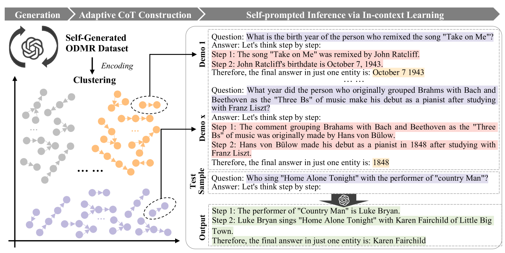

# 利用大型语言模型进行开放域多跳推理的自启发式思维链探索

发布时间：2023年10月23日

`LLM应用

这篇论文主要探讨了如何通过自提示思维链（SP-CoT）技术来提升大型语言模型（LLMs）在开放领域多跳推理（ODMR）任务中的表现。论文中提出的SP-CoT框架旨在自动化生成高质量的推理链，以增强LLMs的推理能力，并在多个问答基准测试中展示了其优越性能。这一研究专注于LLMs的应用层面，特别是在问答系统中的推理能力提升，因此属于LLM应用分类。` `人工智能` `问答系统`

> Self-prompted Chain-of-Thought on Large Language Models for Open-domain Multi-hop Reasoning

# 摘要

> 在开放领域问答（ODQA）中，多数问题仅涉及常识性的单步推理。为了拓展这一领域，我们正式推出开放领域多跳推理（ODMR），即在开放环境中通过明确展示推理步骤来解答复杂问题。大型语言模型（LLMs）近期在无需额外语料库的情况下，极大地推动了ODQA的发展。特别是思维链（CoT）提示技术，无论是手动还是自动模式，都显著增强了LLMs的推理能力。然而，自动方法常缺乏质量控制，而手动方法则因扩展性差和多样性不足而受限，制约了LLMs的潜力。为此，我们提出了自提示思维链（SP-CoT），一个专为LLMs设计的自动化框架，旨在生成大量高质量的CoTs。SP-CoT通过自动化流程创建了高质量的ODMR数据集，采用自适应采样器精选情境CoT，并利用情境学习进行自提示推理。在四个多跳问答基准测试中，SP-CoT不仅在大规模（175B）LLMs上显著优于现有技术，而且在小规模（13B）LLMs上的零-shot性能几乎翻倍。深入分析显示，SP-CoT能有效激发直接且简洁的中间推理步骤，在MuSiQue-Ans数据集上回忆的中间答案比例高达约50%。

> In open-domain question-answering (ODQA), most existing questions require single-hop reasoning on commonsense. To further extend this task, we officially introduce open-domain multi-hop reasoning (ODMR) by answering multi-hop questions with explicit reasoning steps in open-domain setting. Recently, large language models (LLMs) have found significant utility in facilitating ODQA without external corpus. Furthermore, chain-of-thought (CoT) prompting boosts the reasoning capability of LLMs to a greater extent with manual or automated paradigms. However, existing automated methods lack of quality assurance, while manual approaches suffer from limited scalability and poor diversity, hindering the capabilities of LLMs. In this paper, we propose Self-prompted Chain-of-Thought (SP-CoT), an automated framework to mass-produce high quality CoTs of LLMs, by LLMs and for LLMs. SP-CoT introduces an automated generation pipeline of high quality ODMR datasets, an adaptive sampler for in-context CoT selection and self-prompted inference via in-context learning. Extensive experiments on four multi-hop question-answering benchmarks show that our proposed SP-CoT not only significantly surpasses the previous SOTA methods on large-scale (175B) LLMs, but also nearly doubles the zero-shot performance of small-scale (13B) LLMs. Further analysis reveals the remarkable capability of SP-CoT to elicit direct and concise intermediate reasoning steps by recalling $\sim$50\% of intermediate answers on MuSiQue-Ans dataset.

[Arxiv](https://arxiv.org/abs/2310.13552)