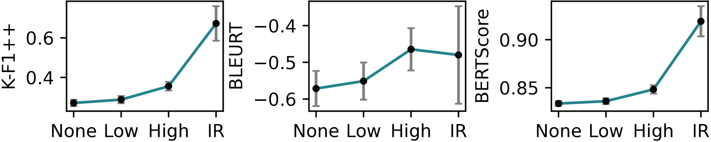
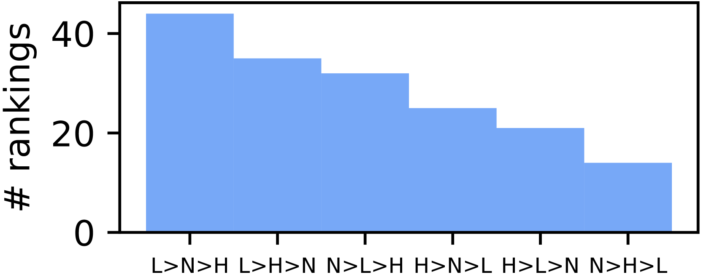
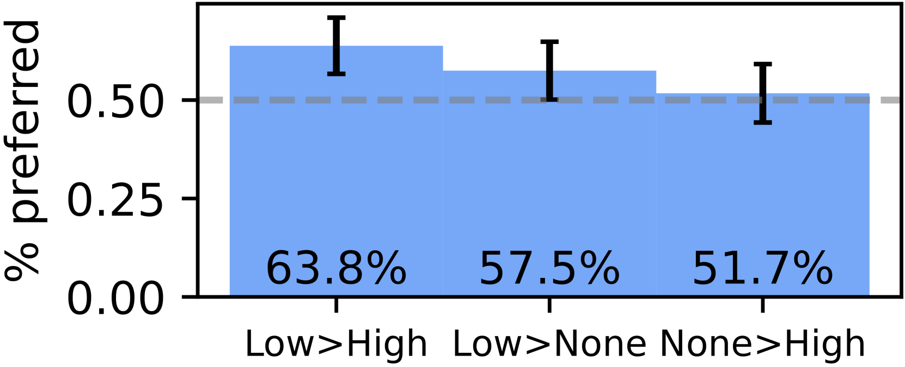
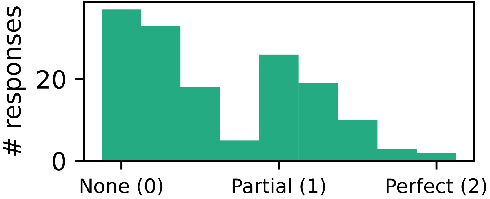
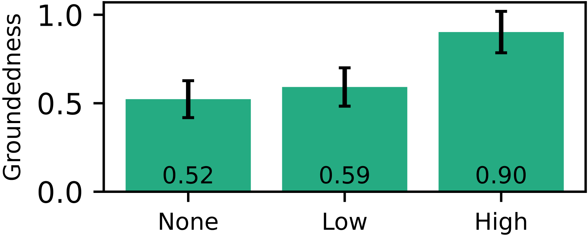
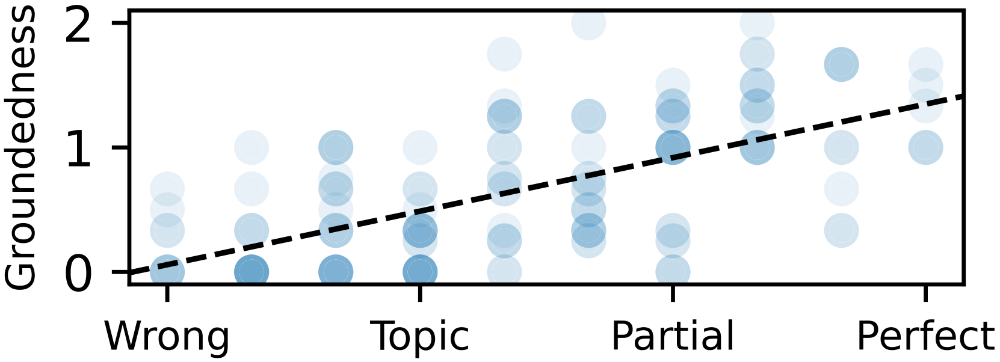

# 利用检索增强生成技术提升数学问题解答能力：在扎根基础与迎合人类偏好间寻求平衡

发布时间：2023年11月10日

`RAG`

> Retrieval-augmented Generation to Improve Math Question-Answering: Trade-offs Between Groundedness and Human Preference

> 对中学生而言，与辅导老师进行互动式数学问答是提升数学理解的有效途径。借助大型语言模型的灵活性，人们开始探索自动化辅导环节，包括通过互动式问答来深入探讨数学理念。然而，这些模型在回答数学问题时可能会出错或与学校教学大纲不符。为此，我们提出了检索增强生成（RAG）方法，通过整合经过验证的外部知识源，以提升模型回答的质量。本文设计了一系列提示，利用一本优质的开源数学教材内容，生成针对学生提问的回答。通过多条件调查，我们评估了RAG系统在中学代数和几何问答上的效果，结果显示人们更倾向于RAG生成的回答，但如果回答过于依赖教材，则不受青睐。我们认为，尽管RAG能够提升回答的质量，但设计数学问答系统时，还需权衡学生偏好与教育资源匹配度之间的关系。

> For middle-school math students, interactive question-answering (QA) with tutors is an effective way to learn. The flexibility and emergent capabilities of generative large language models (LLMs) has led to a surge of interest in automating portions of the tutoring process - including interactive QA to support conceptual discussion of mathematical concepts. However, LLM responses to math questions can be incorrect or mismatched to the educational context - such as being misaligned with a school's curriculum. One potential solution is retrieval-augmented generation (RAG), which involves incorporating a vetted external knowledge source in the LLM prompt to increase response quality. In this paper, we designed prompts that retrieve and use content from a high-quality open-source math textbook to generate responses to real student questions. We evaluate the efficacy of this RAG system for middle-school algebra and geometry QA by administering a multi-condition survey, finding that humans prefer responses generated using RAG, but not when responses are too grounded in the textbook content. We argue that while RAG is able to improve response quality, designers of math QA systems must consider trade-offs between generating responses preferred by students and responses closely matched to specific educational resources.

[Arxiv](https://arxiv.org/abs/2310.03184)