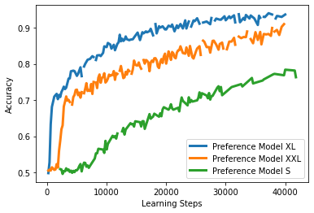
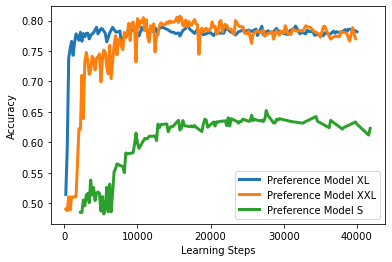
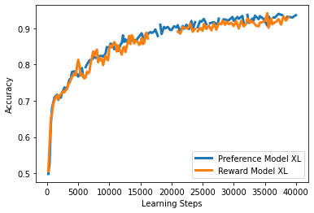
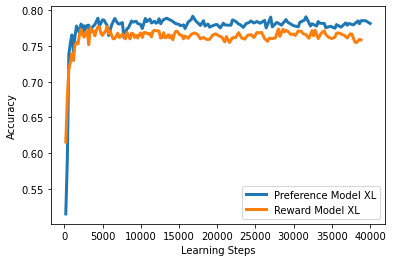

# 纳什学习：汲取人类反馈的精髓

发布时间：2023年12月06日

`LLM应用` `人工智能`

> Nash Learning from Human Feedback

# 摘要

> 人类反馈驱动的强化学习（RLHF）正成为调整大型语言模型（LLM）以符合人类偏好的主要方法。这种方法首先从人类反馈中学习奖励模型，然后通过强化学习算法优化LLM策略，以最大化奖励。但现有奖励模型难以全面捕捉人类偏好的多样性和对样本分布的依赖。本研究提出了一种新颖的LLM微调流程，利用成对的人类反馈。该流程首先学习一个基于提示的两个输入条件的偏好模型，然后制定一个策略，该策略生成的响应总是比竞争对手的策略更受青睐，形成偏好模型的纳什均衡。我们将此方法命名为纳什学习人类反馈（NLHF）。在表格策略表示的框架下，我们提出了一种基于镜像下降原理的新算法——Nash-MD。该算法生成一系列策略，最终迭代达到规范化的纳什均衡。我们还探讨了策略的参数化表示，并为深度学习架构引入了梯度下降算法。通过在LLM的文本摘要任务微调中展示实验结果，我们证明了该方法的有效性。我们相信NLHF为学习偏好和优化策略提供了一个有前景的方向，有助于推动LLM与人类偏好对齐的研究领域。

> Reinforcement learning from human feedback (RLHF) has emerged as the main paradigm for aligning large language models (LLMs) with human preferences. Typically, RLHF involves the initial step of learning a reward model from human feedback, often expressed as preferences between pairs of text generations produced by a pre-trained LLM. Subsequently, the LLM's policy is fine-tuned by optimizing it to maximize the reward model through a reinforcement learning algorithm. However, an inherent limitation of current reward models is their inability to fully represent the richness of human preferences and their dependency on the sampling distribution.
  In this study, we introduce an alternative pipeline for the fine-tuning of LLMs using pairwise human feedback. Our approach entails the initial learning of a preference model, which is conditioned on two inputs given a prompt, followed by the pursuit of a policy that consistently generates responses preferred over those generated by any competing policy, thus defining the Nash equilibrium of this preference model. We term this approach Nash learning from human feedback (NLHF).
  In the context of a tabular policy representation, we present a novel algorithmic solution, Nash-MD, founded on the principles of mirror descent. This algorithm produces a sequence of policies, with the last iteration converging to the regularized Nash equilibrium. Additionally, we explore parametric representations of policies and introduce gradient descent algorithms for deep-learning architectures. To demonstrate the effectiveness of our approach, we present experimental results involving the fine-tuning of a LLM for a text summarization task. We believe NLHF offers a compelling avenue for preference learning and policy optimization with the potential of advancing the field of aligning LLMs with human preferences.

[Arxiv](https://arxiv.org/abs/2312.00886)