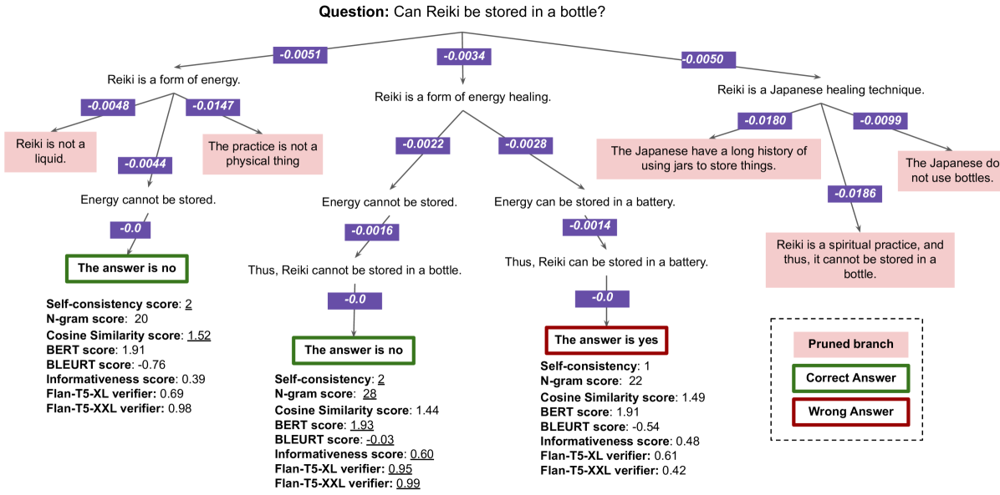
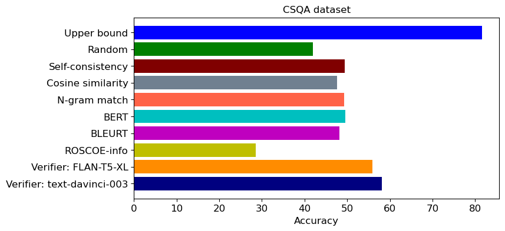
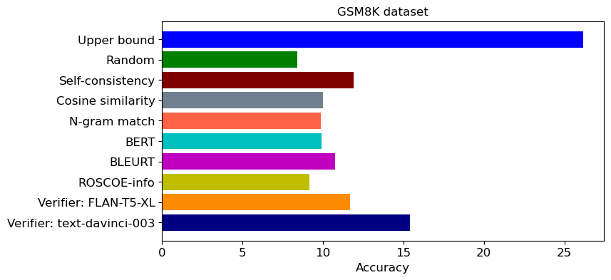
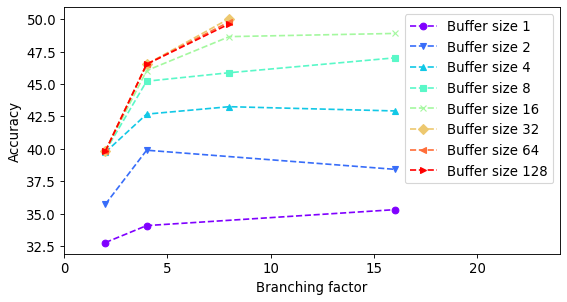
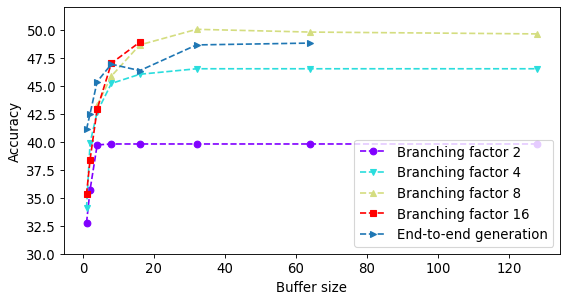

# PathFinder：引领探索多步骤推理之路

发布时间：2023年12月12日

`Agent

理由：这篇论文介绍了一种名为PathFinder的新型推理路径生成策略，它借鉴了束搜索算法的思路，并通过动态解码、多样化的采样技术和参数结合，增强了推理的分支多样性和多跳能力。PathFinder还引入了创新的质量约束、剪枝和探索机制，以提高生成过程的效率与质量。这些特性使得PathFinder更像是一个自主的Agent，能够处理复杂的推理任务，并在多个任务中超越现有基准。因此，这篇论文更适合归类为Agent，因为它描述了一个能够自主执行复杂推理任务的系统。` `人工智能` `推理系统`

> PathFinder: Guided Search over Multi-Step Reasoning Paths

# 摘要

> 近期大型语言模型的发展带来了思维链提示等方法，有效提升了推理任务的表现。尽管如此，多步骤推理任务仍对顶尖模型构成挑战。借鉴束搜索算法的思路，我们开发了PathFinder，一种基于树搜索的推理路径生成策略。该方法通过动态解码与多样化的采样技术和参数相结合，强化了推理的分支多样性和多跳能力。PathFinder采用受限推理，引入创新的质量约束、剪枝和探索机制，显著提升了生成过程的效率与质量。同时，它具备评分和排序功能，优化了候选路径的选择。在三个复杂算术和常识推理任务中，我们的方法平均超越了现有基准6%，并能有效应对更长、未知的推理链，展现出与高分支因子束搜索相媲美的复杂性处理能力。

> With recent advancements in large language models, methods like chain-of-thought prompting to elicit reasoning chains have been shown to improve results on reasoning tasks. However, tasks that require multiple steps of reasoning still pose significant challenges to state-of-the-art models. Drawing inspiration from the beam search algorithm, we propose PathFinder, a tree-search-based reasoning path generation approach. It enhances diverse branching and multi-hop reasoning through the integration of dynamic decoding, enabled by varying sampling methods and parameters. Using constrained reasoning, PathFinder integrates novel quality constraints, pruning, and exploration methods to enhance the efficiency and the quality of generation. Moreover, it includes scoring and ranking features to improve candidate selection. Our approach outperforms competitive baselines on three complex arithmetic and commonsense reasoning tasks by 6% on average. Our model generalizes well to longer, unseen reasoning chains, reflecting similar complexities to beam search with large branching factors.

[Arxiv](https://arxiv.org/abs/2312.05180)