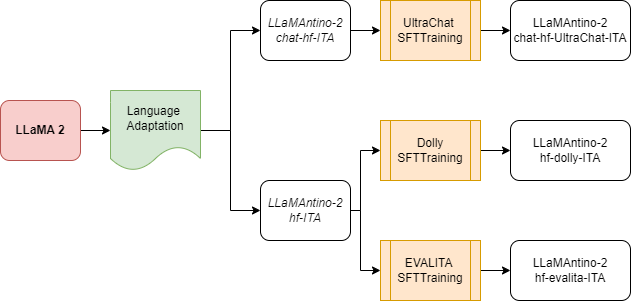

# LLaMAntino：LLaMA 2 模型，专为意大利语高效文本生成而设计。

发布时间：2023年12月15日

`LLM应用` `语言模型`

> LLaMAntino: LLaMA 2 Models for Effective Text Generation in Italian Language

# 摘要

> 大型语言模型（LLM）是当前语言模型的前沿，它们旨在让计算机掌握自然语言的理解。LLaMA系列以其出色的上下文关系捕捉能力，通过推出基于大量可训练参数（7亿、13亿和70亿参数）的基础模型，为自然语言处理领域带来了创新，显著提升了变换器架构的自然语言理解性能。这些模型在多种自然语言理解任务上的表现与OpenAI Chat-GPT等私营公司的模型不相上下，并且具有公开权重和代码的优势，便于研究和商业使用。本研究专注于LLaMA模型对意大利语的适应性，旨在解决这一语言在原始模型数据集中代表性不足的问题。我们采用开放科学的策略，尝试多种调优方法，以生成适合意大利语的高质量文本，满足这一语言在常见任务中的需求。我们致力于推出具有强大语言特性的文本生成模型，以应对使用多语言或通用LLM时面临的挑战。本研究通过引入LLaMAntino家族——一系列新型的意大利语LLM，为意大利语的语言适应提供了新的策略，进一步推动了开放科学在语言适应领域的贡献。

> Large Language Models represent state-of-the-art linguistic models designed to equip computers with the ability to comprehend natural language. With its exceptional capacity to capture complex contextual relationships, the LLaMA (Large Language Model Meta AI) family represents a novel advancement in the field of natural language processing by releasing foundational models designed to improve the natural language understanding abilities of the transformer architecture thanks to their large amount of trainable parameters (7, 13, and 70 billion parameters). In many natural language understanding tasks, these models obtain the same performances as private company models such as OpenAI Chat-GPT with the advantage to make publicly available weights and code for research and commercial uses. In this work, we investigate the possibility of Language Adaptation for LLaMA models, explicitly focusing on addressing the challenge of Italian Language coverage. Adopting an open science approach, we explore various tuning approaches to ensure a high-quality text generated in Italian suitable for common tasks in this underrepresented language in the original models' datasets. We aim to release effective text generation models with strong linguistic properties for many tasks that seem challenging using multilingual or general-purpose LLMs. By leveraging an open science philosophy, this study contributes to Language Adaptation strategies for the Italian language by introducing the novel LLaMAntino family of Italian LLMs.

[Arxiv](https://arxiv.org/abs/2312.09993)