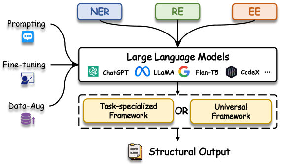
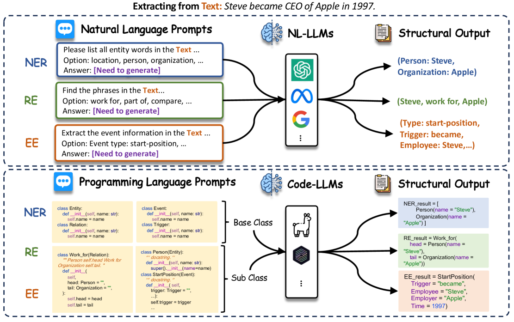
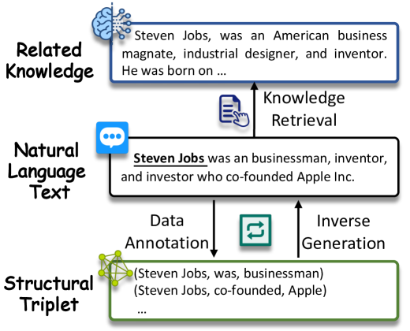

# 大型语言模型在生成信息提取领域的应用综述

发布时间：2023年12月29日

`LLM应用

理由：这篇论文摘要主要讨论了生成型大型语言模型（LLMs）在信息抽取（IE）领域的应用，包括对相关工作的分类概述、实证分析以及未来研究方向的探讨。这些内容聚焦于LLMs在实际任务中的应用，而非理论研究或Agent、RAG的特定应用，因此最合适的分类是LLM应用。` `信息抽取`

> Large Language Models for Generative Information Extraction: A Survey

# 摘要

> 信息抽取（IE）致力于从自然语言文本中提炼出结构化知识，如实体、关系和事件。生成型大型语言模型（LLMs）近期在文本理解和生成领域大放异彩，展现出跨领域的泛化能力。鉴于此，众多研究纷纷利用LLMs的潜能，为IE任务提供了基于生成范式的创新解决方案。本研究旨在对LLMs在IE领域的应用进行深入的系统回顾，我们首先根据IE子任务和学习范式对相关工作进行分类概述，随后实证分析了前沿技术，揭示了LLMs与IE任务结合的新趋势。通过详尽的回顾，我们指出了技术上的洞见和未来研究值得深究的方向，并维护了一个公共资源库，持续更新相关资料，地址为：\url{https://github.com/quqxui/Awesome-LLM4IE-Papers}。

> Information extraction (IE) aims to extract structural knowledge (such as entities, relations, and events) from plain natural language texts. Recently, generative Large Language Models (LLMs) have demonstrated remarkable capabilities in text understanding and generation, allowing for generalization across various domains and tasks. As a result, numerous works have been proposed to harness abilities of LLMs and offer viable solutions for IE tasks based on a generative paradigm. To conduct a comprehensive systematic review and exploration of LLM efforts for IE tasks, in this study, we survey the most recent advancements in this field. We first present an extensive overview by categorizing these works in terms of various IE subtasks and learning paradigms, then we empirically analyze the most advanced methods and discover the emerging trend of IE tasks with LLMs. Based on thorough review conducted, we identify several insights in technique and promising research directions that deserve further exploration in future studies. We maintain a public repository and consistently update related resources at: \url{https://github.com/quqxui/Awesome-LLM4IE-Papers}.

[Arxiv](https://arxiv.org/abs/2312.17617)