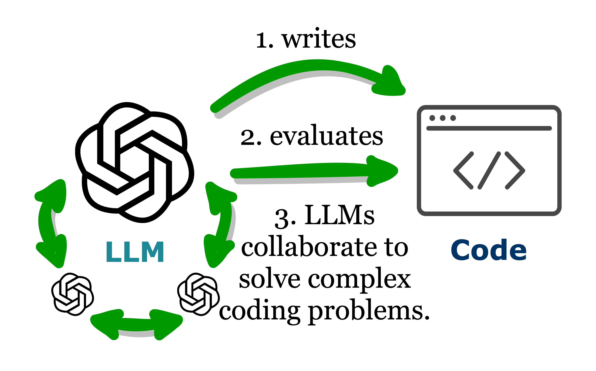
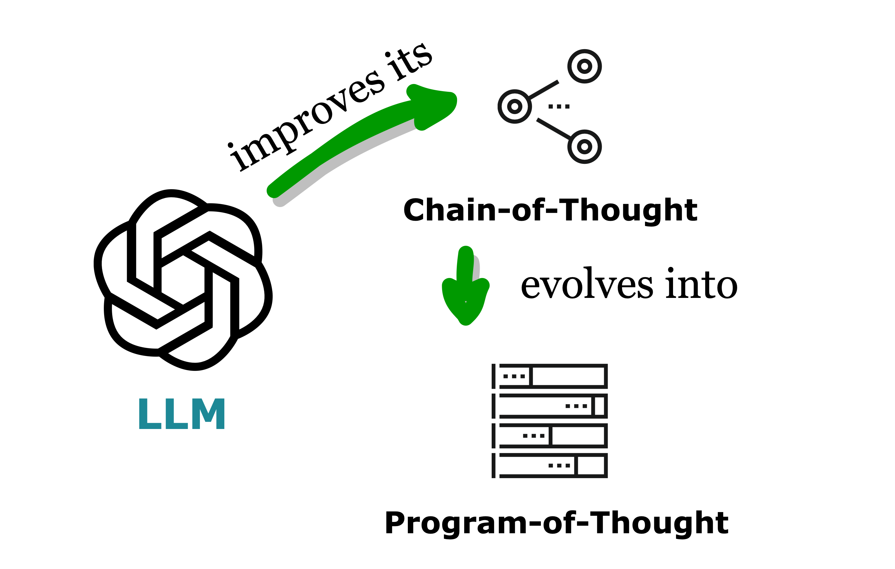
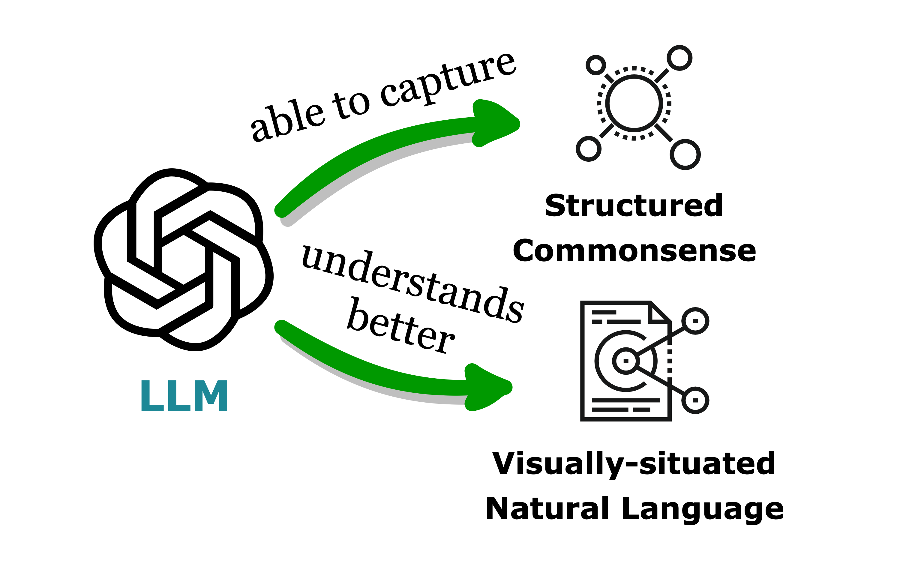
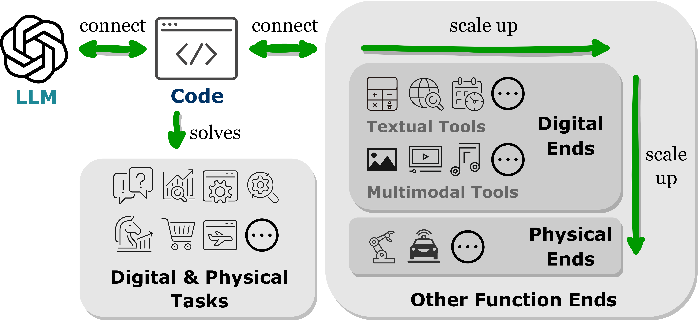
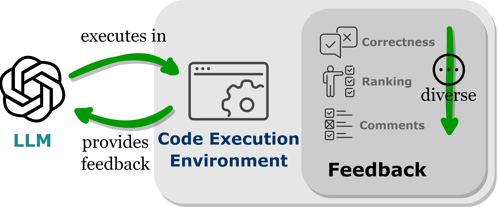
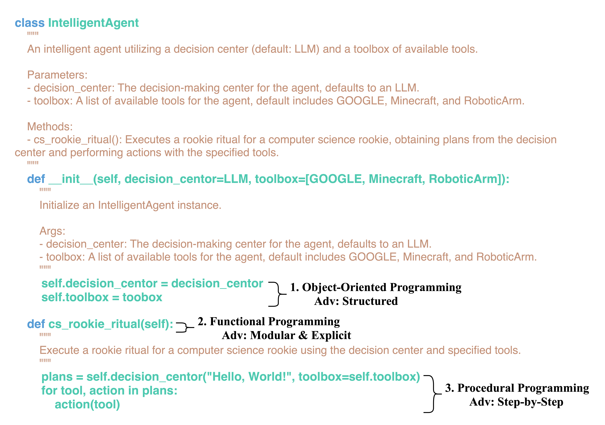
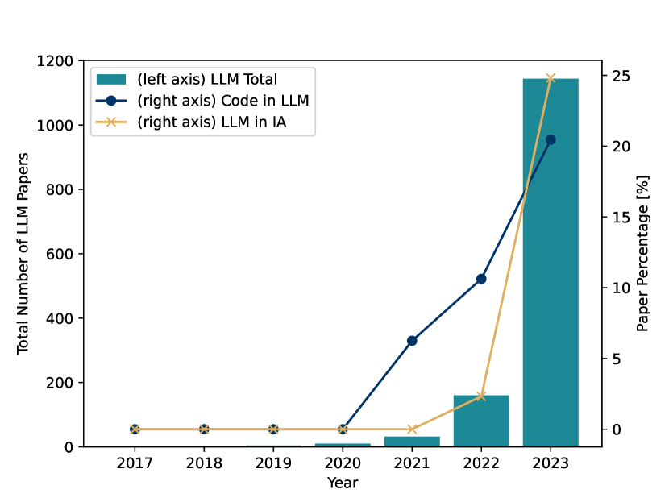

# 将大型语言模型（LLM）比作巫师，代码则是其施展魔法的魔杖。本文综述了代码如何赋予LLM以智能代理的能力。

发布时间：2024年01月08日

`LLM理论` `人工智能`

> If LLM Is the Wizard, Then Code Is the Wand: A Survey on How Code Empowers Large Language Models to Serve as Intelligent Agents

# 摘要

> 现代大型语言模型（LLMs）不仅在规模上超越了以往的模型，更因其结合了自然语言与代码形式语言的训练而独具特色。代码作为人机交流的桥梁，将复杂目标转换为具体可执行的步骤，展现了其标准化的语法、逻辑性、抽象能力和模块化结构。本综述展示了将代码融入LLMs训练数据的多重益处。它不仅提升了LLMs在代码生成方面的表现，更激发了其推理潜能，拓宽了其在自然语言处理任务上的应用范围；同时，代码的引入也让LLMs能够生成结构化、精确的中间步骤，便于与外部执行环境对接；此外，代码的编译与执行特性也为模型优化提供了丰富的反馈。文章还探讨了代码赋予LLMs的这些深层次能力，如何使其在理解指令、分解任务、规划执行和反馈迭代等方面成为智能代理（IAs），从而在下游任务中取得成功。最后，我们展望了如何进一步通过代码强化LLMs能力所面临的挑战与发展方向。

> The prominent large language models (LLMs) of today differ from past language models not only in size, but also in the fact that they are trained on a combination of natural language and formal language (code). As a medium between humans and computers, code translates high-level goals into executable steps, featuring standard syntax, logical consistency, abstraction, and modularity. In this survey, we present an overview of the various benefits of integrating code into LLMs' training data. Specifically, beyond enhancing LLMs in code generation, we observe that these unique properties of code help (i) unlock the reasoning ability of LLMs, enabling their applications to a range of more complex natural language tasks; (ii) steer LLMs to produce structured and precise intermediate steps, which can then be connected to external execution ends through function calls; and (iii) take advantage of code compilation and execution environment, which also provides diverse feedback for model improvement. In addition, we trace how these profound capabilities of LLMs, brought by code, have led to their emergence as intelligent agents (IAs) in situations where the ability to understand instructions, decompose goals, plan and execute actions, and refine from feedback are crucial to their success on downstream tasks. Finally, we present several key challenges and future directions of empowering LLMs with code.

[Arxiv](https://arxiv.org/abs/2401.00812)