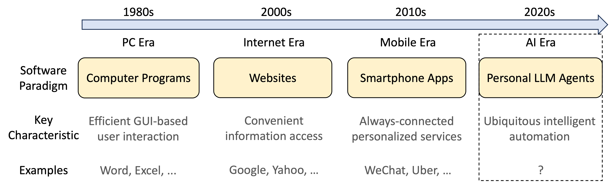
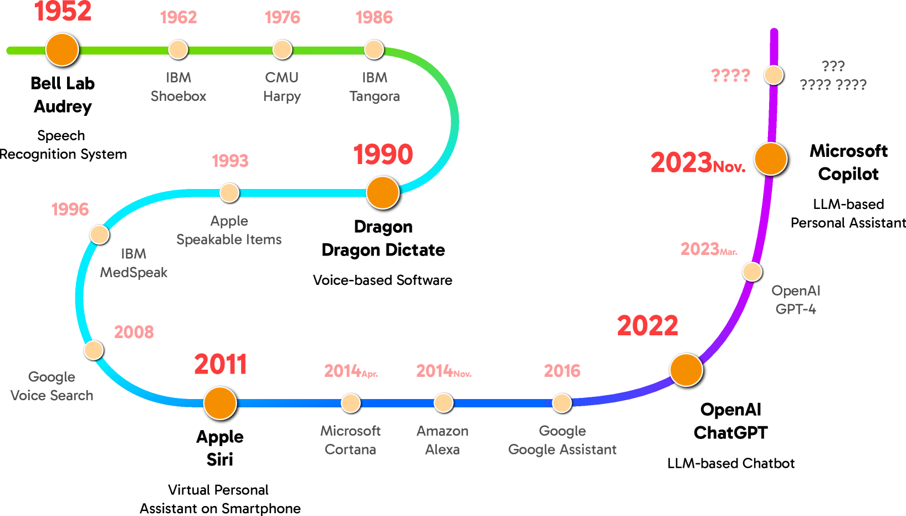
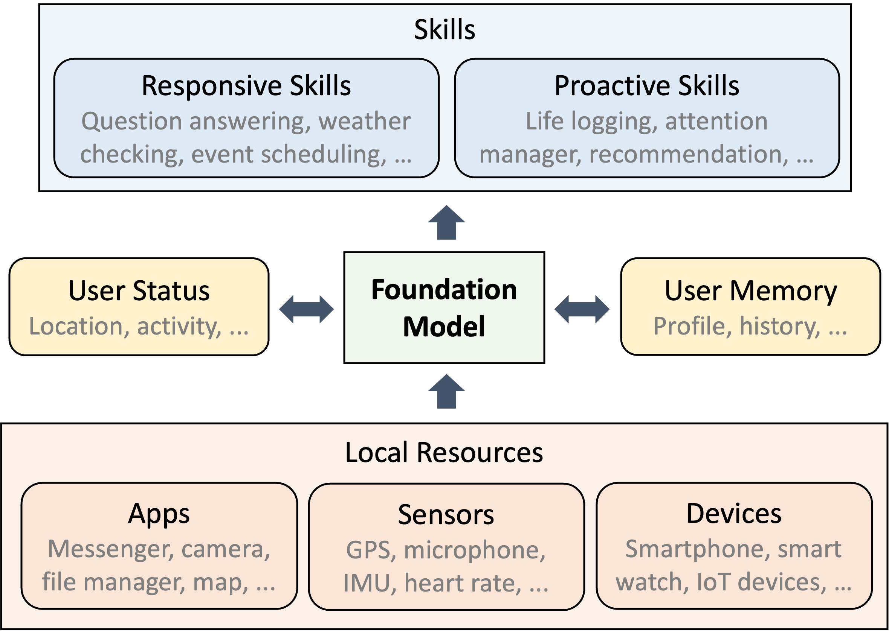
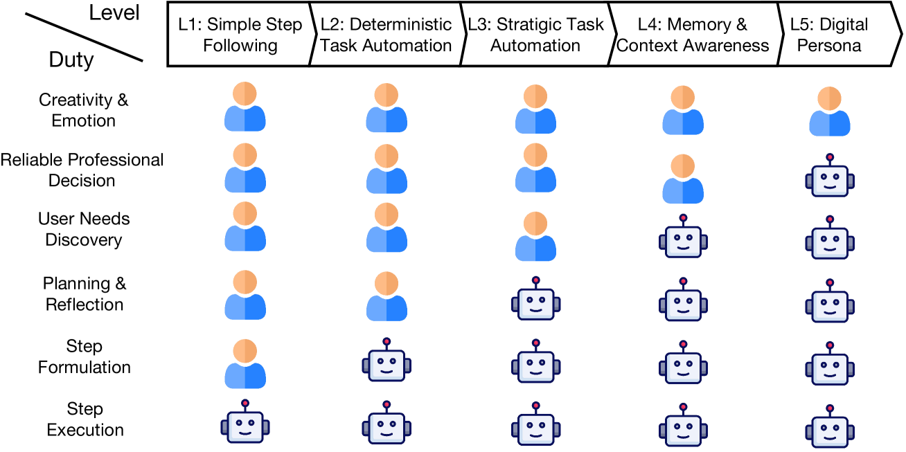
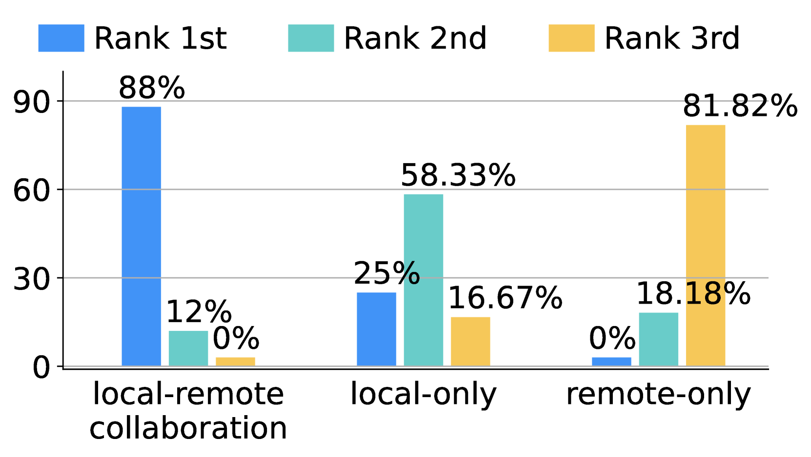
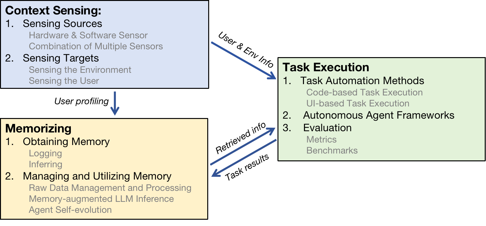
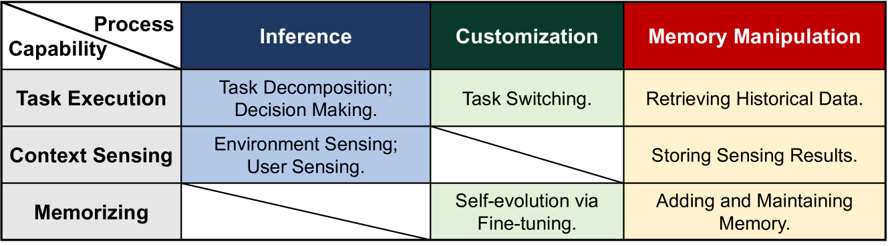
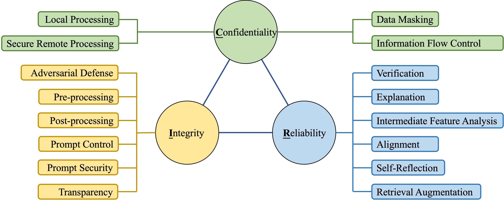

# 个人化大型语言模型（LLM）代理：深入探讨其能力、效率与安全性

发布时间：2024年01月10日

`Agent` `智能个人助理` `用户体验`

> Personal LLM Agents: Insights and Survey about the Capability, Efficiency and Security

# 摘要

> 自个人电脑设备诞生之日起，智能个人助理（IPAs）就成为研究者和工程师们致力研究的核心技术，目的是让用户能够更高效地获取信息、完成任务，并享受到更智能、便捷、丰富的互动体验。随着智能手机和物联网技术的飞速发展，计算与感知设备已经遍布各个角落，极大地拓宽了IPAs的应用范围。然而，受限于对用户意图的理解、任务规划、工具运用和个人数据管理等方面的能力不足，目前的IPAs在实用性和扩展性上仍有局限。最近，以大型语言模型（LLMs）为代表的基础模型的崛起，为IPAs的进化开辟了新天地。借助LLM强大的语义理解和推理能力，智能代理能够独立解决复杂问题。本文聚焦于个人LLM代理——一种深度融合个人数据和设备，致力于个人辅助的LLM基础代理。我们预见，个人LLM代理将成为未来用户体验的主要软件模式。为实现这一目标，我们首先探讨了个人LLM代理的架构、功能、效率和安全性等关键问题。文章从梳理个人LLM代理架构的核心组件和设计决策开始，接着深入分析了领域专家的意见。然后，我们讨论了打造智能、高效、安全个人LLM代理所面临的主要挑战，并全面审视了应对这些挑战的典型解决方案。

> Since the advent of personal computing devices, intelligent personal assistants (IPAs) have been one of the key technologies that researchers and engineers have focused on, aiming to help users efficiently obtain information and execute tasks, and provide users with more intelligent, convenient, and rich interaction experiences. With the development of smartphones and IoT, computing and sensing devices have become ubiquitous, greatly expanding the boundaries of IPAs. However, due to the lack of capabilities such as user intent understanding, task planning, tool using, and personal data management etc., existing IPAs still have limited practicality and scalability. Recently, the emergence of foundation models, represented by large language models (LLMs), brings new opportunities for the development of IPAs. With the powerful semantic understanding and reasoning capabilities, LLM can enable intelligent agents to solve complex problems autonomously. In this paper, we focus on Personal LLM Agents, which are LLM-based agents that are deeply integrated with personal data and personal devices and used for personal assistance. We envision that Personal LLM Agents will become a major software paradigm for end-users in the upcoming era. To realize this vision, we take the first step to discuss several important questions about Personal LLM Agents, including their architecture, capability, efficiency and security. We start by summarizing the key components and design choices in the architecture of Personal LLM Agents, followed by an in-depth analysis of the opinions collected from domain experts. Next, we discuss several key challenges to achieve intelligent, efficient and secure Personal LLM Agents, followed by a comprehensive survey of representative solutions to address these challenges.

[Arxiv](https://arxiv.org/abs/2401.05459)