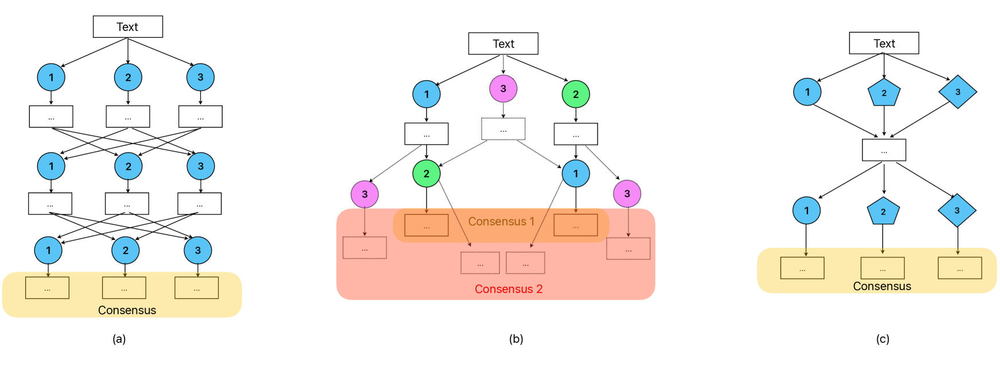
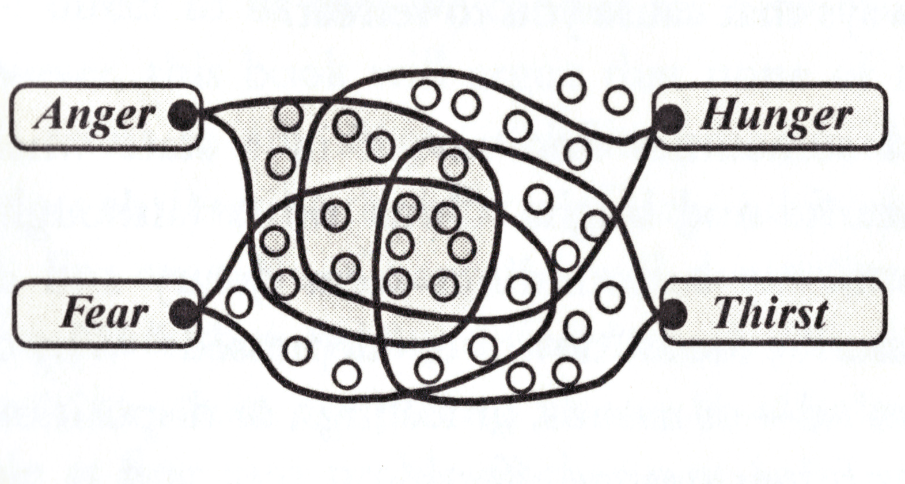
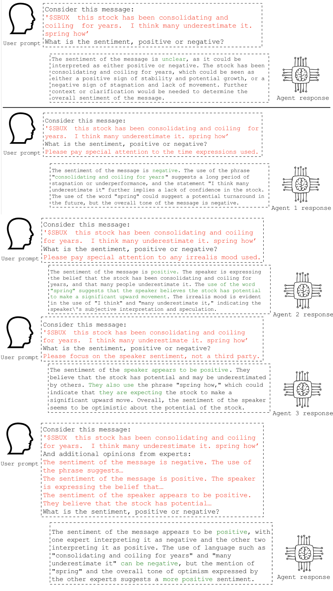

# 本文旨在探讨如何设计多样化的大型语言模型代理，以提升金融情绪分析的准确性和效率。

发布时间：2024年01月11日

`分类：LLM应用` `情感分析`

> Designing Heterogeneous LLM Agents for Financial Sentiment Analysis

# 摘要

> 大型语言模型（LLMs）彻底颠覆了智能系统设计的常规路径，将关注点从海量数据收集和模型训练转移到了与人类价值观的契合以及如何充分挖掘现有预训练模型的潜力上。但在金融情感分析（FSA）领域，这一变革尚未完全落地，主要原因在于FSA任务的独特性和在此类情境下应用生成模型的指导性知识尚不明确。本研究探讨了不经微调直接使用LLMs进行FSA的新范式的有效性。研究基于明斯基的心智与情感理论，提出了一个包含多种LLM代理的设计框架。该框架利用对FSA错误类型的先验知识，创建专业代理，并对代理间的讨论进行综合分析。通过在FSA数据集上的全面评估，证实了该框架尤其在讨论深入时能显著提高准确率。本研究不仅为LLMs在FSA领域的应用奠定了设计基础，也为未来的探索开辟了新路。同时，研究还探讨了其对商业和管理模式的潜在影响。

> Large language models (LLMs) have drastically changed the possible ways to design intelligent systems, shifting the focuses from massive data acquisition and new modeling training to human alignment and strategical elicitation of the full potential of existing pre-trained models. This paradigm shift, however, is not fully realized in financial sentiment analysis (FSA), due to the discriminative nature of this task and a lack of prescriptive knowledge of how to leverage generative models in such a context. This study investigates the effectiveness of the new paradigm, i.e., using LLMs without fine-tuning for FSA. Rooted in Minsky's theory of mind and emotions, a design framework with heterogeneous LLM agents is proposed. The framework instantiates specialized agents using prior domain knowledge of the types of FSA errors and reasons on the aggregated agent discussions. Comprehensive evaluation on FSA datasets show that the framework yields better accuracies, especially when the discussions are substantial. This study contributes to the design foundations and paves new avenues for LLMs-based FSA. Implications on business and management are also discussed.

[Arxiv](https://arxiv.org/abs/2401.05799)