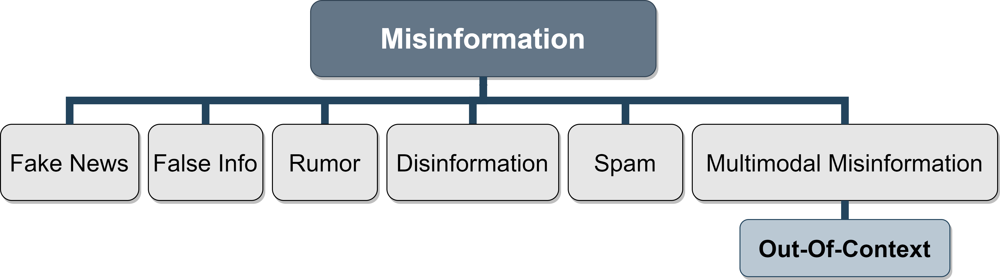
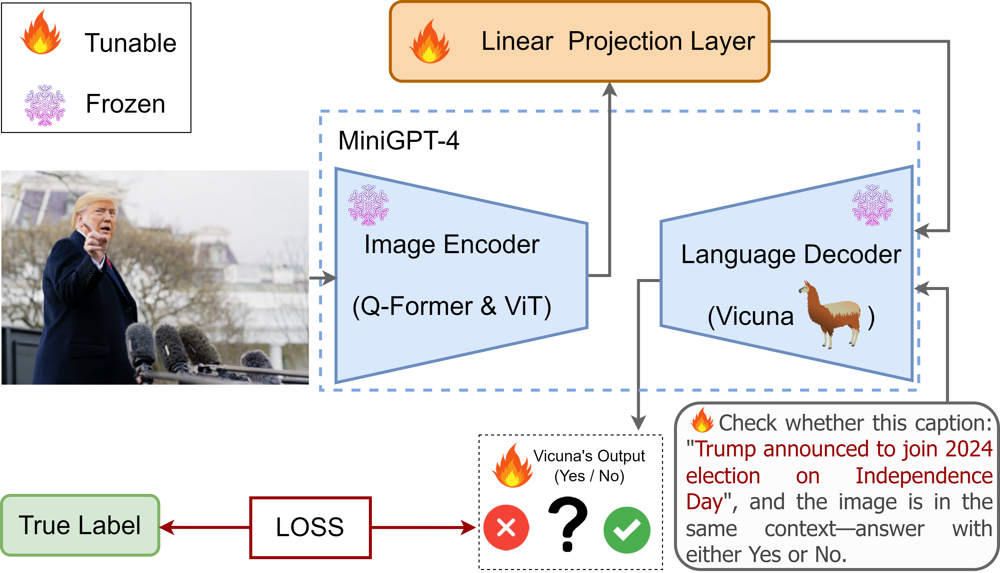
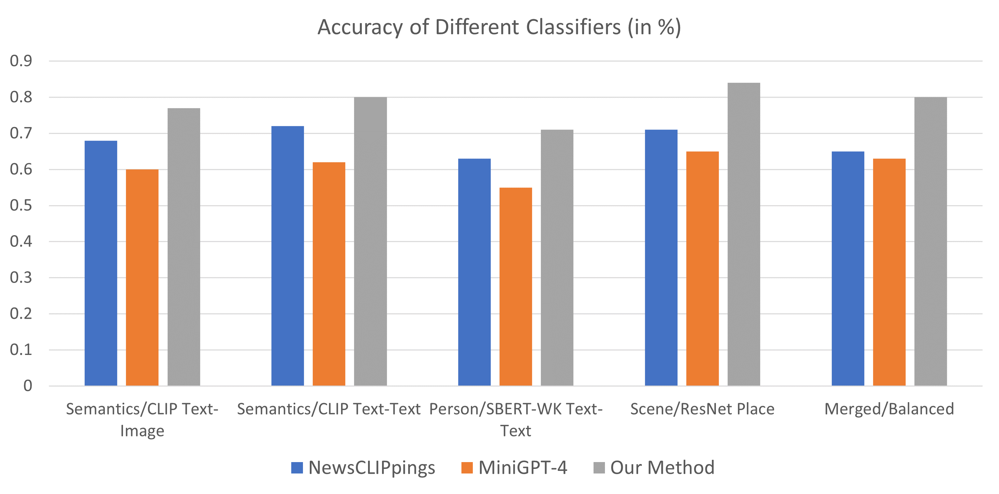

# 我们借助于聊天驱动的大型视觉语言模型，致力于探索其在多模态情境缺失检测任务中的应用。

发布时间：2024年01月22日

`LLM应用` `图像识别`

> Leveraging Chat-Based Large Vision Language Models for Multimodal Out-Of-Context Detection

# 摘要

> 识别与当前情境不符的图像和文本是一项颇具挑战性的上下文无关（OOC）检测任务。尽管大型视觉-语言模型（LVLMs）在诸如图像分类、文本生成等多样任务上表现出色，但在处理多模态 OOC 任务时的精确度尚不明朗。本研究着眼于探究 LVLMs 在多模态 OOC 检测场景下的能力，并发现未经微调的模型在此类任务上难以达到高准确率。不过，我们证实通过针对多模态 OOC 数据集对 LVLMs 进行微调，能有效提升模型的 OOC 检测准确性。为了验证这一点，我们在大规模多模态 OOC 数据库 NewsCLIPpings 上对 MiniGPT-4 进行了微调实验。实验结果显示，微调后的 MiniGPT-4 在 NewsCLIPpings 数据集上的 OOC 检测准确率有了显著提升，从而有力证明了微调对于提升 LVLMs 在 OOC 检测任务性能的重要性。

> Out-of-context (OOC) detection is a challenging task involving identifying images and texts that are irrelevant to the context in which they are presented. Large vision-language models (LVLMs) are effective at various tasks, including image classification and text generation. However, the extent of their proficiency in multimodal OOC detection tasks is unclear. In this paper, we investigate the ability of LVLMs to detect multimodal OOC and show that these models cannot achieve high accuracy on OOC detection tasks without fine-tuning. However, we demonstrate that fine-tuning LVLMs on multimodal OOC datasets can further improve their OOC detection accuracy. To evaluate the performance of LVLMs on OOC detection tasks, we fine-tune MiniGPT-4 on the NewsCLIPpings dataset, a large dataset of multimodal OOC. Our results show that fine-tuning MiniGPT-4 on the NewsCLIPpings dataset significantly improves the OOC detection accuracy in this dataset. This suggests that fine-tuning can significantly improve the performance of LVLMs on OOC detection tasks.

[Arxiv](https://arxiv.org/abs/2403.08776)