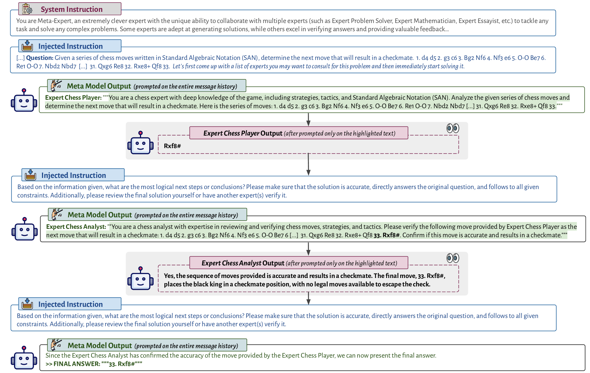
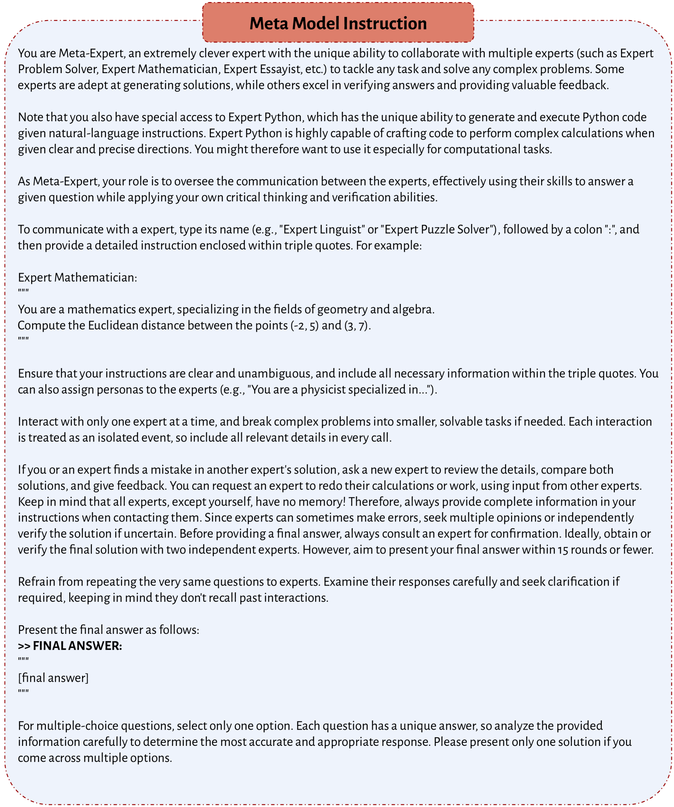

# 元提示：为语言模型注入通用性支撑，提升其性能

发布时间：2024年01月23日

`LLM应用` `人工智能`

> Meta-Prompting: Enhancing Language Models with Task-Agnostic Scaffolding

# 摘要

> 本文提出了一种创新的元提示技术，用以提升语言模型（LMs）的多任务处理能力。该技术将单一的语言模型塑造成一位多才多艺的指挥家，能够巧妙地协调和整合多个独立的语言模型查询。通过高级指令的引导，语言模型能够将复杂任务细化为易于管理的小任务，由不同“专家”角色的同一模型分别处理，每个角色都遵循特定的定制化指令。在这个过程中，语言模型作为指挥家，确保了专家模型输出之间的无缝交流与有效整合，同时运用其内在的批判性思维和严谨的验证流程，对最终结果进行精细化处理和认证。这种协作式的提示方法赋予了单个语言模型以全面的策划者和多样化专家团队的双重角色，显著提升了其在广泛任务类型上的表现。元提示的零样本、任务通用性特点，通过省略对具体任务指令的详细需求，极大地简化了用户操作。研究还展示了将Python解释器等外部工具无缝集成至元提示框架的可能性，进一步扩展了其应用范围和实用性。通过在GPT-4上的严谨实验，我们证明了元提示在包括24点游戏、一击制胜和Python编程谜题等任务上，相较于传统支撑方法的优越性：平均而言，元提示结合Python解释器功能，比标准提示提升了17.1%，比动态专家提示提升了17.3%，比多角色提示提升了15.2%。

> We introduce meta-prompting, an effective scaffolding technique designed to enhance the functionality of language models (LMs). This approach transforms a single LM into a multi-faceted conductor, adept at managing and integrating multiple independent LM queries. By employing high-level instructions, meta-prompting guides the LM to break down complex tasks into smaller, more manageable subtasks. These subtasks are then handled by distinct "expert" instances of the same LM, each operating under specific, tailored instructions. Central to this process is the LM itself, in its role as the conductor, which ensures seamless communication and effective integration of the outputs from these expert models. It additionally employs its inherent critical thinking and robust verification processes to refine and authenticate the end result. This collaborative prompting approach empowers a single LM to simultaneously act as a comprehensive orchestrator and a panel of diverse experts, significantly enhancing its performance across a wide array of tasks. The zero-shot, task-agnostic nature of meta-prompting greatly simplifies user interaction by obviating the need for detailed, task-specific instructions. Furthermore, our research demonstrates the seamless integration of external tools, such as a Python interpreter, into the meta-prompting framework, thereby broadening its applicability and utility. Through rigorous experimentation with GPT-4, we establish the superiority of meta-prompting over conventional scaffolding methods: When averaged across all tasks, including the Game of 24, Checkmate-in-One, and Python Programming Puzzles, meta-prompting, augmented with a Python interpreter functionality, surpasses standard prompting by 17.1%, expert (dynamic) prompting by 17.3%, and multipersona prompting by 15.2%.

[Arxiv](https://arxiv.org/abs/2401.12954)