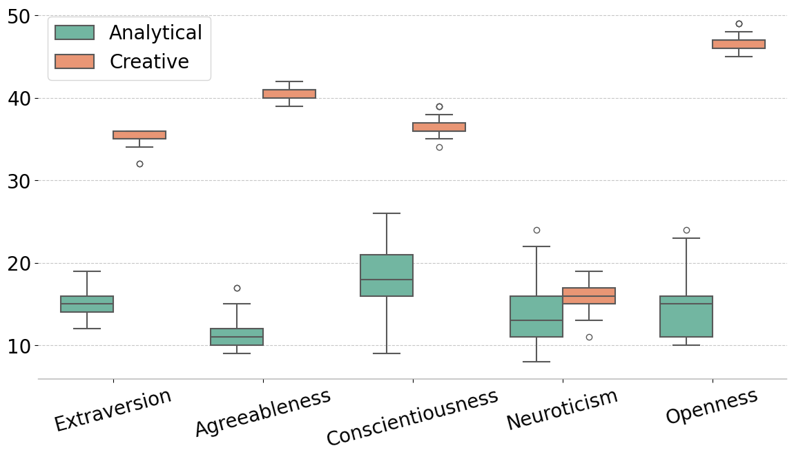
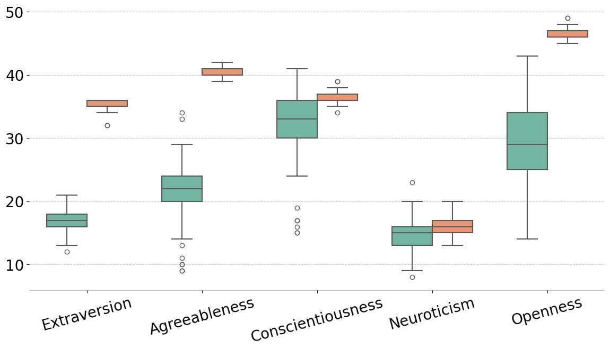
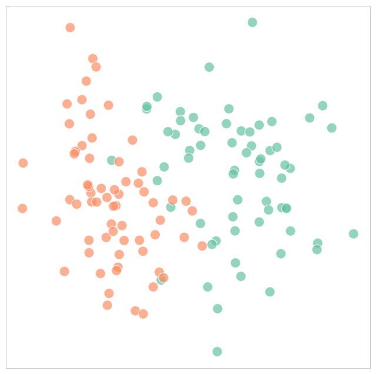
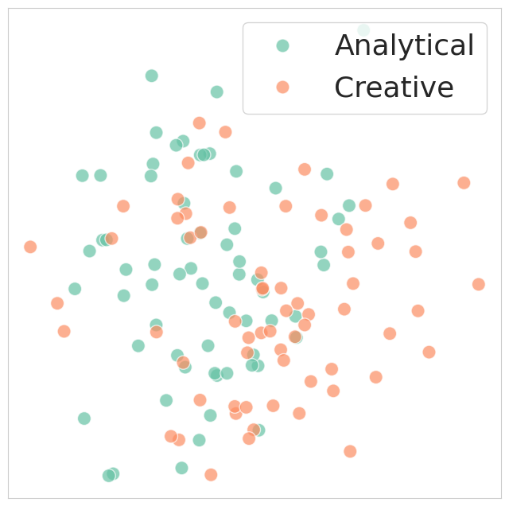
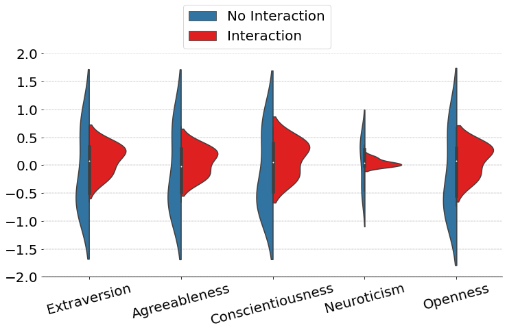
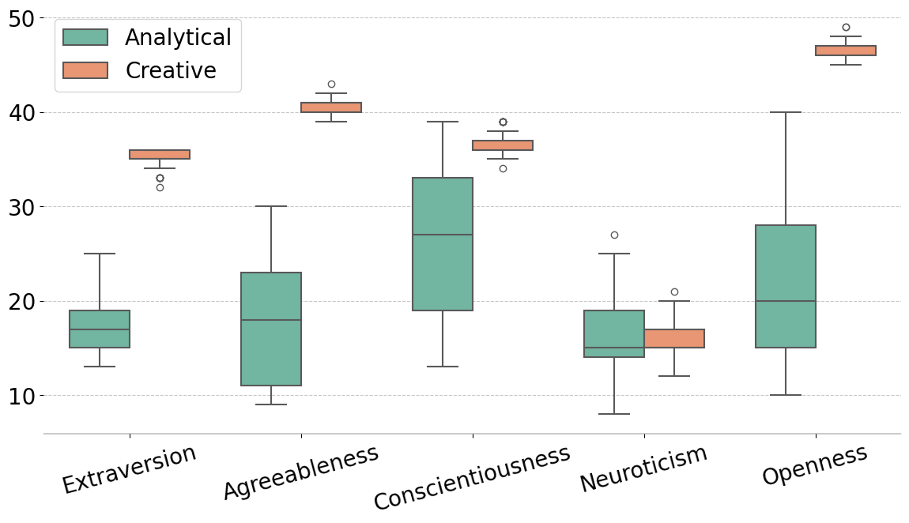

# 大型语言模型（LLM）的交互代理：探究在互动中的LLM群体内的个性连贯性与语言协调性

发布时间：2024年02月05日

`Agent` `人工智能`

> LLM Agents in Interaction: Measuring Personality Consistency and Linguistic Alignment in Interacting Populations of Large Language Models

# 摘要

> 代理互动与个性化在大型语言模型（LLM）的研究领域内均是活跃的研究主题，但对语言互动如何影响个性化LLM代理行为的研究却鲜有关注。确保这些代理在保持其既定特性的同时，能够进行开放且自然的对话至关重要。在本研究中，我们通过提示的方式对GPT-3.5进行个性化设置，并利用一个简单的变化引入抽样算法，生成了两组LLM代理。随后，我们对这些代理进行了性格测试，并让它们参与协作写作任务，结果发现不同性格配置的代理在性格一致性和与对话伙伴的语言协调性上表现出差异。本研究旨在深化我们对LLM间对话互动的理解，并强调了为交互环境设计更强健、更人性化的LLM个性化代理的新方法的必要性。

> While both agent interaction and personalisation are vibrant topics in research on large language models (LLMs), there has been limited focus on the effect of language interaction on the behaviour of persona-conditioned LLM agents. Such an endeavour is important to ensure that agents remain consistent to their assigned traits yet are able to engage in open, naturalistic dialogues. In our experiments, we condition GPT-3.5 on personality profiles through prompting and create a two-group population of LLM agents using a simple variability-inducing sampling algorithm. We then administer personality tests and submit the agents to a collaborative writing task, finding that different profiles exhibit different degrees of personality consistency and linguistic alignment to their conversational partners. Our study seeks to lay the groundwork for better understanding of dialogue-based interaction between LLMs and highlights the need for new approaches to crafting robust, more human-like LLM personas for interactive environments.

[Arxiv](https://arxiv.org/abs/2402.02896)