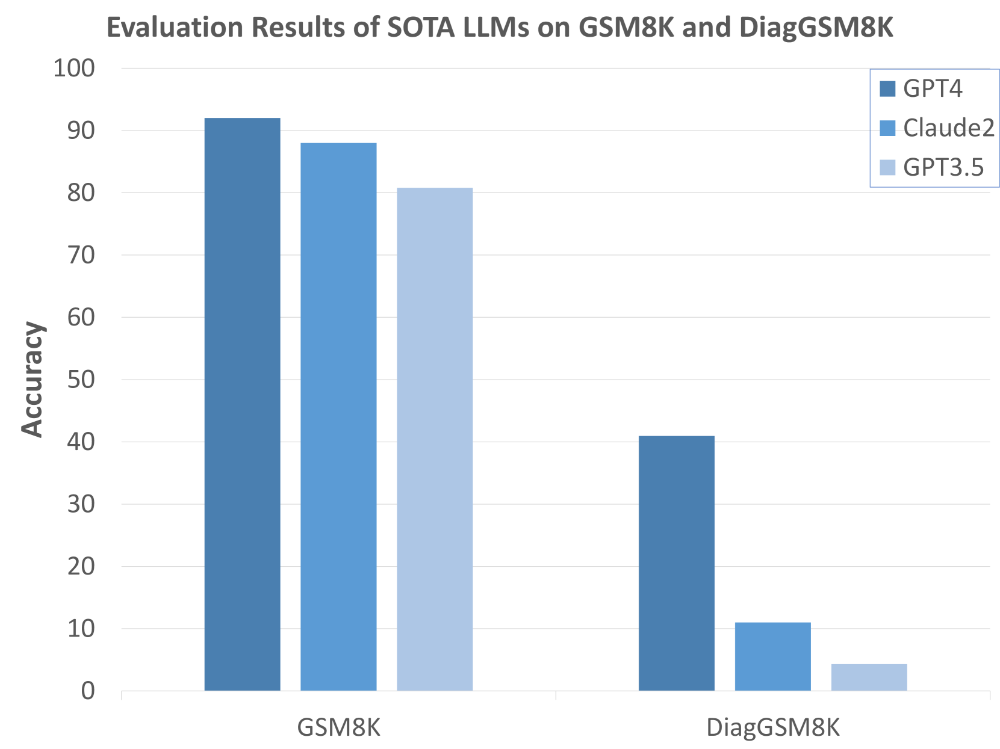
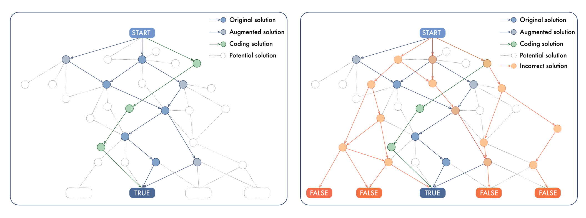
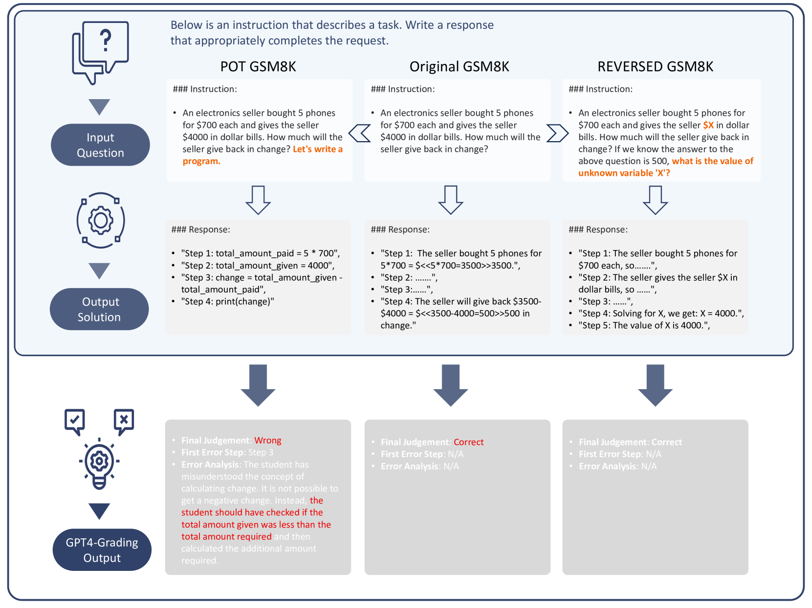
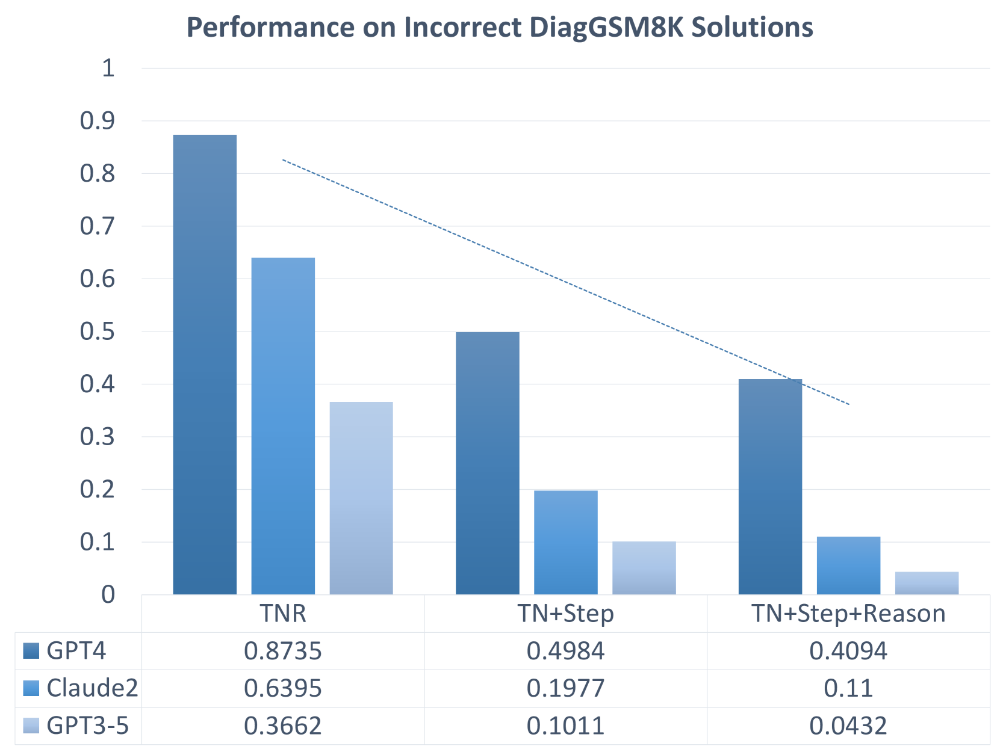
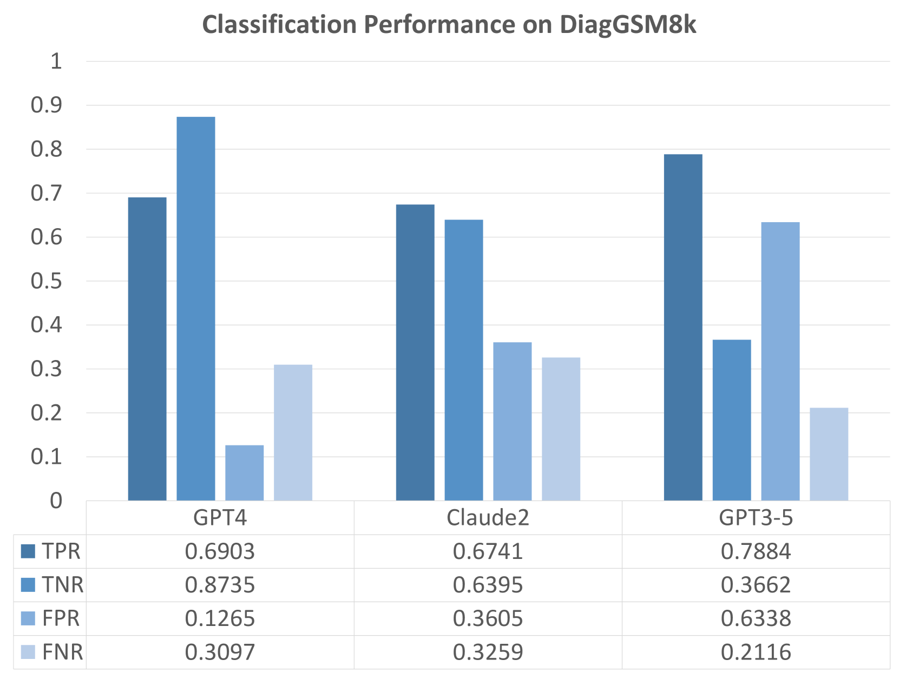
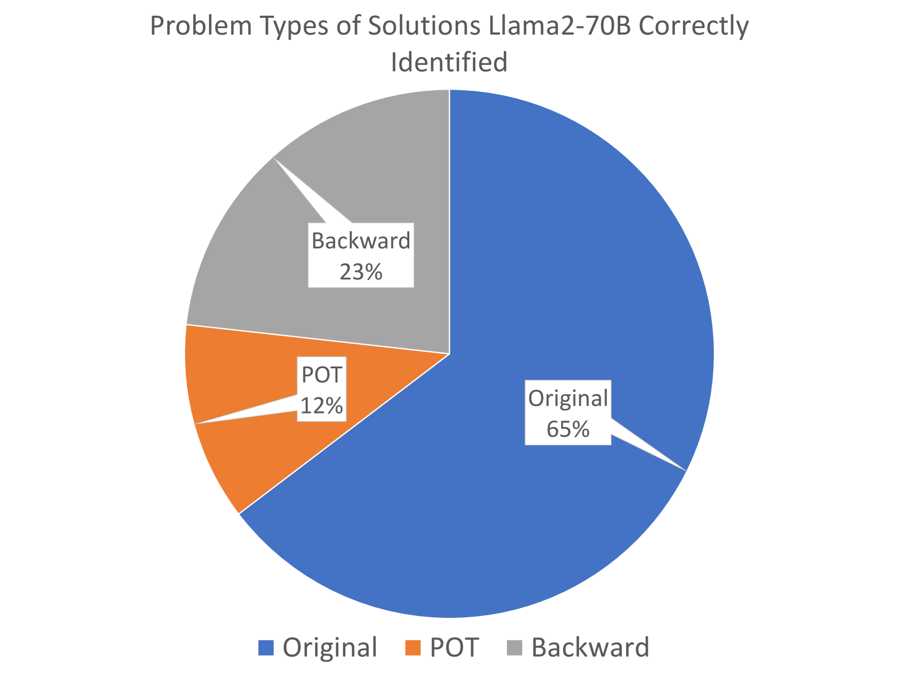

# MR-GSM8K：引领大型语言模型评估领域的元推理革新。

发布时间：2024年02月06日

`LLM理论` `人工智能` `认知科学`

> MR-GSM8K: A Meta-Reasoning Revolution in Large Language Model Evaluation

# 摘要

> 本研究提出了一种针对大型语言模型（LLMs）的创新评估框架，旨在推动模型进行深层次的元推理。这一方法克服了传统数学问题解决基准测试的局限，这些测试通常只评估代理的最终结果，而忽略了推理过程本身。我们的评估框架更加全面，能够更有效地衡量不同模型之间的认知差异。以我们的测试为例，GPT-4的解题能力是GPT3-5的五倍。这种新框架的关键在于其揭示了现有评估标准（如GSM8K）无法察觉的LLMs潜在认知缺陷，这些缺陷因现有标准的饱和度和对不同推理能力的区分不足而被掩盖。我们的深入分析涵盖了来自开源和闭源社区的多种尖端数学模型，发现了它们在训练和评估方法上的根本性不足。本文不仅呼吁对LLMs的评估方法进行根本性的变革，也为关于实现人工通用智能（AGI）的路径的讨论提供了新的视角。我们提倡采用类似于我们的元推理评估方法，以期对LLMs的真实认知能力进行更精确的评估。

> In this work, we introduce a novel evaluation paradigm for Large Language Models, one that challenges them to engage in meta-reasoning. This approach addresses critical shortcomings in existing math problem-solving benchmarks, traditionally used to evaluate the cognitive capabilities of agents. Our paradigm shifts the focus from result-oriented assessments, which often overlook the reasoning process, to a more holistic evaluation that effectively differentiates the cognitive capabilities among models. For example, in our benchmark, GPT-4 demonstrates a performance five times better than GPT3-5. The significance of this new paradigm lies in its ability to reveal potential cognitive deficiencies in LLMs that current benchmarks, such as GSM8K, fail to uncover due to their saturation and lack of effective differentiation among varying reasoning abilities. Our comprehensive analysis includes several state-of-the-art math models from both open-source and closed-source communities, uncovering fundamental deficiencies in their training and evaluation approaches. This paper not only advocates for a paradigm shift in the assessment of LLMs but also contributes to the ongoing discourse on the trajectory towards Artificial General Intelligence (AGI). By promoting the adoption of meta-reasoning evaluation methods similar to ours, we aim to facilitate a more accurate assessment of the true cognitive abilities of LLMs.

[Arxiv](https://arxiv.org/abs/2312.17080)