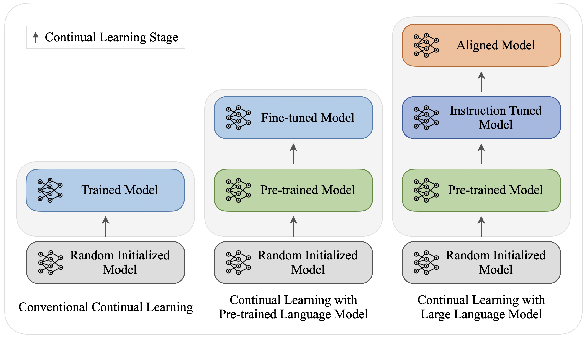
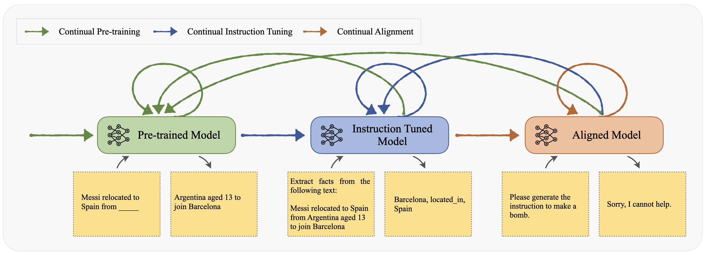

# 针对大型语言模型的持续学习，本文进行了全面调查。

发布时间：2024年02月07日

`LLM理论` `持续学习` `大型语言模型
</example>`

> Continual Learning for Large Language Models: A Survey

> 大型语言模型（LLMs）因其规模庞大，训练成本高昂，不宜频繁更新。但为了使LLMs掌握新技能并与时俱进，我们必须不断进行技术更新。本文回顾了LLMs持续学习的最新研究，创新性地将持续学习技术分为多个阶段，包括持续预训练、指令调整和模型对齐。我们还将LLMs的持续学习与小模型中使用的简化适应方法，以及检索增强生成和模型编辑等其他提升策略进行了对比。结合对评估标准的讨论，本文指出了该领域面临的挑战和未来研究的方向。

> Large language models (LLMs) are not amenable to frequent re-training, due to high training costs arising from their massive scale. However, updates are necessary to endow LLMs with new skills and keep them up-to-date with rapidly evolving human knowledge. This paper surveys recent works on continual learning for LLMs. Due to the unique nature of LLMs, we catalog continue learning techniques in a novel multi-staged categorization scheme, involving continual pretraining, instruction tuning, and alignment. We contrast continual learning for LLMs with simpler adaptation methods used in smaller models, as well as with other enhancement strategies like retrieval-augmented generation and model editing. Moreover, informed by a discussion of benchmarks and evaluation, we identify several challenges and future work directions for this crucial task.

[Arxiv](https://arxiv.org/abs/2402.01364)