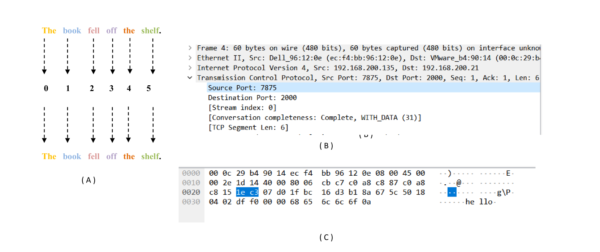

# 《流之守望：利用大型语言模型实现软件定义网络中的动态数据包分类》——立场论文

发布时间：2024年02月09日

`分类：LLM应用` `网络安全` `人工智能`

> Sentinels of the Stream: Unleashing Large Language Models for Dynamic Packet Classification in Software Defined Networks -- Position Paper

# 摘要

> OpenAI 的 ChatGPT 问世后，学术界对基于 GPT 的大型语言模型（LLM）聊天助手的兴趣激增。随后数月，多款大型语言模型相继问世，包括 Meta 的 LLama 系列和 Mistral AI 的 Mistral 及 Mixtral MoE 模型。这些模型以多种许可证形式，开放用于广泛的用途，如编程、SQL 创建等。本研究旨在探讨大型语言模型在网络安全领域的应用潜力。我们计划开发一款名为 Sentinel 的 LLM，用于分析网络数据包内容，并评估其潜在威胁。本报告为初步研究，旨在为未来的研究工作奠定基础。

> With the release of OpenAI's ChatGPT, the field of large language models (LLM) saw an increase of academic interest in GPT based chat assistants. In the next few months multiple accesible large language models were released that included Meta's LLama models and Mistral AI's Mistral and Mixtral MoE models. These models are available openly for a wide array of purposes with a wide spectrum of licenses. These LLMs have found their use in a different number of fields like code development, SQL generation etc. In this work we propose our plan to explore the applicability of large language model in the domain of network security. We plan to create Sentinel, a LLM, to analyse network packet contents and pass a judgment on it's threat level. This work is a preliminary report that will lay our plan for our future endeavors.

[Arxiv](https://arxiv.org/abs/2402.07950)