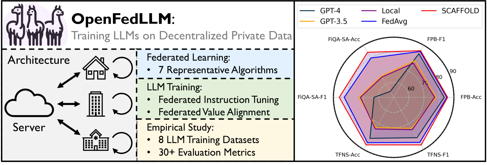

# OpenFedLLM：采用联邦学习技术，实现在分散的私密数据上对大型语言模型的训练。

发布时间：2024年02月10日

`LLM应用` `人工智能`

> OpenFedLLM: Training Large Language Models on Decentralized Private Data via Federated Learning

# 摘要

> 大型语言模型（LLMs）利用海量公开数据训练，在众多领域取得了显著成就。然而，优质公共数据资源将在不久后面临枯竭。本文提出了当前LLMs发展的新方向：通过联邦学习（FL），在保护隐私的前提下，利用分散的私有数据进行协作训练。我们开发了OpenFedLLM，一个简洁、集成化且研究友好的框架/代码库，它包括联邦指令调整、价值对齐以及7种代表性的FL算法。OpenFedLLM支持跨多个领域的训练，并涵盖了8种不同的训练数据集，同时提供超过30个评估指标的全面评估。广泛的实验表明，所有FL算法在LLMs的训练上都超越了传统的本地训练方法。特别地，在金融领域的基准测试中，使用任何FL算法微调的Llama2-7B性能显著优于GPT-4，这一发现极大地激励了客户端参与FL的积极性。相关代码已在GitHub上公开，地址为 https://github.com/rui-ye/OpenFedLLM。

> Trained on massive publicly available data, large language models (LLMs) have demonstrated tremendous success across various fields. While more data contributes to better performance, a disconcerting reality is that high-quality public data will be exhausted in a few years. In this paper, we offer a potential next step for contemporary LLMs: collaborative and privacy-preserving LLM training on the underutilized distributed private data via federated learning (FL), where multiple data owners collaboratively train a shared model without transmitting raw data. To achieve this, we build a concise, integrated, and research-friendly framework/codebase, named OpenFedLLM. It covers federated instruction tuning for enhancing instruction-following capability, federated value alignment for aligning with human values, and 7 representative FL algorithms. Besides, OpenFedLLM supports training on diverse domains, where we cover 8 training datasets; and provides comprehensive evaluations, where we cover 30+ evaluation metrics. Through extensive experiments, we observe that all FL algorithms outperform local training on training LLMs, demonstrating a clear performance improvement across a variety of settings. Notably, in a financial benchmark, Llama2-7B fine-tuned by applying any FL algorithm can outperform GPT-4 by a significant margin while the model obtained through individual training cannot, demonstrating strong motivation for clients to participate in FL. The code is available at https://github.com/rui-ye/OpenFedLLM.

[Arxiv](https://arxiv.org/abs/2402.06954)