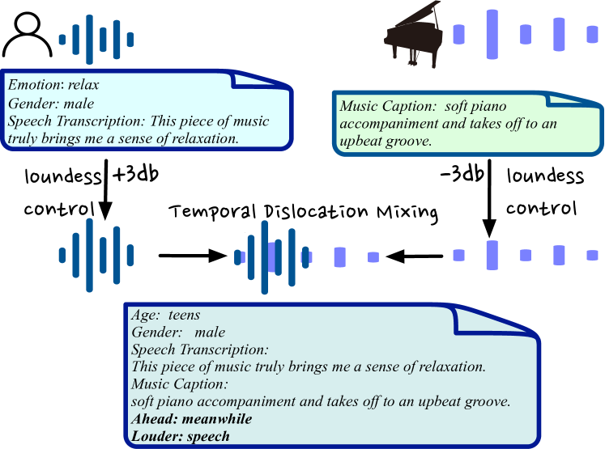

# AIR-Bench：通过创造性理解对大型音频-语言模型进行性能评估。

发布时间：2024年02月12日

`LLM应用` `音频处理`

> AIR-Bench: Benchmarking Large Audio-Language Models via Generative Comprehension

# 摘要

> 近期，用于人声音频互动的指令遵循型音频-语言模型受到了广泛关注。但目前缺少评估音频交互能力的基准测试，这限制了该领域的进一步发展。以往的研究主要集中在基础任务如自动语音识别（ASR）上，而忽略了对音频中心的开放式生成能力的评估。这使得追踪大型音频-语言模型（LALMs）的发展和指导未来改进变得困难。本文提出了AIR-Bench（音频指令基准测试），这是首个旨在评估LALMs理解多种音频信号并进行文本交互能力的基准。AIR-Bench包含基础和聊天两个维度，前者包含19个任务，约19k个单选问题，用以检验LALMs的基本单任务能力；后者则包含2k个开放式问答实例，直接测试模型对复杂音频的理解和指令遵循能力。两个基准测试都要求模型直接生成假设。我们构建了一个统一框架，使用如GPT-4这样的高级语言模型来评估基于音频元信息生成的假设得分。实验结果显示，基于GPT-4的评估与人类评估具有高度一致性。AIR-Bench通过评估结果揭示了现有LALMs的不足，为未来研究方向提供了指导。

> Recently, instruction-following audio-language models have received broad attention for human-audio interaction. However, the absence of benchmarks capable of evaluating audio-centric interaction capabilities has impeded advancements in this field. Previous models primarily focus on assessing different fundamental tasks, such as Automatic Speech Recognition (ASR), and lack an assessment of the open-ended generative capabilities centered around audio. Thus, it is challenging to track the progression in the Large Audio-Language Models (LALMs) domain and to provide guidance for future improvement. In this paper, we introduce AIR-Bench (\textbf{A}udio \textbf{I}nst\textbf{R}uction \textbf{Bench}mark), the first benchmark designed to evaluate the ability of LALMs to understand various types of audio signals (including human speech, natural sounds, and music), and furthermore, to interact with humans in the textual format. AIR-Bench encompasses two dimensions: \textit{foundation} and \textit{chat} benchmarks. The former consists of 19 tasks with approximately 19k single-choice questions, intending to inspect the basic single-task ability of LALMs. The latter one contains 2k instances of open-ended question-and-answer data, directly assessing the comprehension of the model on complex audio and its capacity to follow instructions. Both benchmarks require the model to generate hypotheses directly. We design a unified framework that leverages advanced language models, such as GPT-4, to evaluate the scores of generated hypotheses given the meta-information of the audio. Experimental results demonstrate a high level of consistency between GPT-4-based evaluation and human evaluation. By revealing the limitations of existing LALMs through evaluation results, AIR-Bench can provide insights into the direction of future research.

[Arxiv](https://arxiv.org/abs/2402.07729)