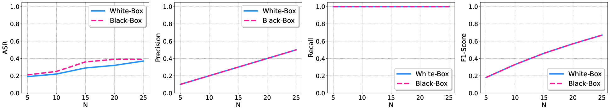

# 知识毒化攻击：探究大型语言模型检索增强生成中的PoisonedRAG现象

发布时间：2024年02月12日

`RAG

这篇论文主要探讨了检索增强生成（RAG）技术在大型语言模型（LLMs）中的应用，特别是在安全性方面的研究。论文提出了名为 PoisonedRAG 的知识中毒攻击策略，并针对这种攻击提出了相应的解决方案。因此，这篇论文更符合RAG分类，因为它专注于RAG技术的安全性和攻击策略，而不是Agent的行为、LLM的理论研究或一般的LLM应用。` `网络安全` `人工智能安全`

> PoisonedRAG: Knowledge Poisoning Attacks to Retrieval-Augmented Generation of Large Language Models

# 摘要

> 大型语言模型（LLMs）凭借其卓越的生成能力取得了巨大成功，但仍面临知识更新滞后和信息虚构等挑战。检索增强生成（RAG）技术应运而生，它通过从庞大的知识库中提取相关信息来优化 LLM 的输入，例如从维基百科的海量文本中找到与问题最相关的文章。然而，RAG 的安全性研究尚未充分展开。我们的研究聚焦于这一领域，提出了名为 PoisonedRAG 的知识中毒攻击策略，攻击者通过向知识库中植入特定文本，操控 LLM 对特定问题的回答。我们将这种攻击视为一个优化问题，并针对攻击者的不同知识背景（黑盒或白盒）提出了两种解决方案。实验结果显示，在向包含数百万文本的数据库中每目标问题注入 5 篇中毒文本时，攻击成功率高达 90%。我们还测试了现有的防御措施，发现它们难以抵御此类攻击，这表明我们需要新的防御策略。

> Large language models (LLMs) have achieved remarkable success due to their exceptional generative capabilities. Despite their success, they also have inherent limitations such as a lack of up-to-date knowledge and hallucination. Retrieval-Augmented Generation (RAG) is a state-of-the-art technique to mitigate those limitations. In particular, given a question, RAG retrieves relevant knowledge from a knowledge database to augment the input of the LLM. For instance, the retrieved knowledge could be a set of top-k texts that are most semantically similar to the given question when the knowledge database contains millions of texts collected from Wikipedia. As a result, the LLM could utilize the retrieved knowledge as the context to generate an answer for the given question. Existing studies mainly focus on improving the accuracy or efficiency of RAG, leaving its security largely unexplored. We aim to bridge the gap in this work. Particularly, we propose PoisonedRAG , a set of knowledge poisoning attacks to RAG, where an attacker could inject a few poisoned texts into the knowledge database such that the LLM generates an attacker-chosen target answer for an attacker-chosen target question. We formulate knowledge poisoning attacks as an optimization problem, whose solution is a set of poisoned texts. Depending on the background knowledge (e.g., black-box and white-box settings) of an attacker on the RAG, we propose two solutions to solve the optimization problem, respectively. Our results on multiple benchmark datasets and LLMs show our attacks could achieve 90% attack success rates when injecting 5 poisoned texts for each target question into a database with millions of texts. We also evaluate recent defenses and our results show they are insufficient to defend against our attacks, highlighting the need for new defenses.

[Arxiv](https://arxiv.org/abs/2402.07867)