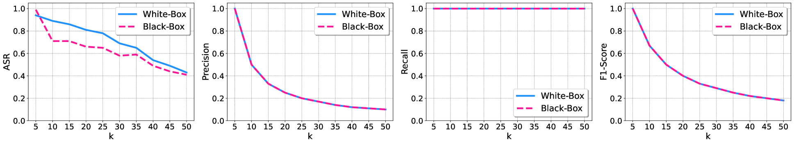

# PoisonedRAG：大型语言模型检索增强生成遭遇知识投毒攻击

发布时间：2024年02月12日

`RAG

这篇论文主要探讨了检索增强生成（RAG）技术在大型语言模型（LLMs）中的应用，特别是在安全性方面的挑战。论文提出了名为PoisonedRAG的知识中毒攻击，这是一种针对RAG系统的攻击方式，通过向知识库注入恶意文本来操控LLM的输出。因此，这篇论文的内容主要集中在RAG技术的应用和安全性问题上，属于RAG分类。` `网络安全` `人工智能安全`

> PoisonedRAG: Knowledge Poisoning Attacks to Retrieval-Augmented Generation of Large Language Models

# 摘要

> 大型语言模型（LLMs）凭借其卓越的生成能力取得了显著成就，但仍面临知识更新滞后和产生幻觉的挑战。检索增强生成（RAG）技术应运而生，它通过从庞大的知识库中提取相关信息来优化LLM的输入，例如从维基百科的数百万文本中找出与问题最相关的文本集。然而，尽管RAG在提升准确性和效率方面取得了进展，其安全性却鲜有探讨。我们的研究聚焦于这一盲点，提出了PoisonedRAG，一种针对RAG的知识中毒攻击，允许攻击者通过向知识库注入少量恶意文本，操控LLM为特定问题生成预设答案。我们通过优化问题定义了这种攻击，并根据攻击者对RAG的了解程度（黑盒或白盒）提出了相应的解决方案。实验结果显示，在包含数百万文本的数据库中，每目标问题注入5个中毒文本，攻击成功率高达90%。我们还评估了现有防御措施，发现它们难以抵御此类攻击，强调了开发新防御策略的紧迫性。

> Large language models (LLMs) have achieved remarkable success due to their exceptional generative capabilities. Despite their success, they also have inherent limitations such as a lack of up-to-date knowledge and hallucination. Retrieval-Augmented Generation (RAG) is a state-of-the-art technique to mitigate those limitations. In particular, given a question, RAG retrieves relevant knowledge from a knowledge database to augment the input of the LLM. For instance, the retrieved knowledge could be a set of top-k texts that are most semantically similar to the given question when the knowledge database contains millions of texts collected from Wikipedia. As a result, the LLM could utilize the retrieved knowledge as the context to generate an answer for the given question. Existing studies mainly focus on improving the accuracy or efficiency of RAG, leaving its security largely unexplored. We aim to bridge the gap in this work. Particularly, we propose PoisonedRAG , a set of knowledge poisoning attacks to RAG, where an attacker could inject a few poisoned texts into the knowledge database such that the LLM generates an attacker-chosen target answer for an attacker-chosen target question. We formulate knowledge poisoning attacks as an optimization problem, whose solution is a set of poisoned texts. Depending on the background knowledge (e.g., black-box and white-box settings) of an attacker on the RAG, we propose two solutions to solve the optimization problem, respectively. Our results on multiple benchmark datasets and LLMs show our attacks could achieve 90% attack success rates when injecting 5 poisoned texts for each target question into a database with millions of texts. We also evaluate recent defenses and our results show they are insufficient to defend against our attacks, highlighting the need for new defenses.

[Arxiv](https://arxiv.org/abs/2402.07867)