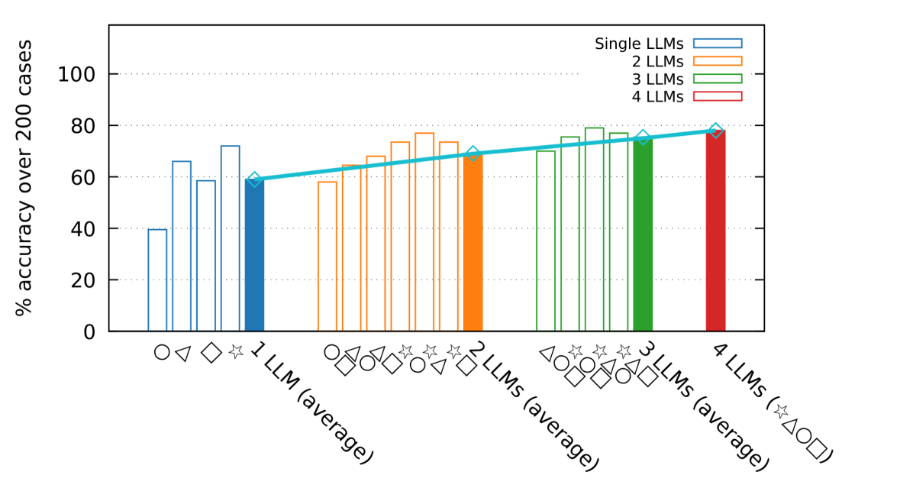
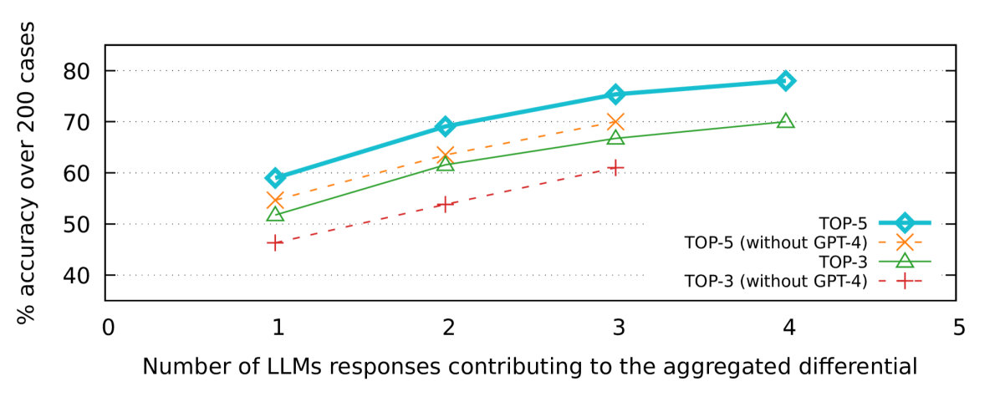

# 融合多个大型语言模型的洞见，能够显著提升诊断的精确度。

发布时间：2024年02月13日

`LLM应用` `人工智能`

> Combining Insights From Multiple Large Language Models Improves Diagnostic Accuracy

# 摘要

> 背景：大型语言模型（LLM），如 OpenAI 的 GPT-4 或 Google 的 PaLM 2，被提议作为诊断辅助工具，甚至可能取代现场咨询。但即便是专门训练于医学领域的 LLM，其诊断精确度也未必能满足实际应用的需求。方法：我们利用群体智能技术，结合200个真实临床案例的资料集，对比了单独商业化LLM（包括OpenAI GPT-4、Google PaLM 2、Cohere Command、Meta Llama 2）的个体诊断准确性，以及通过整合这些LLM的响应得出的综合诊断准确性。结果：研究发现，整合多个不同LLM的响应得到的诊断准确性更高（三个LLM的平均准确度为75.3% ± 1.6pp），相比于单一LLM的诊断结果（单一LLM的平均准确度为59.0% ± 6.1pp）。讨论：通过群体智能技术整合不同LLM的响应以形成综合诊断，有助于推动LLM作为诊断辅助工具的接受度，这包括两个关键步骤：（1）证明其高度的诊断准确性；（2）减少对单一商业供应商的依赖。

> Background: Large language models (LLMs) such as OpenAI's GPT-4 or Google's PaLM 2 are proposed as viable diagnostic support tools or even spoken of as replacements for "curbside consults". However, even LLMs specifically trained on medical topics may lack sufficient diagnostic accuracy for real-life applications.
  Methods: Using collective intelligence methods and a dataset of 200 clinical vignettes of real-life cases, we assessed and compared the accuracy of differential diagnoses obtained by asking individual commercial LLMs (OpenAI GPT-4, Google PaLM 2, Cohere Command, Meta Llama 2) against the accuracy of differential diagnoses synthesized by aggregating responses from combinations of the same LLMs.
  Results: We find that aggregating responses from multiple, various LLMs leads to more accurate differential diagnoses (average accuracy for 3 LLMs: $75.3\%\pm 1.6pp$) compared to the differential diagnoses produced by single LLMs (average accuracy for single LLMs: $59.0\%\pm 6.1pp$).
  Discussion: The use of collective intelligence methods to synthesize differential diagnoses combining the responses of different LLMs achieves two of the necessary steps towards advancing acceptance of LLMs as a diagnostic support tool: (1) demonstrate high diagnostic accuracy and (2) eliminate dependence on a single commercial vendor.

[Arxiv](https://arxiv.org/abs/2402.08806)