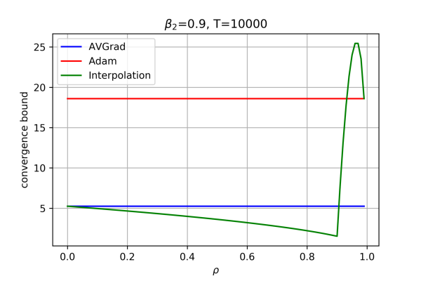
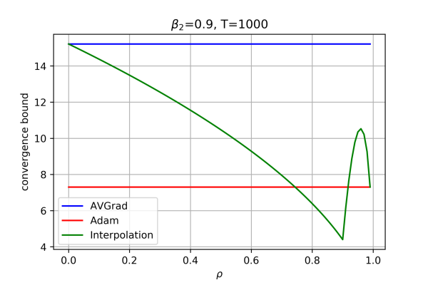
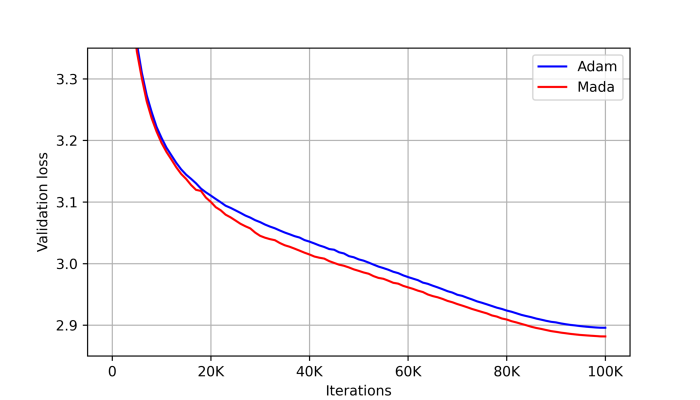
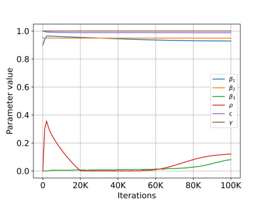
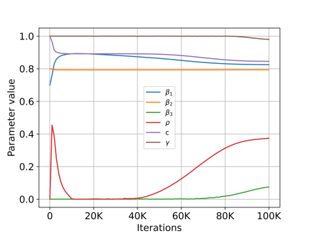
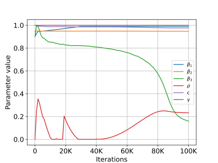
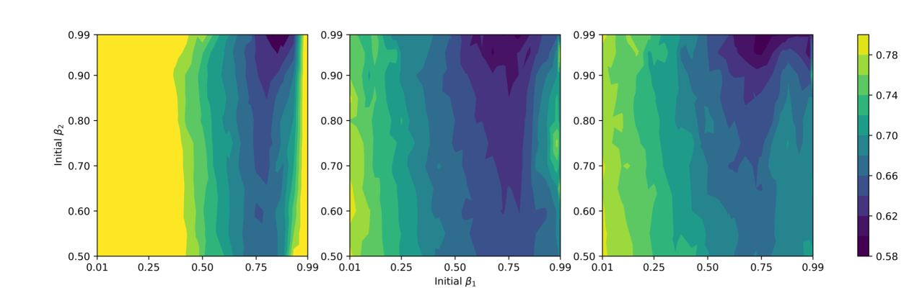
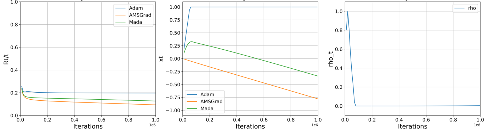

# MADA：一种通过超梯度下降实现的元自适应优化器技术

发布时间：2024年02月15日

`LLM理论` `优化算法`

> MADA: Meta-Adaptive Optimizers through hyper-gradient Descent

# 摘要

> 自从 Adam 算法问世后，便涌现出多款创新的深度学习自适应优化器。尽管这些优化器在特定任务上表现优异，但并非总能在所有任务上超越 Adam。本研究提出了一种名为元自适应优化器（MADA）的全新统一优化框架，它能够整合多种已知优化器，并在训练过程中智能选择最合适的算法。MADA 的核心策略在于对优化器参数空间进行建模，并通过超梯度下降法进行搜索。我们对 MADA 进行了广泛的实验，包括视觉和语言任务，以及 CNN、ResNet 和 GPT-2 模型的训练，与其他主流优化器相比，MADA 在超参数调整不佳的情况下仍展现出强大的鲁棒性，并持续超越了 Adam 及其他流行优化器。实验结果显示，在 GPT-2 训练过程中，MADA 带来的验证性能提升是其他优化器的三倍。此外，我们还提出了 AVGrad，这是对 AMSGrad 的一种改进，它通过平均而非最大操作来适应超梯度优化框架。最终，我们还进行了收敛性分析，证实了优化器的插值方法能够提升其误差界限（至多常数倍），这为元优化器的优势提供了有力证据。

> Since Adam was introduced, several novel adaptive optimizers for deep learning have been proposed. These optimizers typically excel in some tasks but may not outperform Adam uniformly across all tasks. In this work, we introduce Meta-Adaptive Optimizers (MADA), a unified optimizer framework that can generalize several known optimizers and dynamically learn the most suitable one during training. The key idea in MADA is to parameterize the space of optimizers and search through it using hyper-gradient descent. We compare MADA to other popular optimizers empirically on vision and language tasks to train CNN, ResNet and GPT-2 models. Results suggest that MADA is robust against sub-optimally tuned hyper-parameters, and consistently outperforms Adam and other popular optimizers. We find that MADA gives $3\times$ the validation performance gain over Adam that other popular optimizers do on GPT-2 training. We also propose AVGrad, a modification of AMSGrad that replaces the maximum operator with averaging, that is suitable for hyper-gradient optimization framework. Finally, we provide a convergence analysis to show that interpolation of optimizers can improve their error bounds (up to constants), hinting at an advantage for meta-optimizers.

[Arxiv](https://arxiv.org/abs/2401.08893)