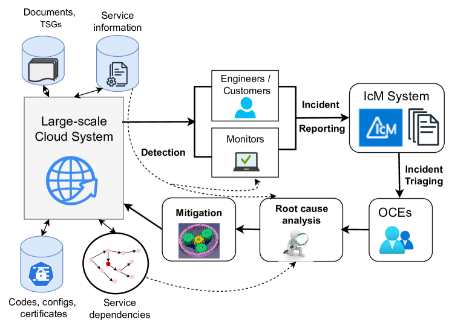

# 通过大型语言模型实现云事件管理的全生命周期学习策略。

发布时间：2024年02月15日

`LLM应用` `云计算` `事故处理`

> X-lifecycle Learning for Cloud Incident Management using LLMs

# 摘要

> 大型云服务的事故处理既复杂又繁琐，值班工程师（OCEs）需付出大量手动劳动。他们通常依靠软件开发生命周期（SDLC）各阶段的数据（如代码、配置、监控等）来洞察事故的检测、定位和缓解。最新的大型语言模型（如ChatGPT、GPT-4等）为自动生成有针对性的建议提供了可能，帮助工程师迅速识别和处理关键问题。然而，传统研究往往只关注利用SDLC某一阶段的数据来解决特定任务。本文证明，结合SDLC多个阶段的上下文数据，能显著提升两项关键且富有挑战性任务的效能：一是自动推荐依赖失败事故的根本原因；二是识别用于自动发现事故的服务监控本体。利用微软提供的353个事故案例和260个监控数据，我们展示了这种方法相较于现有顶尖技术的优势。

> Incident management for large cloud services is a complex and tedious process and requires significant amount of manual efforts from on-call engineers (OCEs). OCEs typically leverage data from different stages of the software development lifecycle [SDLC] (e.g., codes, configuration, monitor data, service properties, service dependencies, trouble-shooting documents, etc.) to generate insights for detection, root causing and mitigating of incidents. Recent advancements in large language models [LLMs] (e.g., ChatGPT, GPT-4, Gemini) created opportunities to automatically generate contextual recommendations to the OCEs assisting them to quickly identify and mitigate critical issues. However, existing research typically takes a silo-ed view for solving a certain task in incident management by leveraging data from a single stage of SDLC. In this paper, we demonstrate that augmenting additional contextual data from different stages of SDLC improves the performance of two critically important and practically challenging tasks: (1) automatically generating root cause recommendations for dependency failure related incidents, and (2) identifying ontology of service monitors used for automatically detecting incidents. By leveraging 353 incident and 260 monitor dataset from Microsoft, we demonstrate that augmenting contextual information from different stages of the SDLC improves the performance over State-of-The-Art methods.

[Arxiv](https://arxiv.org/abs/2404.03662)