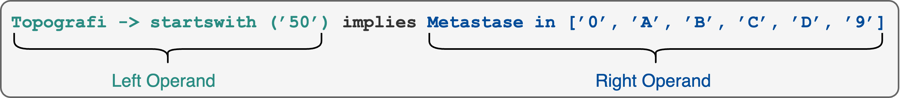
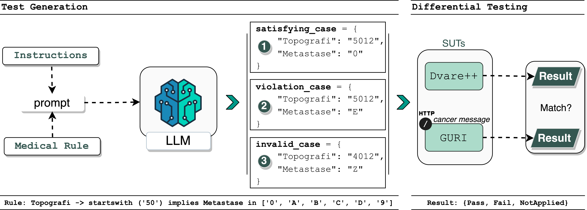
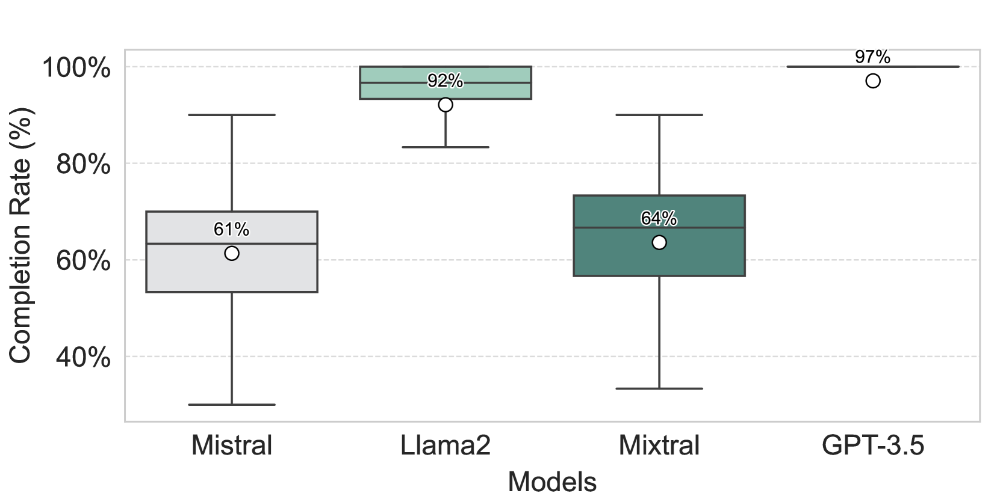
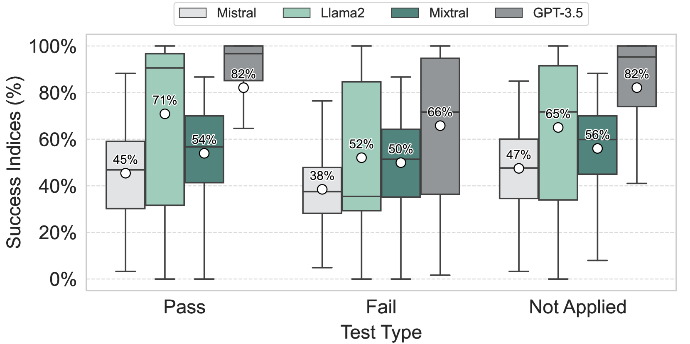
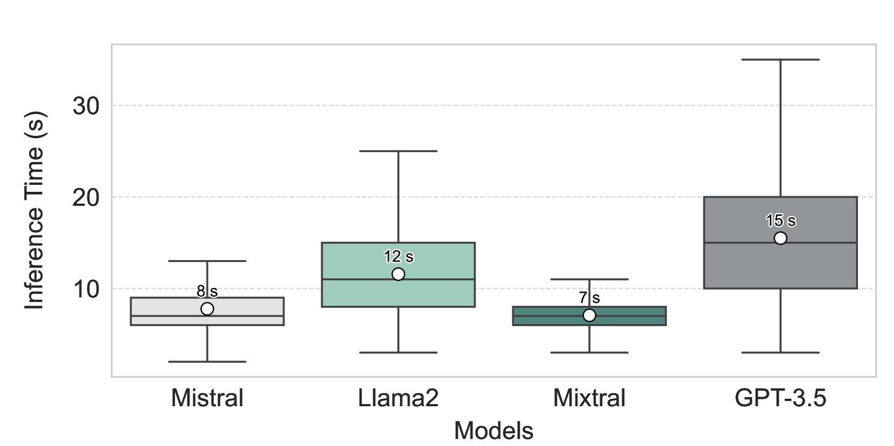
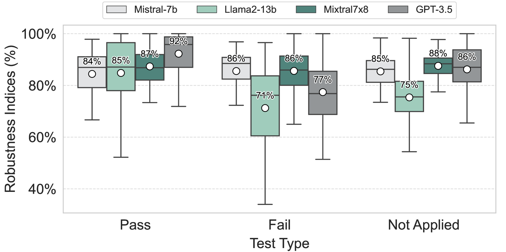

# 大型语言模型成为差异测试的核心：探索医学规则引擎的案例分析

发布时间：2024年02月16日

`LLM应用` `癌症登记` `数据验证`

> LLMs in the Heart of Differential Testing: A Case Study on a Medical Rule Engine

# 摘要

> 挪威癌症登记处运用CaReSS系统来辅助核心工作，包括数据收集、整理及为各方制作数据产品和统计信息。GURI作为CaReSS的关键部分，主要负责依据医学专家根据医学准则、法规和研究成果手动编写的医学规则来验证数据。鉴于大型语言模型（LLMs）已在众多公共信息上接受了训练，我们能够利用这些模型为GURI生成测试。因此，我们设计了一种基于LLM的测试生成与差异性测试方法（LLMeDiff），对GURI进行测试。我们通过四个不同的LLMs、两套医学规则引擎和58条真实医学规则进行了实验，旨在探究LLMs在生成测试时的准确性、成功率、效率和稳定性，以及这些测试发现GURI潜在问题的有效性。研究结果显示，GPT-3.5在准确性上表现最佳，成功率最高，且最为稳定；尽管如此，其效率却是最差的。我们的差异性测试发现了22条存在实施不一致的医学规则。最终，我们根据这些实验结果为业界实践者和研究者提供了深刻的洞见。

> The Cancer Registry of Norway (CRN) uses an automated cancer registration support system (CaReSS) to support core cancer registry activities, i.e, data capture, data curation, and producing data products and statistics for various stakeholders. GURI is a core component of CaReSS, which is responsible for validating incoming data with medical rules. Such medical rules are manually implemented by medical experts based on medical standards, regulations, and research. Since large language models (LLMs) have been trained on a large amount of public information, including these documents, they can be employed to generate tests for GURI. Thus, we propose an LLM-based test generation and differential testing approach (LLMeDiff) to test GURI. We experimented with four different LLMs, two medical rule engine implementations, and 58 real medical rules to investigate the hallucination, success, time efficiency, and robustness of the LLMs to generate tests, and these tests' ability to find potential issues in GURI. Our results showed that GPT-3.5 hallucinates the least, is the most successful, and is generally the most robust; however, it has the worst time efficiency. Our differential testing revealed 22 medical rules where implementation inconsistencies were discovered (e.g., regarding handling rule versions). Finally, we provide insights for practitioners and researchers based on the results.

[Arxiv](https://arxiv.org/abs/2404.03664)