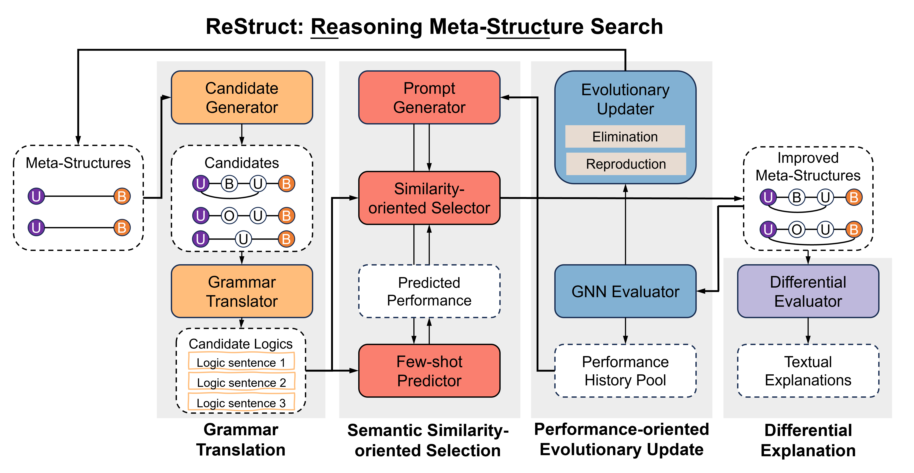
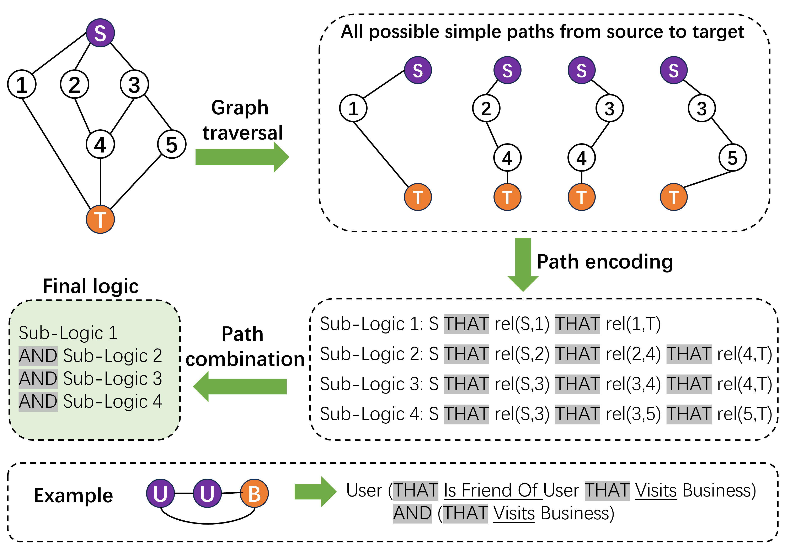
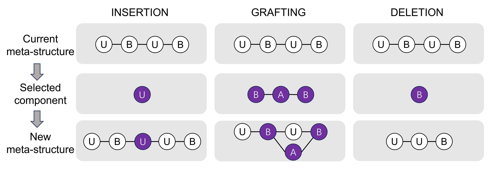
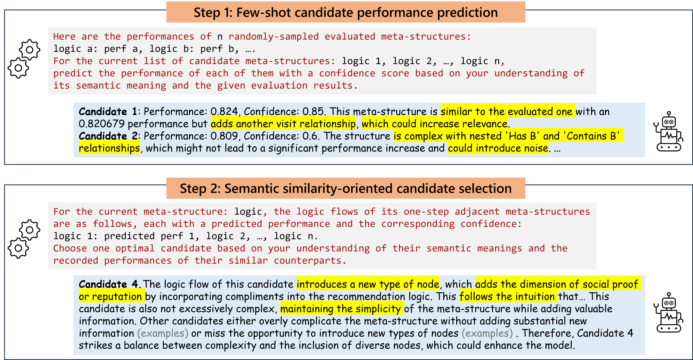
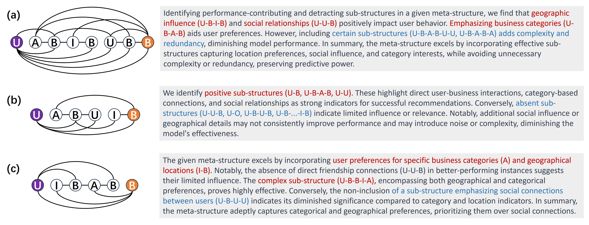
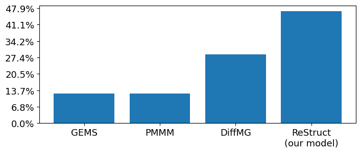
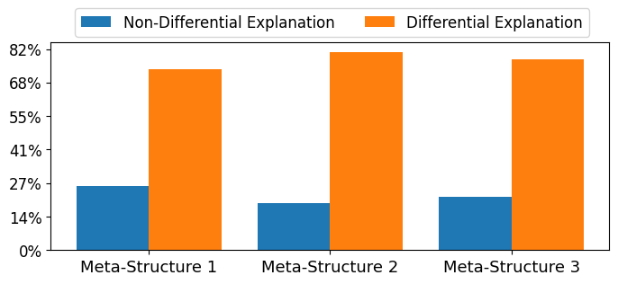
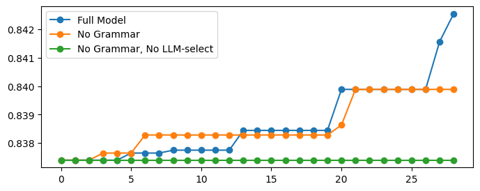
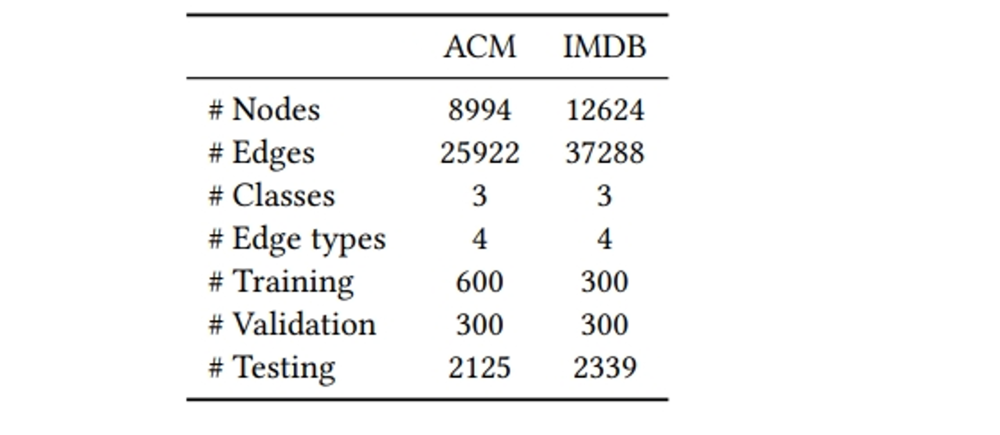
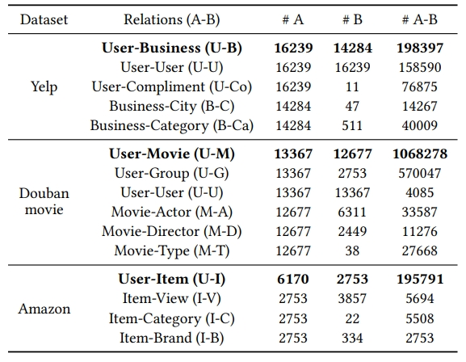

# 利用大型语言模型探索异构信息网络中的元结构

发布时间：2024年02月18日

`LLM应用

这篇论文介绍了一种名为ReStruct的框架，它利用大型语言模型（LLMs）的推理能力来优化异构信息网络（HIN）中的元结构搜索。该框架通过将元结构转化为自然语言表述，并利用LLMs评估其语义合理性，同时结合性能导向的进化策略来优化元结构的解释性和实际表现。这种方法不仅提升了元结构的经验预测能力，还增强了其解释性，使得生成的元结构更加易于理解和应用。因此，这篇论文属于LLM应用类别，因为它展示了如何将LLMs应用于特定的技术问题（即元结构搜索），并取得了显著的实际效果。` `数据挖掘` `图神经网络`

> Large Language Model-driven Meta-structure Discovery in Heterogeneous Information Network

# 摘要

> 异构信息网络（HIN）因其能捕捉多样节点间的复杂关系而备受瞩目。元结构的概念应运而生，旨在揭示HIN中的关键关系模式，有效提升了语义信息的提取，并助力图神经网络塑造更具表达力的表示。尽管如此，手工定制的元结构在规模扩展上遭遇瓶颈，激发了对自动元结构搜索算法的广泛研究。以往研究多聚焦于提升元结构的经验预测能力，却忽视了其解释性，导致所生成的元结构往往过拟合且晦涩难懂。为此，我们借鉴大型语言模型（LLMs）的推理潜能，创新性地提出了推理元结构搜索（ReStruct）框架，将LLM的推理能力融入进化搜索过程。ReStruct通过语法翻译器将元结构转化为自然语言表述，并借助LLMs评估其语义合理性。同时，ReStruct采用性能导向的进化策略，两者协同作用，旨在优化元结构的解释性与实际表现。我们还开发了差分LLM解释器，为元结构提供自然语言解释，并通过推理搜索历程不断精炼解释。实验结果显示，ReStruct在节点分类与链接推荐任务中表现卓越，达到行业领先水平。一项涵盖73名研究生的调查进一步证实，ReStruct所产出的元结构及解释显著提升了可理解性。

> Heterogeneous information networks (HIN) have gained increasing popularity for being able to capture complex relations between nodes of diverse types. Meta-structure was proposed to identify important patterns of relations on HIN, which has been proven effective for extracting rich semantic information and facilitating graph neural networks to learn expressive representations. However, hand-crafted meta-structures pose challenges for scaling up, which draws wide research attention for developing automatic meta-structure search algorithms. Previous efforts concentrate on searching for meta-structures with good empirical prediction performance, overlooking explainability. Thus, they often produce meta-structures prone to overfitting and incomprehensible to humans. To address this, we draw inspiration from the emergent reasoning abilities of large language models (LLMs). We propose a novel REasoning meta-STRUCTure search (ReStruct) framework that integrates LLM reasoning into the evolutionary procedure. ReStruct uses a grammar translator to encode meta-structures into natural language sentences, and leverages the reasoning power of LLMs to evaluate semantically feasible meta-structures. ReStruct also employs performance-oriented evolutionary operations. These two competing forces jointly optimize for semantic explainability and empirical performance of meta-structures. We also design a differential LLM explainer that can produce natural language explanations for the discovered meta-structures, and refine the explanation by reasoning through the search history. Experiments on five datasets demonstrate ReStruct achieve SOTA performance in node classification and link recommendation tasks. Additionally, a survey study involving 73 graduate students shows that the meta-structures and natural language explanations generated by ReStruct are substantially more comprehensible.

[Arxiv](https://arxiv.org/abs/2402.11518)