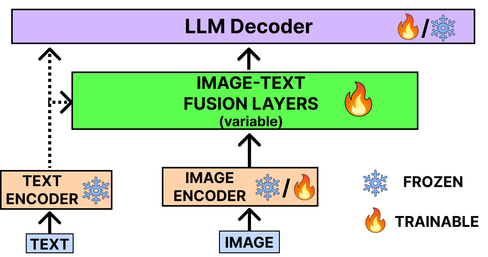

# 本文综述了视觉-语言模型的研究现状，探讨了各种方法论，并展望了未来的发展方向。

发布时间：2024年02月20日

`LLM应用` `视觉-语言模型` `多模态学习`

> Exploring the Frontier of Vision-Language Models: A Survey of Current Methodologies and Future Directions

# 摘要

> 随着大型语言模型（LLMs）的兴起，人工智能的发展方向发生了重大变革。尽管如此，LLMs在处理视觉信息方面的能力尚显不足。为了弥补这一不足，研究者们开始尝试将视觉功能融入LLMs，催生了视觉-语言模型（VLMs）。VLMs在图像描述、视觉问答等复杂任务中大放异彩。本文通过深入调研，将VLMs分为三大类：专注于视觉与语言理解的模型、将多模态输入转换为单模态（文本）输出的模型，以及能够处理并生成多模态输入输出的模型。我们根据它们处理和生成不同数据模态的能力，对每个模型进行了细致的剖析，包括其基础架构、训练数据来源、优势与局限，以便读者全面掌握其关键要素。同时，我们还对VLMs在多个基准数据集上的表现进行了分析，以期为读者呈现VLMs多样性的深入理解。文章还指出了未来研究的可能方向，预示着该领域的更多创新和进步。

> The advent of Large Language Models (LLMs) has significantly reshaped the trajectory of the AI revolution. Nevertheless, these LLMs exhibit a notable limitation, as they are primarily adept at processing textual information. To address this constraint, researchers have endeavored to integrate visual capabilities with LLMs, resulting in the emergence of Vision-Language Models (VLMs). These advanced models are instrumental in tackling more intricate tasks such as image captioning and visual question answering. In our comprehensive survey paper, we delve into the key advancements within the realm of VLMs. Our classification organizes VLMs into three distinct categories: models dedicated to vision-language understanding, models that process multimodal inputs to generate unimodal (textual) outputs and models that both accept and produce multimodal inputs and outputs.This classification is based on their respective capabilities and functionalities in processing and generating various modalities of data.We meticulously dissect each model, offering an extensive analysis of its foundational architecture, training data sources, as well as its strengths and limitations wherever possible, providing readers with a comprehensive understanding of its essential components. We also analyzed the performance of VLMs in various benchmark datasets. By doing so, we aim to offer a nuanced understanding of the diverse landscape of VLMs. Additionally, we underscore potential avenues for future research in this dynamic domain, anticipating further breakthroughs and advancements.

[Arxiv](https://arxiv.org/abs/2404.07214)