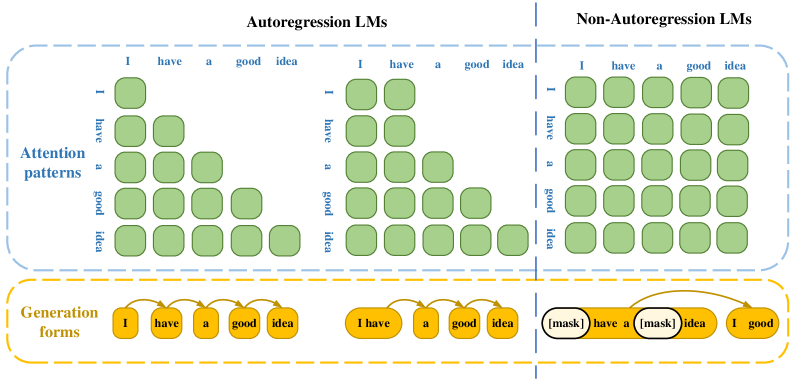
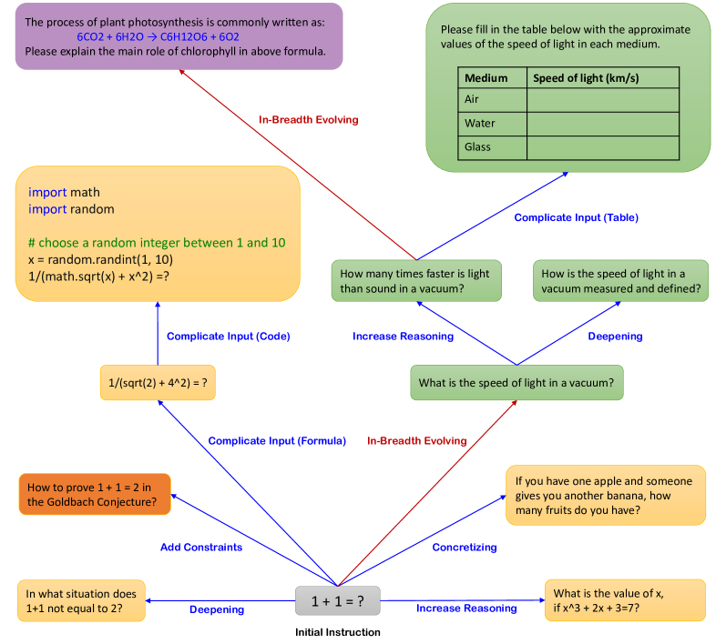
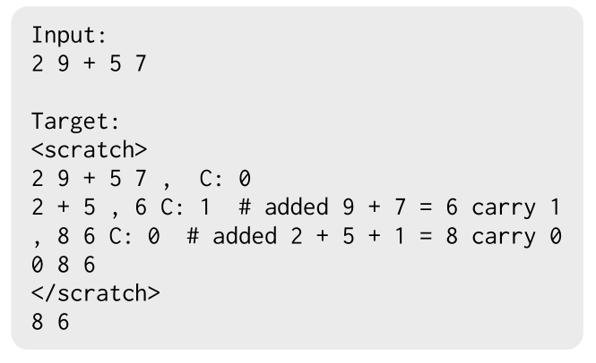
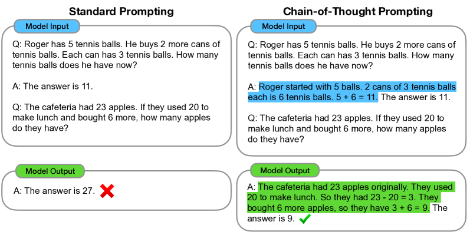
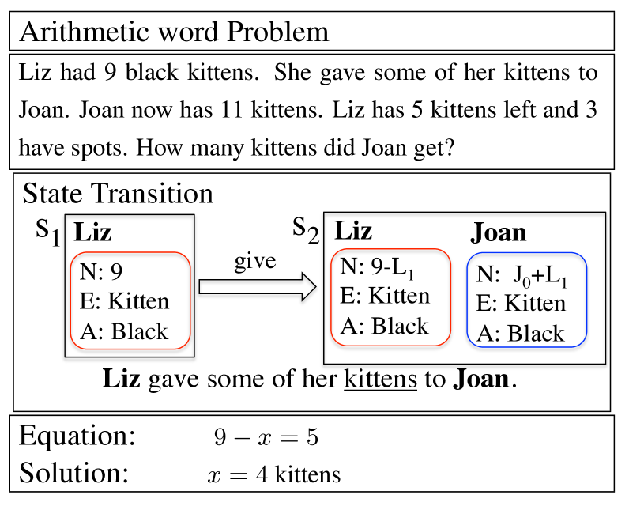
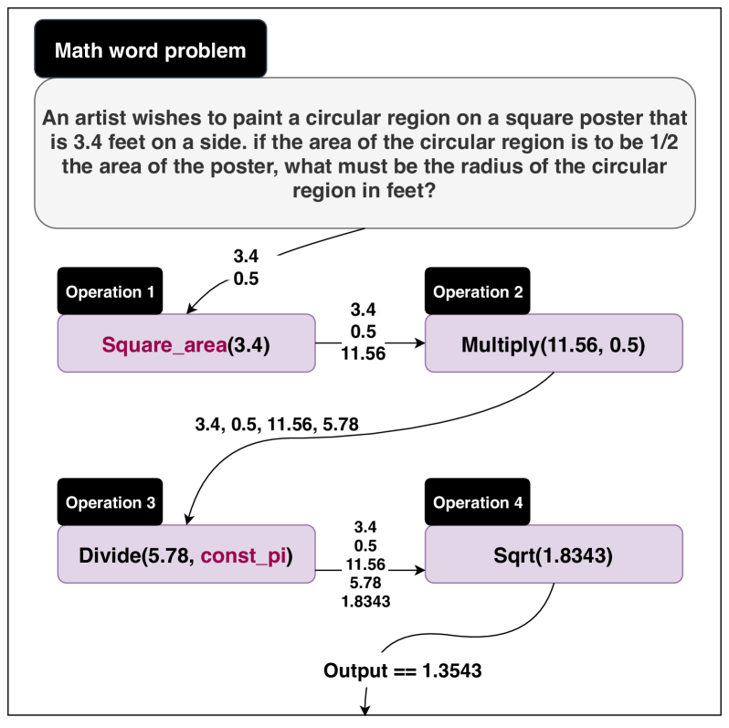
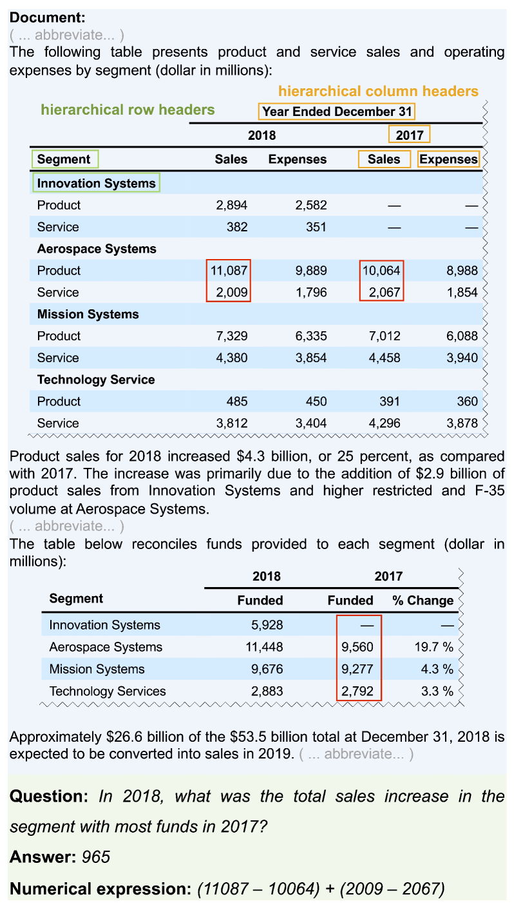
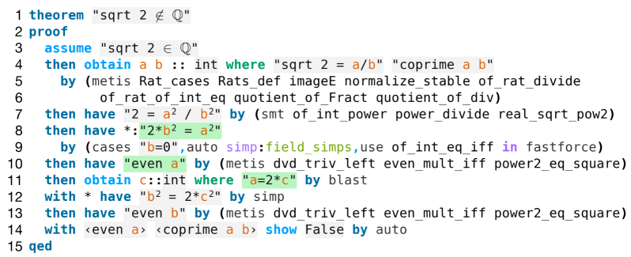

# 数学语言模型综览：探索与洞察

发布时间：2024年02月23日

`LLM理论

理由：这篇论文摘要主要关注的是预训练语言模型（PLMs）和大规模语言模型（LLMs）在数学领域的应用和研究进展。它系统地梳理了该领域的关键研究进展，并详细介绍了多种数学LLMs，以及相关的数据集。这表明论文主要集中在理论层面的探讨和总结，而不是具体的应用实例或Agent的设计与实现。因此，将其归类为LLM理论是合适的。` `人工智能`

> Mathematical Language Models: A Survey

# 摘要

> 近年来，数学领域在利用预训练语言模型（PLMs）和大规模语言模型（LLMs）方面取得了显著进步，本文从任务和方法两个维度，系统梳理了该领域的关键研究进展。综述中详细介绍了多种数学LLMs，涵盖了从基础的CoT技术到高级方法的广泛范围，并整理了超过60个数学数据集，包括训练集、基准集和增强集。本综述不仅指出了当前挑战，还展望了未来发展方向，旨在为致力于推动该领域发展的研究者提供灵感和支持。

> In recent years, there has been remarkable progress in leveraging Language Models (LMs), encompassing Pre-trained Language Models (PLMs) and Large-scale Language Models (LLMs), within the domain of mathematics. This paper conducts a comprehensive survey of mathematical LMs, systematically categorizing pivotal research endeavors from two distinct perspectives: tasks and methodologies. The landscape reveals a large number of proposed mathematical LLMs, which are further delineated into instruction learning, tool-based methods, fundamental CoT techniques, and advanced CoT methodologies. In addition, our survey entails the compilation of over 60 mathematical datasets, including training datasets, benchmark datasets, and augmented datasets. Addressing the primary challenges and delineating future trajectories within the field of mathematical LMs, this survey is positioned as a valuable resource, poised to facilitate and inspire future innovation among researchers invested in advancing this domain.

[Arxiv](https://arxiv.org/abs/2312.07622)