# 大型语言模型的MetaTool基准：抉择工具之用与选择之道

发布时间：2024年02月23日

`Agent

这篇论文主要探讨了大型语言模型（LLMs）在智能代理应用中的工具使用能力，特别是在AutoGPT和MetaGPT等系统中，LLMs如何进行复杂决策以选择和使用工具来响应用户需求。论文提出了MetaTool基准和ToolE数据集，用于测试LLMs的工具使用意识和选择能力，并进行了实验分析。这与智能代理（Agent）的概念紧密相关，因为智能代理需要具备自主决策和执行任务的能力，包括选择和使用工具。因此，这篇论文应归类于Agent分类。` `智能代理`

> MetaTool Benchmark for Large Language Models: Deciding Whether to Use Tools and Which to Use

# 摘要

> 大型语言模型（LLMs）因其卓越的自然语言处理能力而备受瞩目。近期研究聚焦于LLMs的工具使用能力，探究它们如何与特定工具高效协作。但在智能代理应用中，如AutoGPT和MetaGPT，LLMs需进行复杂决策，决定是否使用工具及如何从众多工具中挑选最合适的以响应用户需求。为此，我们提出了MetaTool基准，旨在测试LLMs是否具备工具使用意识及正确选择工具的能力。我们构建了ToolE数据集，包含多种触发LLMs使用工具的用户查询，涵盖单工具与多工具情境。我们设定了工具使用意识和工具选择的任务，并从不同角度细分为四个子任务。实验涵盖了八种主流LLMs，结果显示多数LLMs在工具选择上仍显不足，揭示了与真正智能代理的差距。尽管如此，错误分析表明改进空间巨大。最后，我们建议工具开发者为下游LLM选择合适的重写模型，以生成适用于其工具的新描述。我们的代码已公开在GitHub上。

> Large language models (LLMs) have garnered significant attention due to their impressive natural language processing (NLP) capabilities. Recently, many studies have focused on the tool utilization ability of LLMs. They primarily investigated how LLMs effectively collaborate with given specific tools. However, in scenarios where LLMs serve as intelligent agents, as seen in applications like AutoGPT and MetaGPT, LLMs are expected to engage in intricate decision-making processes that involve deciding whether to employ a tool and selecting the most suitable tool(s) from a collection of available tools to fulfill user requests. Therefore, in this paper, we introduce MetaTool, a benchmark designed to evaluate whether LLMs have tool usage awareness and can correctly choose tools. Specifically, we create a dataset called ToolE within the benchmark. This dataset contains various types of user queries in the form of prompts that trigger LLMs to use tools, including both single-tool and multi-tool scenarios. Subsequently, we set the tasks for both tool usage awareness and tool selection. We define four subtasks from different perspectives in tool selection, including tool selection with similar choices, tool selection in specific scenarios, tool selection with possible reliability issues, and multi-tool selection. We conduct experiments involving eight popular LLMs and find that the majority of them still struggle to effectively select tools, highlighting the existing gaps between LLMs and genuine intelligent agents. However, through the error analysis, we found there is still significant room for improvement. Finally, we conclude with insights for tool developers -- we strongly recommend that tool developers choose an appropriate rewrite model for generating new descriptions based on the downstream LLM the tool will apply to. Our code is in https://github.com/HowieHwong/MetaTool.

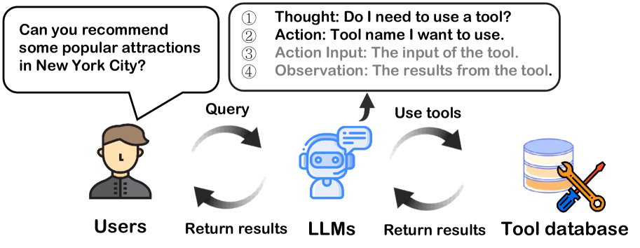

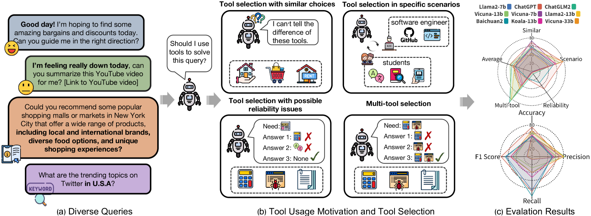

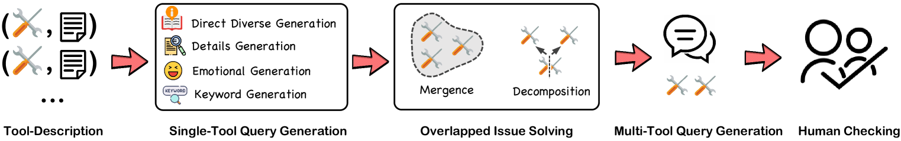

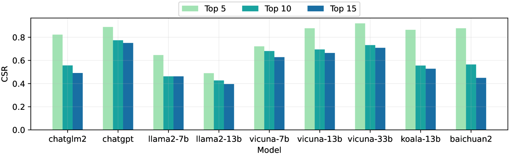

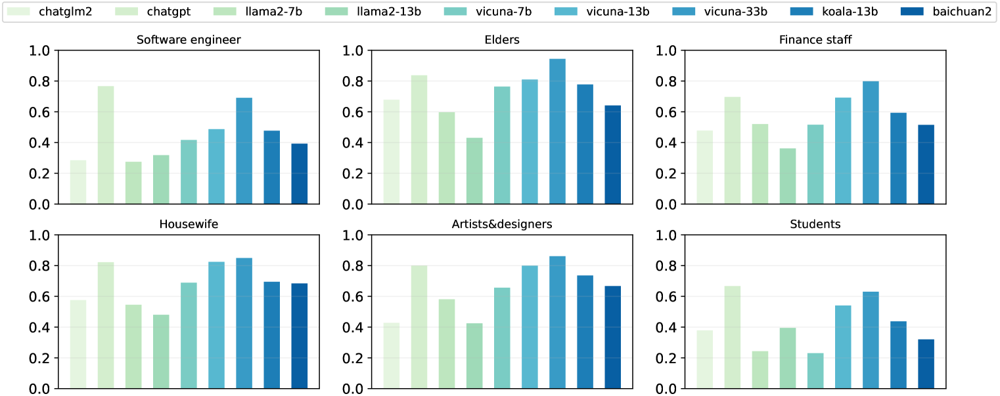

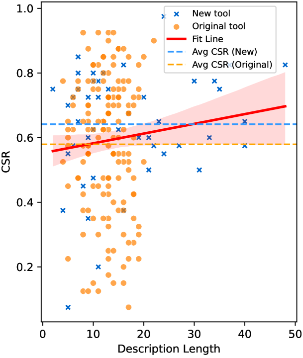

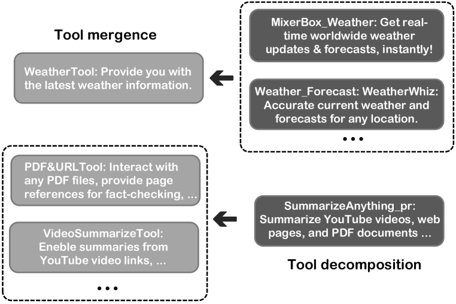

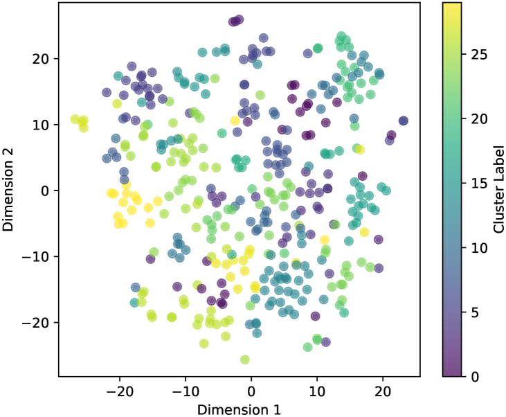

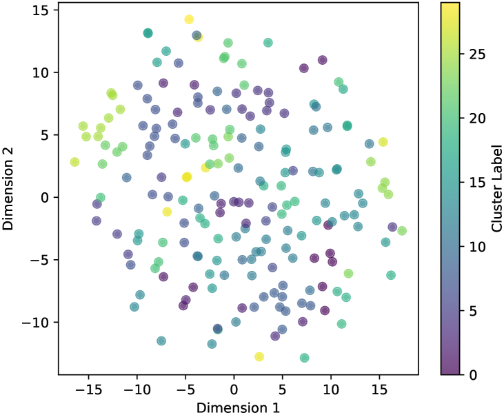

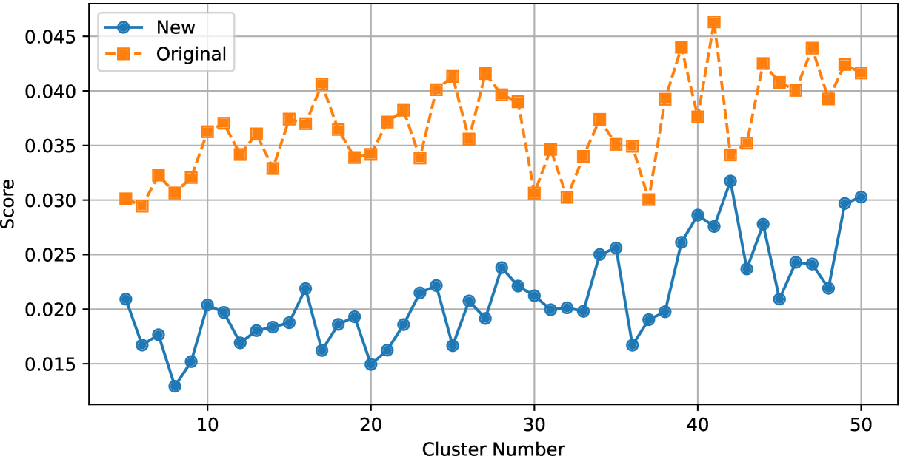

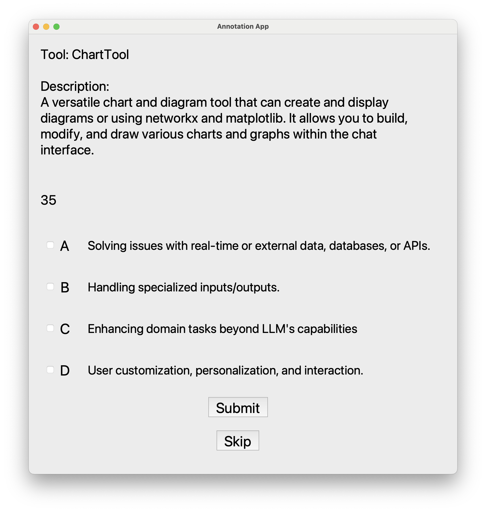

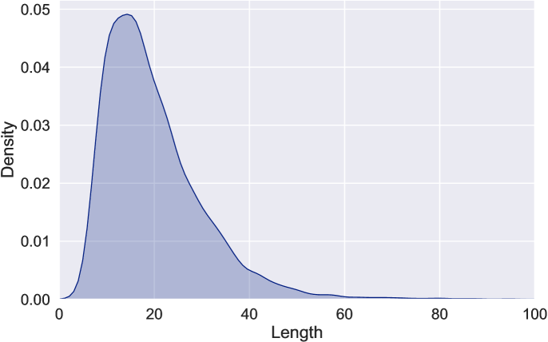

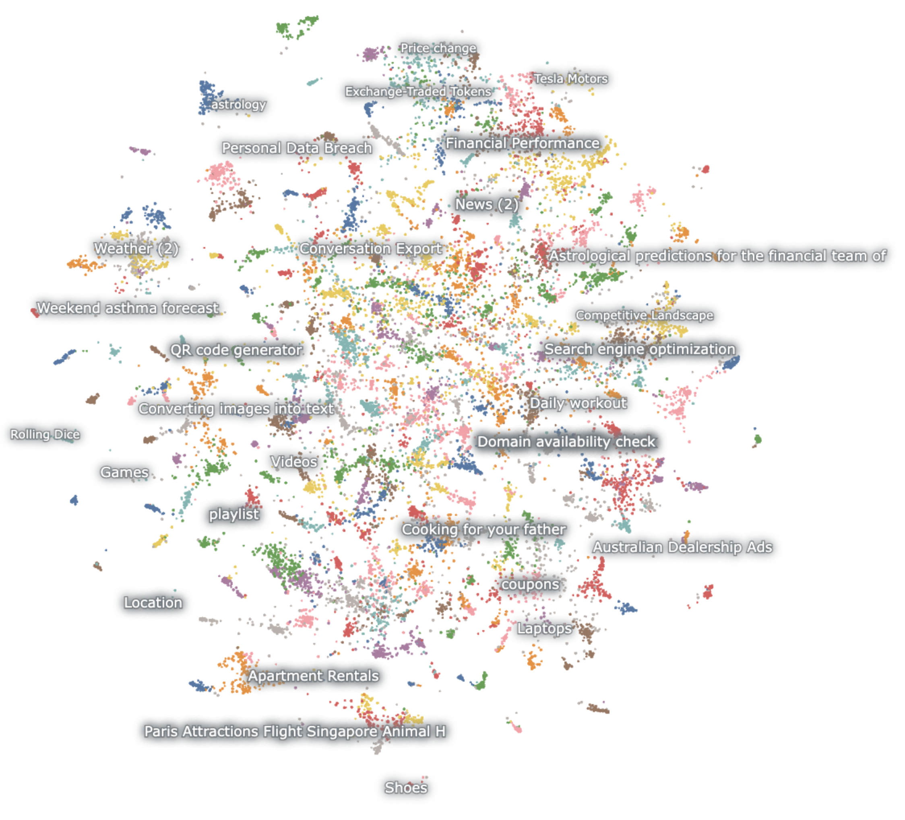

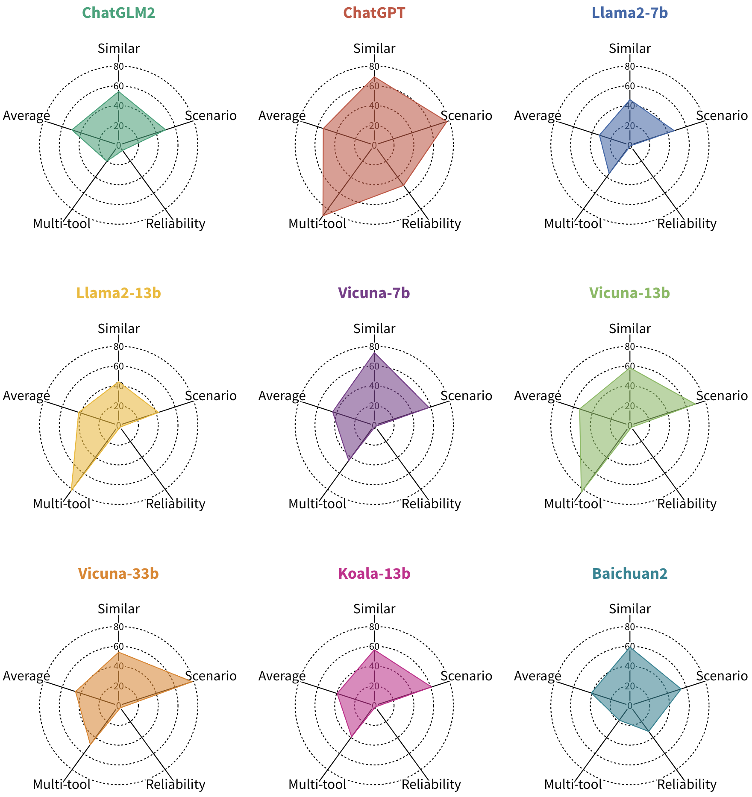

[Arxiv](https://arxiv.org/abs/2310.03128)