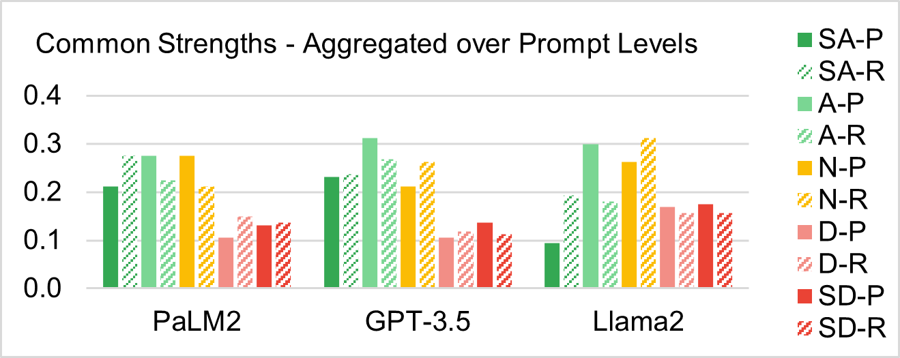
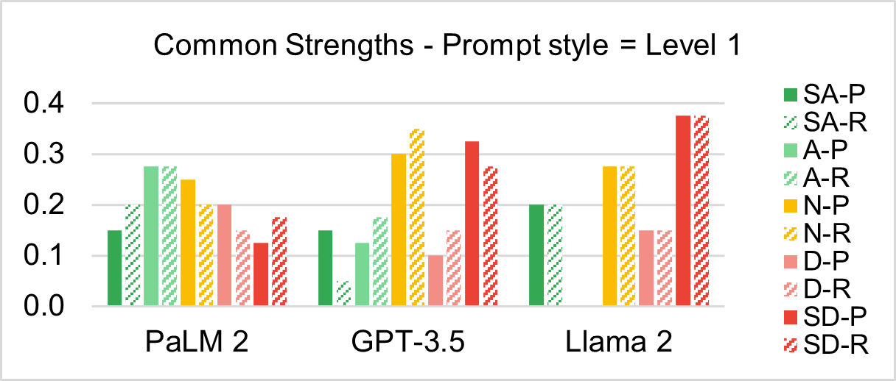
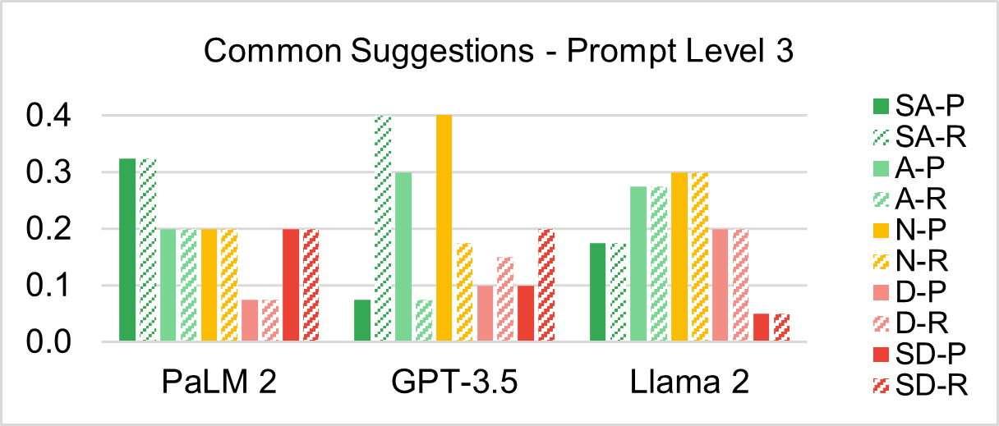

# 引导大型语言模型（LLM）基于学术手稿的同行评审叙述，撰写出元评论的初稿。

发布时间：2024年02月23日

`LLM应用` `学术评审` `人工智能`

> Prompting LLMs to Compose Meta-Review Drafts from Peer-Review Narratives of Scholarly Manuscripts

# 摘要

> 学术同行评审中，撰写元评审是一项至关重要且颇为艰巨的工作，它要求我们基于众多专家的评审意见，深入理解一篇学术论文的核心贡献、优势与不足，并将其综合为一份精炼的全面概述。随着生成性人工智能，尤其是大型语言模型（LLMs）的飞速发展，探索LLMs在学术评审中撰写元评审的潜力变得尤为引人入胜。本文通过三个广受欢迎的LLMs——GPT-3.5、LLaMA2和PaLM2——进行了一项案例研究，我们利用基于TELeR分类法设计的不同类型和层次的提示，引导这些模型自动生成元评审。最终，我们对这些LLMs生成的元评审进行了深入的定性分析，并归纳了我们的发现和建议，为如何有效地引导LLMs完成这一复杂任务提供了指导。

> One of the most important yet onerous tasks in the academic peer-reviewing process is composing meta-reviews, which involves understanding the core contributions, strengths, and weaknesses of a scholarly manuscript based on peer-review narratives from multiple experts and then summarizing those multiple experts' perspectives into a concise holistic overview. Given the latest major developments in generative AI, especially Large Language Models (LLMs), it is very compelling to rigorously study the utility of LLMs in generating such meta-reviews in an academic peer-review setting. In this paper, we perform a case study with three popular LLMs, i.e., GPT-3.5, LLaMA2, and PaLM2, to automatically generate meta-reviews by prompting them with different types/levels of prompts based on the recently proposed TELeR taxonomy. Finally, we perform a detailed qualitative study of the meta-reviews generated by the LLMs and summarize our findings and recommendations for prompting LLMs for this complex task.

[Arxiv](https://arxiv.org/abs/2402.15589)