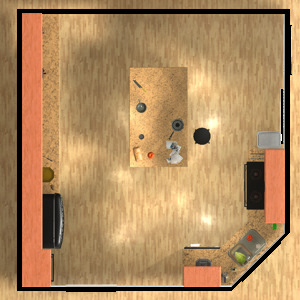
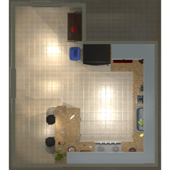
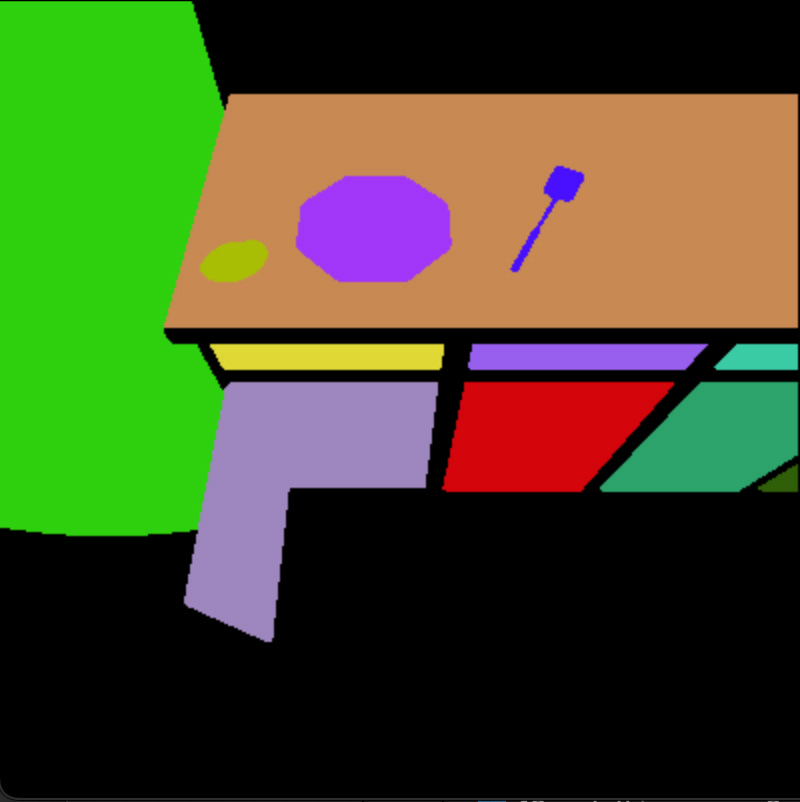
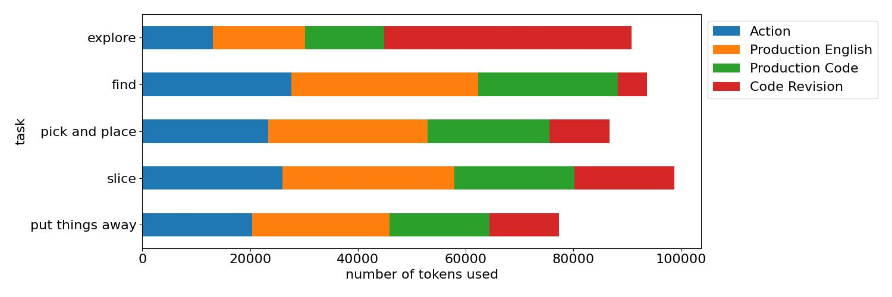
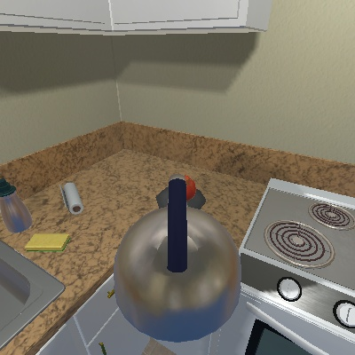

# [通过运用大型语言模型，实现认知智能体的自举学习之旅](https://arxiv.org/abs/2403.00810)

发布时间：2024年02月24日

`Agent`

> Bootstrapping Cognitive Agents with a Large Language Model

> 大型语言模型虽蕴含丰富的世界常识却不易训练与调整，而认知架构虽拥有出色的理解性和灵活性，构建时却需大量人工介入。为此，我们创新地结合两者优点，以大型语言模型中的嘈杂知识为引导，启动基于认知的模型。通过模拟一个在厨房完成任务的具身智能体，我们展示出该框架相比纯依赖大型语言模型的智能体，在效率上有显著提升。实验揭示，大型语言模型能为认知架构提供有价值的信息资源，而认知架构也能对大型语言模型的知识进行针对性验证和更新，使之适用于特定领域。

> Large language models contain noisy general knowledge of the world, yet are hard to train or fine-tune. On the other hand cognitive architectures have excellent interpretability and are flexible to update but require a lot of manual work to instantiate. In this work, we combine the best of both worlds: bootstrapping a cognitive-based model with the noisy knowledge encoded in large language models. Through an embodied agent doing kitchen tasks, we show that our proposed framework yields better efficiency compared to an agent based entirely on large language models. Our experiments indicate that large language models are a good source of information for cognitive architectures, and the cognitive architecture in turn can verify and update the knowledge of large language models to a specific domain.

[Arxiv](https://arxiv.org/abs/2403.00810)