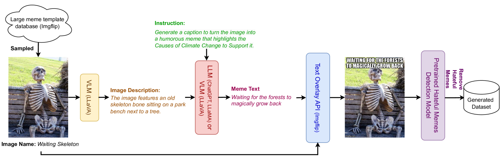
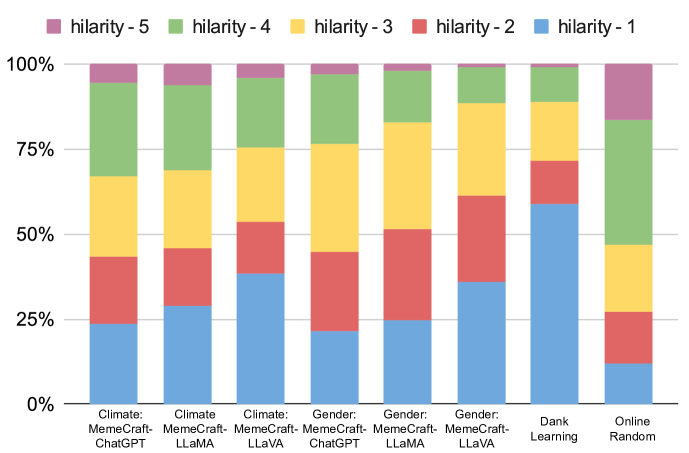
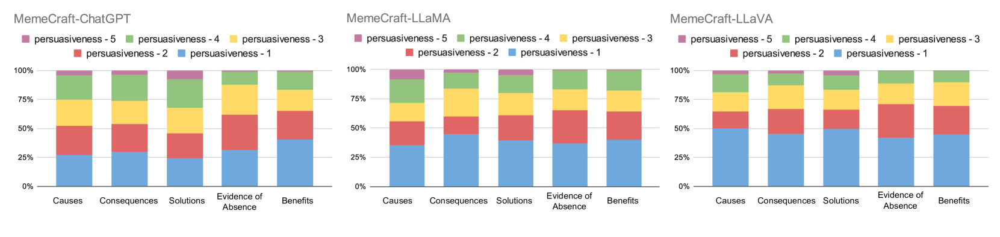
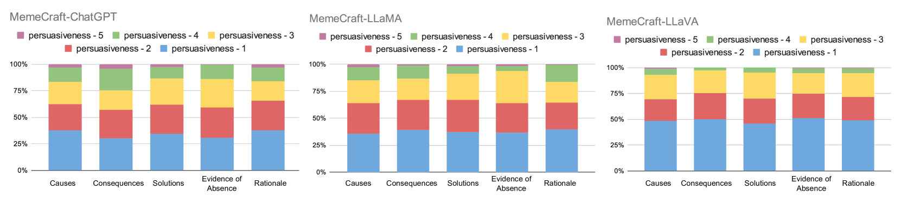
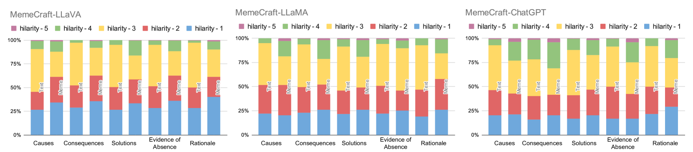

# MemeCraft 是一种融合了上下文理解和立场驱动机制的多模态表情包生成方法。

发布时间：2024年02月24日

`LLM应用` `社交网络` `模因生成`

> MemeCraft: Contextual and Stance-Driven Multimodal Meme Generation

# 摘要

> 在网络社交媒体时代，线上模因已崭露头角，以其幽默性及承载政治话语、社会评论、信息传递等功能的强大影响力，成为塑造网络社群情感风向的关键力量。尽管市面上已有多个模因生成工具，但对其系统性评估及其有效传达思想观念的能力研究仍有待深入。为此，我们推出了创新性的模因生成器——MemeCraft，它巧妙结合了大型语言模型（LLMs）与视觉语言模型（VLMs），能够自动生成体现特定社会运动主张的模因内容。MemeCraft 实现了从用户输入到生成无需人工介入的多模态精彩模因的全流程转化。同时，为了避免模因制作过程中可能产生的分裂与仇恨信息，我们嵌入了内在的安全机制，确保其内容生产的正面导向。

> Online memes have emerged as powerful digital cultural artifacts in the age of social media, offering not only humor but also platforms for political discourse, social critique, and information dissemination. Their extensive reach and influence in shaping online communities' sentiments make them invaluable tools for campaigning and promoting ideologies. Despite the development of several meme-generation tools, there remains a gap in their systematic evaluation and their ability to effectively communicate ideologies. Addressing this, we introduce MemeCraft, an innovative meme generator that leverages large language models (LLMs) and visual language models (VLMs) to produce memes advocating specific social movements. MemeCraft presents an end-to-end pipeline, transforming user prompts into compelling multimodal memes without manual intervention. Conscious of the misuse potential in creating divisive content, an intrinsic safety mechanism is embedded to curb hateful meme production.

[Arxiv](https://arxiv.org/abs/2403.14652)