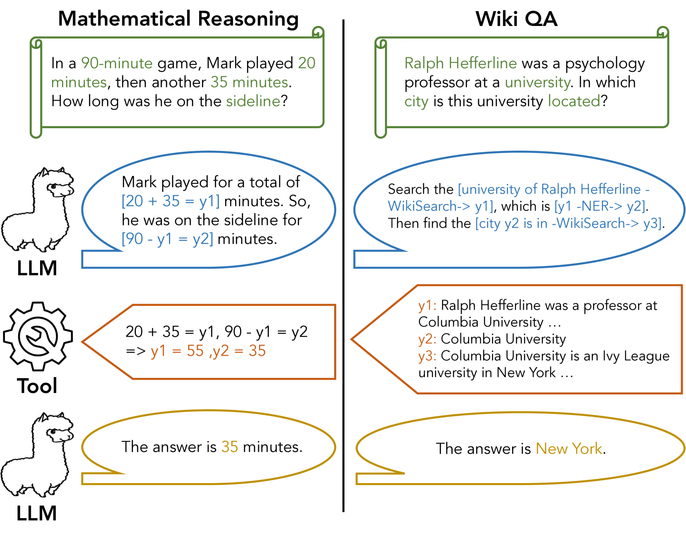
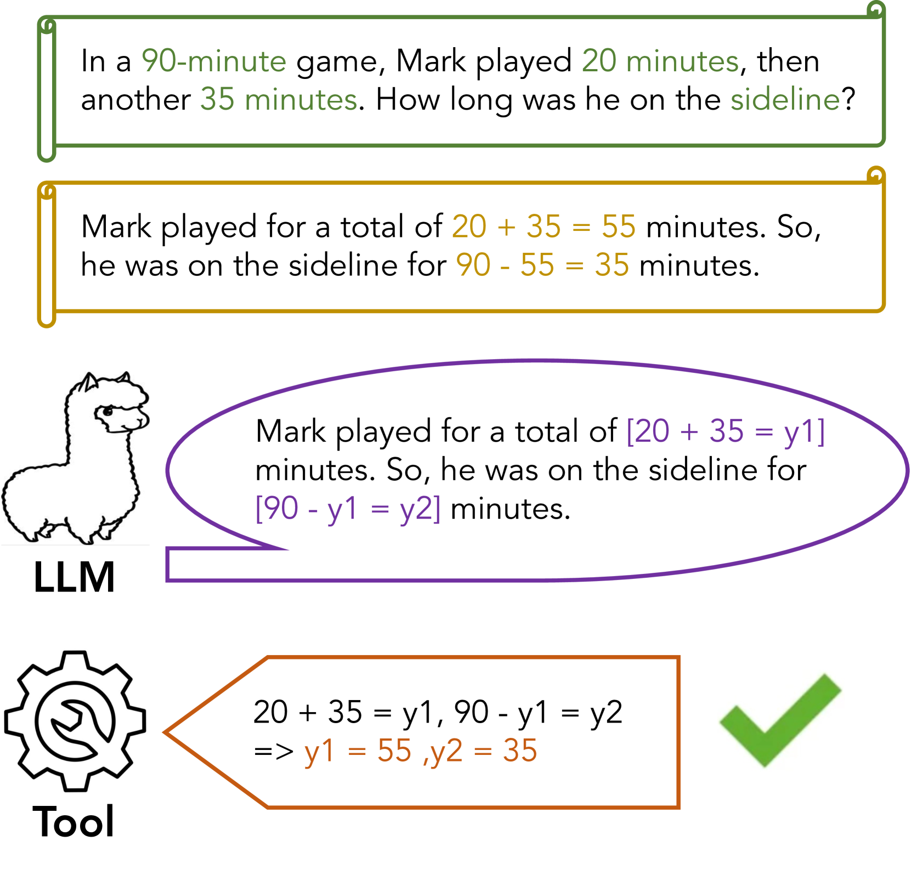
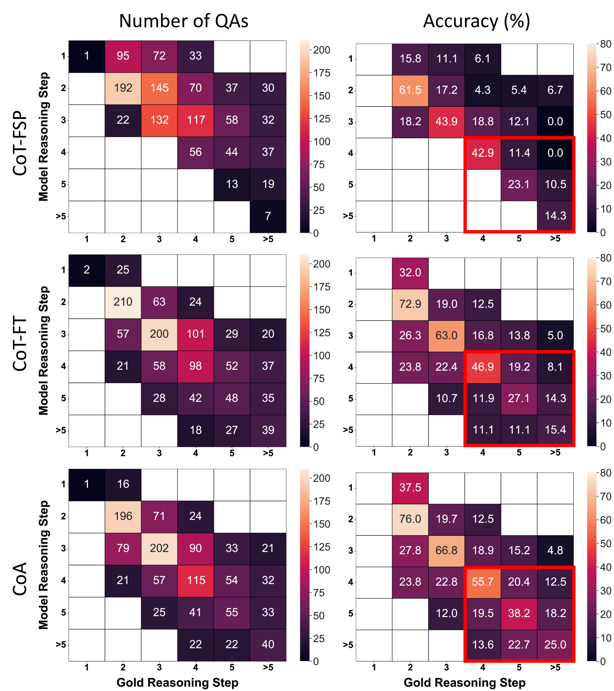
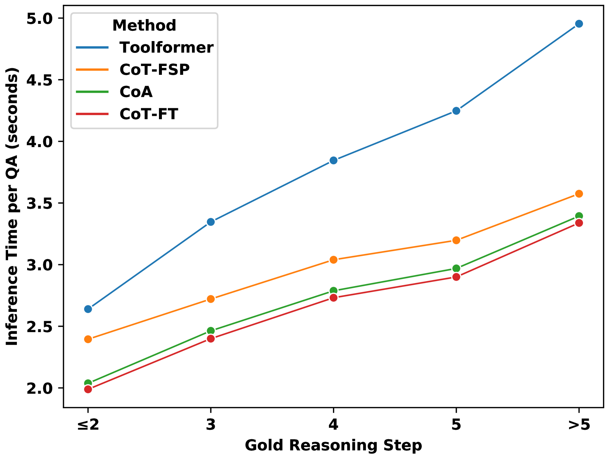

# 通过抽象层次链推理实现高效工具运用

发布时间：2024年02月26日

`分类：LLM应用` `人工智能`

> Efficient Tool Use with Chain-of-Abstraction Reasoning

# 摘要

> 要实现符合人类预期的精准推理，大型语言模型（LLMs）必须将其推理植根于现实世界的知识体系中，如网络信息、数学和物理定律等。尽管现有工具能够帮助LLMs访问这些外部知识库，但在多步推理问题中，如何精准调整LLM代理（如Toolformer）以有效调用工具，仍是一个挑战，这需要对工具调用进行全局和高效的规划。在本研究中，我们提出了一种创新方法，旨在帮助LLMs在多步推理过程中更高效地利用工具。我们的方法称为抽象链（Chain-of-Abstraction，CoA），它训练LLMs首先识别出带有抽象占位符的推理链条，随后调用专业工具来填充具体知识，从而实现每个推理链条。这种基于抽象链条的规划方法不仅使LLMs能够掌握更为通用的推理策略，增强了对知识领域变化（如数学结果）的适应性，还能让LLMs同时进行解码和调用外部工具的操作，有效避免了因等待工具响应而产生的推理延迟。在数学推理和Wiki问答（Wiki QA）领域，我们的实验结果表明，相较于传统的链式思考和工具辅助方法，CoA方法在处理分布内和分布外测试集时，平均QA准确度提升了约6%，并且训练出的LLM代理在使用工具时更为高效，推理速度平均快了约1.4倍。

> To achieve faithful reasoning that aligns with human expectations, large language models (LLMs) need to ground their reasoning to real-world knowledge (e.g., web facts, math and physical rules). Tools help LLMs access this external knowledge, but there remains challenges for fine-tuning LLM agents (e.g., Toolformer) to invoke tools in multi-step reasoning problems, where inter-connected tool calls require holistic and efficient tool usage planning.
  In this work, we propose a new method for LLMs to better leverage tools in multi-step reasoning. Our method, Chain-of-Abstraction (CoA), trains LLMs to first decode reasoning chains with abstract placeholders, and then call domain tools to reify each reasoning chain by filling in specific knowledge. This planning with abstract chains enables LLMs to learn more general reasoning strategies, which are robust to shifts of domain knowledge (e.g., math results) relevant to different reasoning questions. It also allows LLMs to perform decoding and calling of external tools in parallel, which avoids the inference delay caused by waiting for tool responses. In mathematical reasoning and Wiki QA domains, we show that our method consistently outperforms previous chain-of-thought and tool-augmented baselines on both in-distribution and out-of-distribution test sets, with an average ~6% absolute QA accuracy improvement. LLM agents trained with our method also show more efficient tool use, with inference speed being on average ~1.4x faster than baseline tool-augmented LLMs.

[Arxiv](https://arxiv.org/abs/2401.17464)