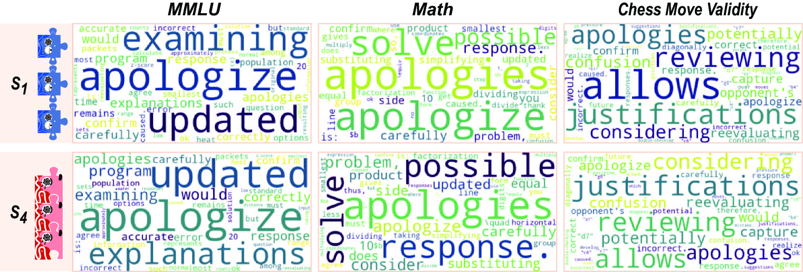

# 探究大型语言模型（LLM）代理协作机制的社会心理学视角

发布时间：2024年02月26日

`分类：LLM应用` `人工智能`

> Exploring Collaboration Mechanisms for LLM Agents: A Social Psychology View

# 摘要

> 自然语言处理（NLP）系统在日益复杂的社会环境中得到广泛应用，引发了一个关键问题：这些系统是否能够模拟人类般的协作智慧，特别是在由众多大型语言模型（LLMs）构成的多智能体社会中？本研究通过结合实证实验与理论分析，深入探讨了当前NLP系统间的协作机制。我们设计了四个各具特色的“社会”，每个社会由具有特定“性格”（如随和或自负）的LLM智能体组成，它们以独特的“思考方式”（如辩论或沉思）进行互动。在对这些多智能体系统进行三个标准数据集的评估后，我们发现某些协作策略不仅超越了先前的最佳方法，还提高了效率，减少了API令牌的使用。此外，研究结果还揭示了LLM智能体展现出的类人社会行为，如遵从性和达成共识，这与基础社会心理学理论相呼应。总结而言，我们结合社会心理学的见解，对LLM智能体的协作进行了情境化分析，激发了对LLMs协作机制更深入研究的动力。我们承诺公开我们的代码和数据集\footnote{\url{https://github.com/zjunlp/MachineSoM}.}，以期推动这一充满希望的研究领域的发展。

> As Natural Language Processing (NLP) systems are increasingly employed in intricate social environments, a pressing query emerges: Can these NLP systems mirror human-esque collaborative intelligence, in a multi-agent society consisting of multiple large language models (LLMs)? This paper probes the collaboration mechanisms among contemporary NLP systems by melding practical experiments with theoretical insights. We fabricate four unique `societies' comprised of LLM agents, where each agent is characterized by a specific `trait' (easy-going or overconfident) and engages in collaboration with a distinct `thinking pattern' (debate or reflection). Through evaluating these multi-agent societies on three benchmark datasets, we discern that certain collaborative strategies not only outshine previous top-tier approaches, but also optimize efficiency (using fewer API tokens). Moreover, our results further illustrate that LLM agents manifest human-like social behaviors, such as conformity and consensus reaching, mirroring foundational social psychology theories. In conclusion, we integrate insights from social psychology to contextualize the collaboration of LLM agents, inspiring further investigations into the collaboration mechanism for LLMs. We commit to sharing our code and datasets\footnote{\url{https://github.com/zjunlp/MachineSoM}.}, hoping to catalyze further research in this promising avenue.

[Arxiv](https://arxiv.org/abs/2310.02124)