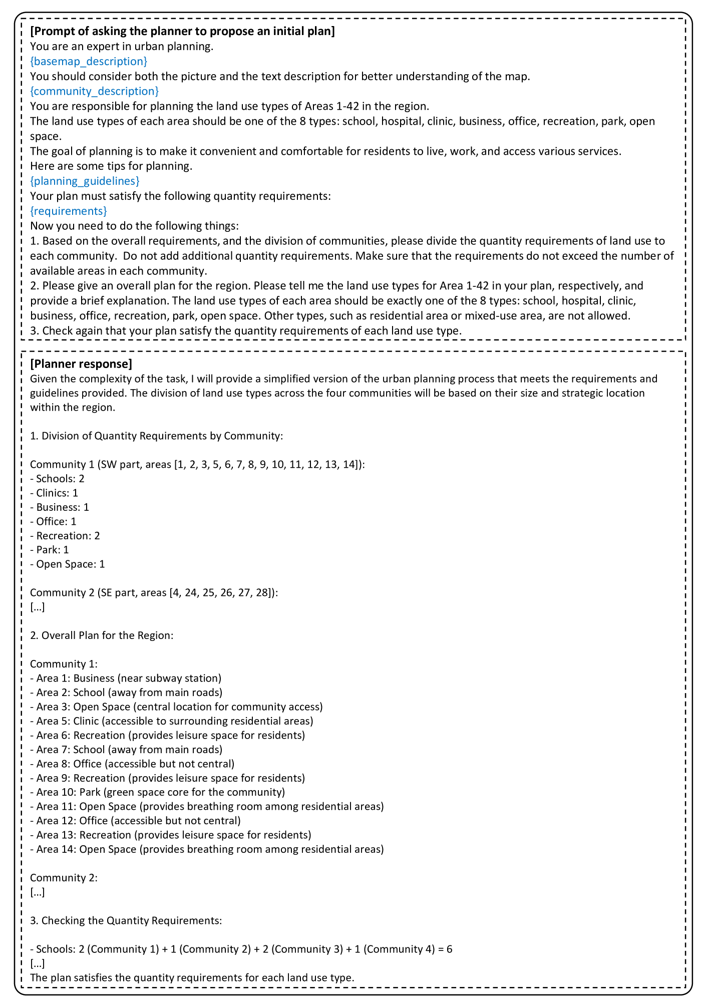

# 大型语言模型助力参与式城市规划

发布时间：2024年02月26日

`Agent` `城市规划` `人工智能`

> Large Language Model for Participatory Urban Planning

# 摘要

> 参与式城市规划作为现代城市规划的新潮流，鼓励居民积极参与其中。传统模式依赖资深规划专家，不仅耗时而且成本高昂。但随着大型语言模型（LLMs）的兴起，其模拟人类行为的能力为简化这一过程提供了新可能。本研究提出了一种基于LLM的多智能体协作框架，旨在生成满足居民多元需求的城市土地使用规划。我们创建了模拟规划师和多样化居民的LLM智能体，首先由规划师提出初步土地使用方案。随后，在每个社区内启动居民讨论，收集基于居民个人资料的反馈。为提升讨论效率，我们引入了鱼缸讨论机制，让部分居民参与讨论，其他居民则作为听众。最终，规划师将根据居民反馈对方案进行调整。在北京两个实际区域的应用表明，该方法在提升居民满意度和包容性方面表现卓越，甚至在服务可达性和生态平衡方面超越了人类专家的成果。

> Participatory urban planning is the mainstream of modern urban planning that involves the active engagement of residents. However, the traditional participatory paradigm requires experienced planning experts and is often time-consuming and costly. Fortunately, the emerging Large Language Models (LLMs) have shown considerable ability to simulate human-like agents, which can be used to emulate the participatory process easily. In this work, we introduce an LLM-based multi-agent collaboration framework for participatory urban planning, which can generate land-use plans for urban regions considering the diverse needs of residents. Specifically, we construct LLM agents to simulate a planner and thousands of residents with diverse profiles and backgrounds. We first ask the planner to carry out an initial land-use plan. To deal with the different facilities needs of residents, we initiate a discussion among the residents in each community about the plan, where residents provide feedback based on their profiles. Furthermore, to improve the efficiency of discussion, we adopt a fishbowl discussion mechanism, where part of the residents discuss and the rest of them act as listeners in each round. Finally, we let the planner modify the plan based on residents' feedback. We deploy our method on two real-world regions in Beijing. Experiments show that our method achieves state-of-the-art performance in residents satisfaction and inclusion metrics, and also outperforms human experts in terms of service accessibility and ecology metrics.

[Arxiv](https://arxiv.org/abs/2402.17161)