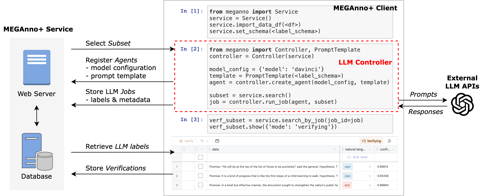
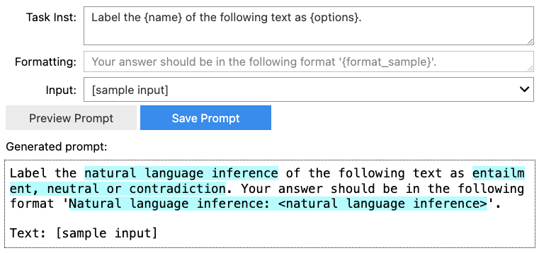
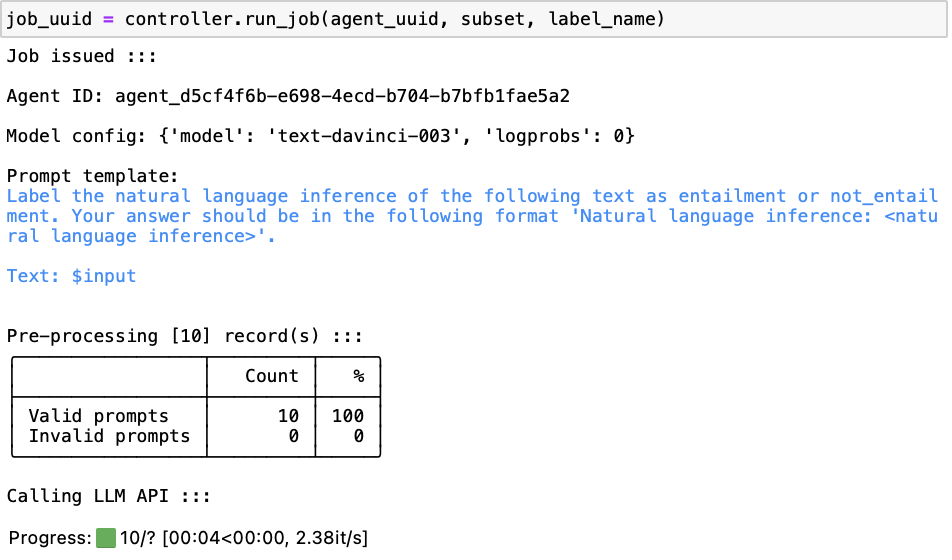
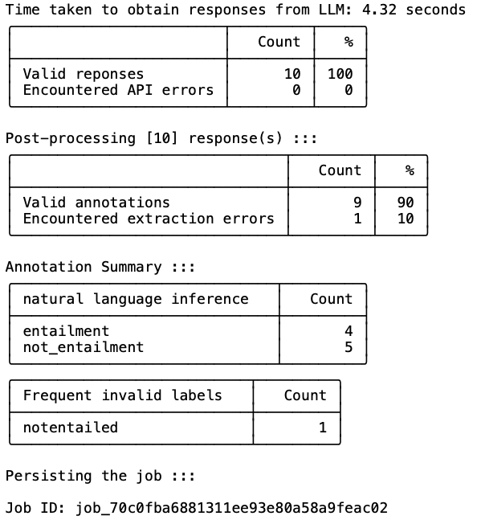
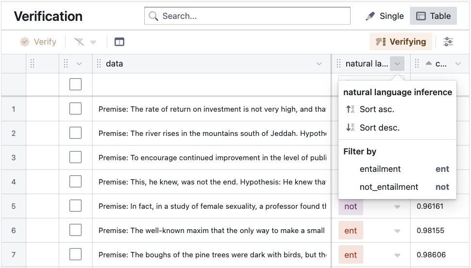

# MEGAnno+ 是一款创新的人类与大型语言模型协同标注工具，旨在通过整合人类智慧与先进AI技术的力量，共同提升数据标注效率与质量。

发布时间：2024年02月27日

`Agent`

> MEGAnno+: A Human-LLM Collaborative Annotation System

# 摘要

> 在各类NLP任务中，LLMs相较于人力具有更快捷、低成本的数据标注优势。然而，面对复杂的社会文化或特定领域情境时，LLMs的理解力可能受限，从而导致标注不准确的问题。因此，我们主张采用人机协作的方式，让人类与LLMs携手产出既可靠又高质量的标注内容。在此背景下，我们推出了MEGAnno+系统——一个融合了人类智慧与LLM能力的协同标注平台。该系统高效管理LLM代理和标注过程，提供简便易用且稳固的LLM标注工具，并支持人类对LLM生成的标注进行深度验证和探究。

> Large language models (LLMs) can label data faster and cheaper than humans for various NLP tasks. Despite their prowess, LLMs may fall short in understanding of complex, sociocultural, or domain-specific context, potentially leading to incorrect annotations. Therefore, we advocate a collaborative approach where humans and LLMs work together to produce reliable and high-quality labels. We present MEGAnno+, a human-LLM collaborative annotation system that offers effective LLM agent and annotation management, convenient and robust LLM annotation, and exploratory verification of LLM labels by humans.

[Arxiv](https://arxiv.org/abs/2402.18050)