# [借助于合作性的、以语言指导的逆向规划方法，我们能够实现对实用指令的有效遵循及目标辅助功能。](https://arxiv.org/abs/2402.17930)

发布时间：2024年02月27日

`Agent`

> Pragmatic Instruction Following and Goal Assistance via Cooperative Language-Guided Inverse Planning

> 在日常生活中，人们常发出需要借助情境才能明确理解的指令，期待自己的行为或目的能揭示真实意图。面对这种挑战，我们提出了一种新颖的贝叶斯智能体架构——合作语言引导逆向计划搜索（CLIPS），它能灵活适应情境，精准解读并执行此类模糊指令，为人类提供高效辅助。CLIPS智能体视人类为主动的合作规划者，通过大型语言模型（LLMs）解析人类的行为和语言表达，共同制定并传递计划信息。然后，智能体运用多模态贝叶斯推理技术，推测人类的真实目标，并依据此推测动态调整策略，力求以最低的成本实现目标。即使在目标不明朗时，CLIPS也能切实遵循指令并给予有效协助。研究在Doors, Keys & Gems与VirtualHome两个合作规划场景下展开，结果显示CLIPS不仅在准确性上远超GPT-4V及基于LLM的直接指令跟随系统，还在实用性上力压单模态逆向规划方法，而且其推断结论和辅助决策效果与人类评分者的评判高度吻合。

> People often give instructions whose meaning is ambiguous without further context, expecting that their actions or goals will disambiguate their intentions. How can we build assistive agents that follow such instructions in a flexible, context-sensitive manner? This paper introduces cooperative language-guided inverse plan search (CLIPS), a Bayesian agent architecture for pragmatic instruction following and goal assistance. Our agent assists a human by modeling them as a cooperative planner who communicates joint plans to the assistant, then performs multimodal Bayesian inference over the human's goal from actions and language, using large language models (LLMs) to evaluate the likelihood of an instruction given a hypothesized plan. Given this posterior, our assistant acts to minimize expected goal achievement cost, enabling it to pragmatically follow ambiguous instructions and provide effective assistance even when uncertain about the goal. We evaluate these capabilities in two cooperative planning domains (Doors, Keys & Gems and VirtualHome), finding that CLIPS significantly outperforms GPT-4V, LLM-based literal instruction following and unimodal inverse planning in both accuracy and helpfulness, while closely matching the inferences and assistive judgments provided by human raters.

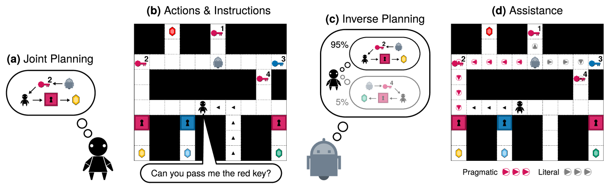

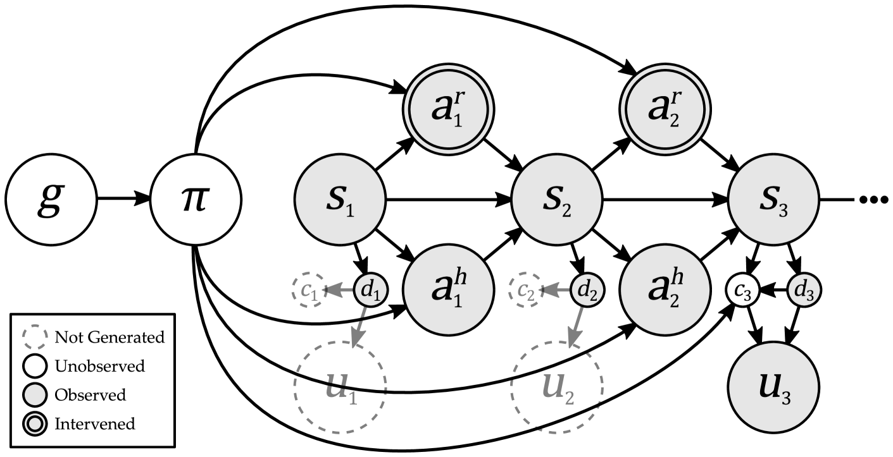

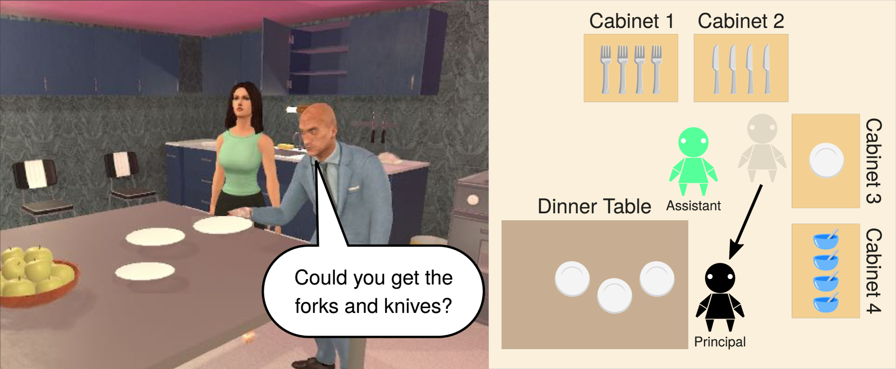

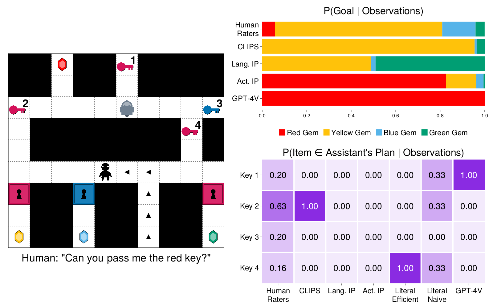

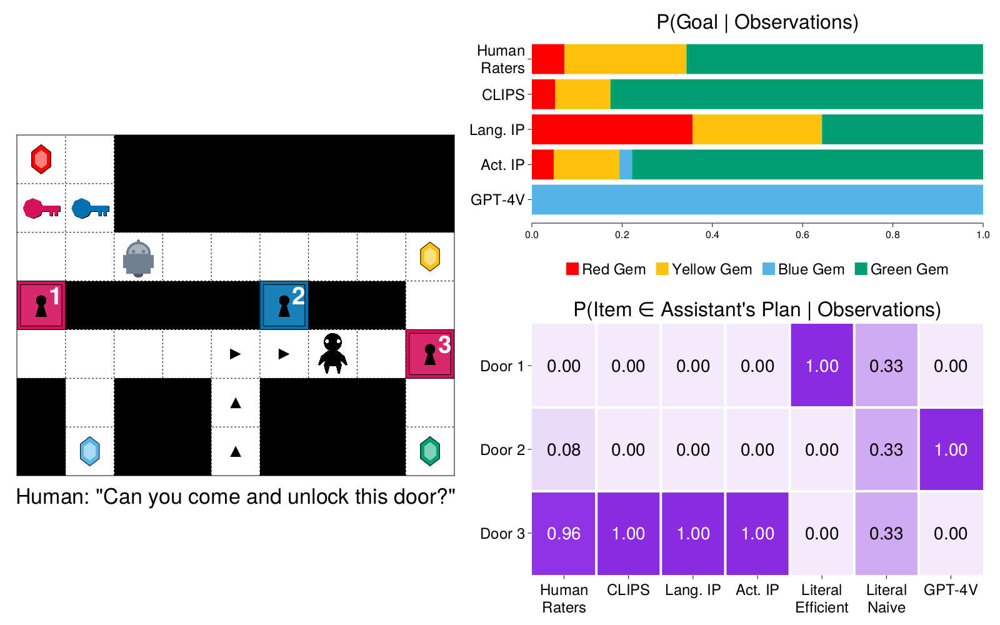

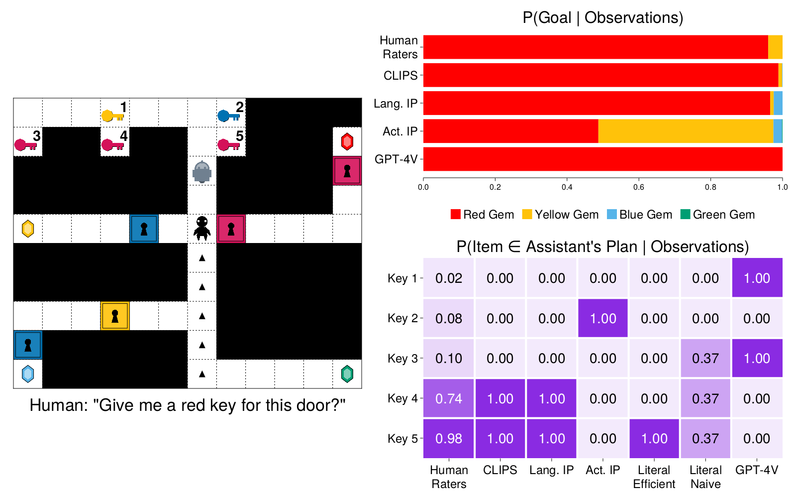

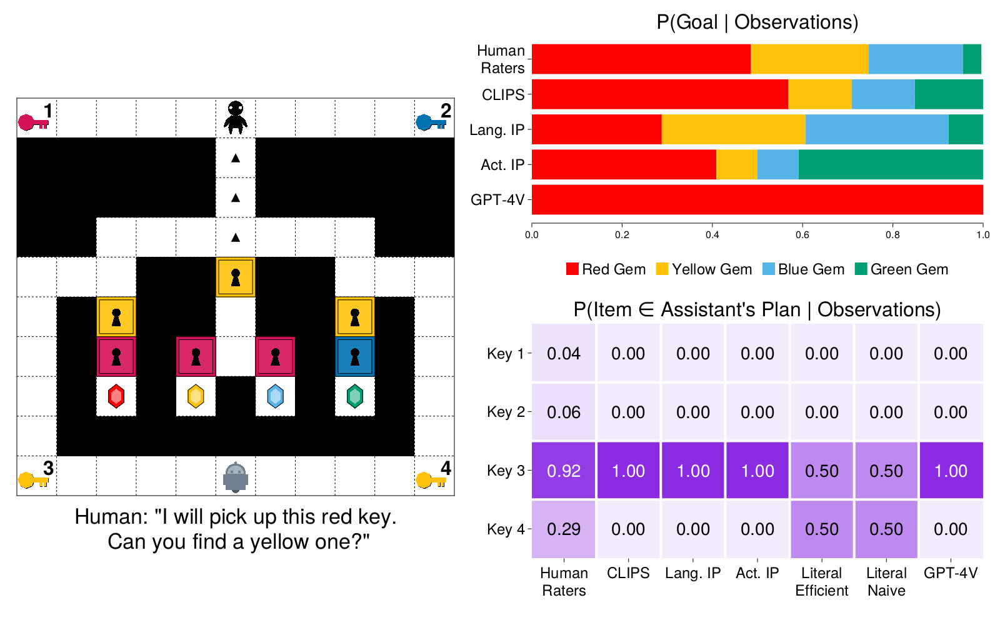

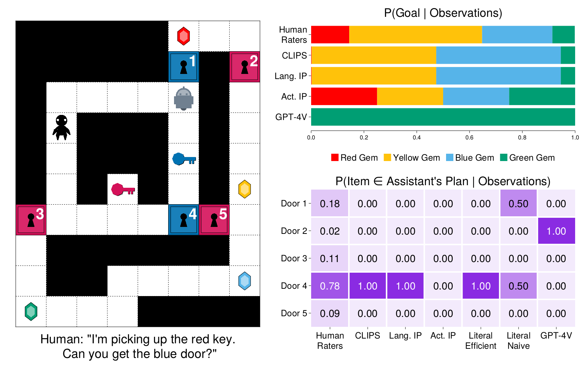

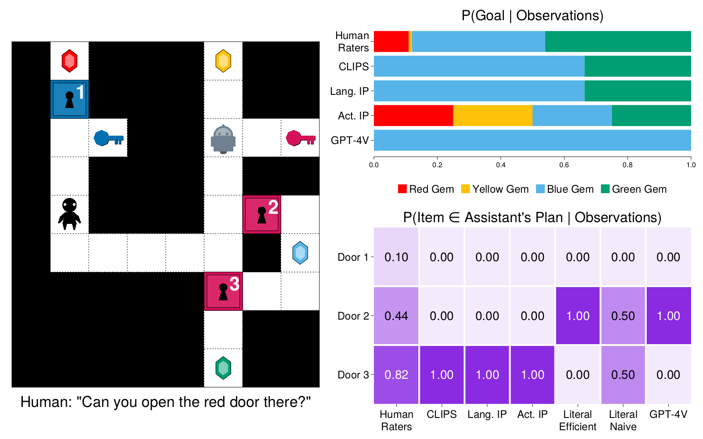

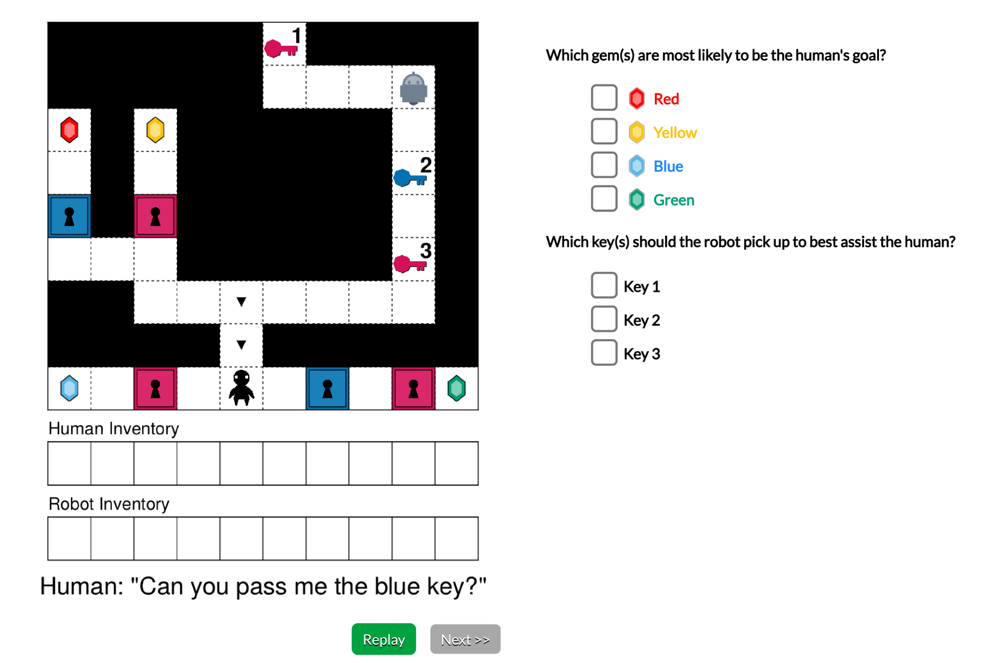

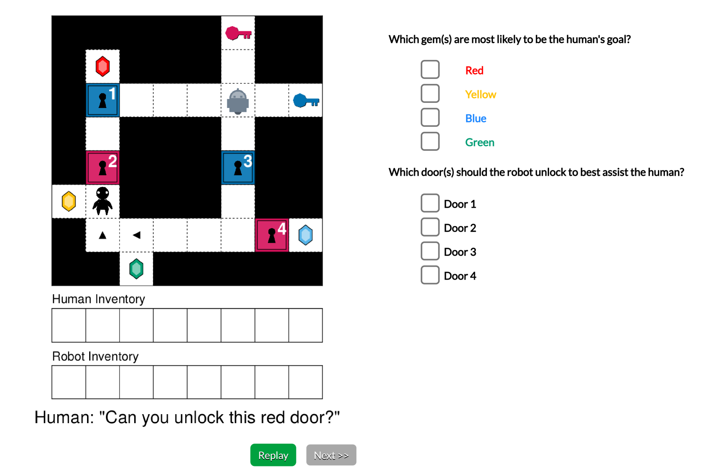

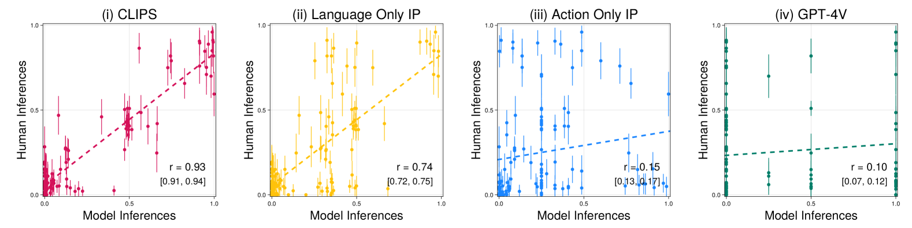

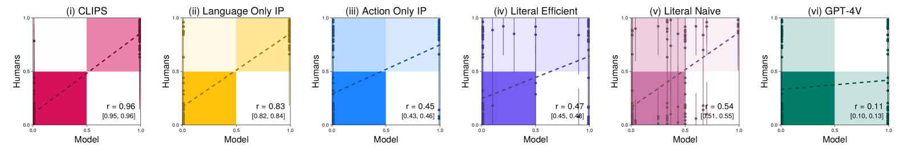

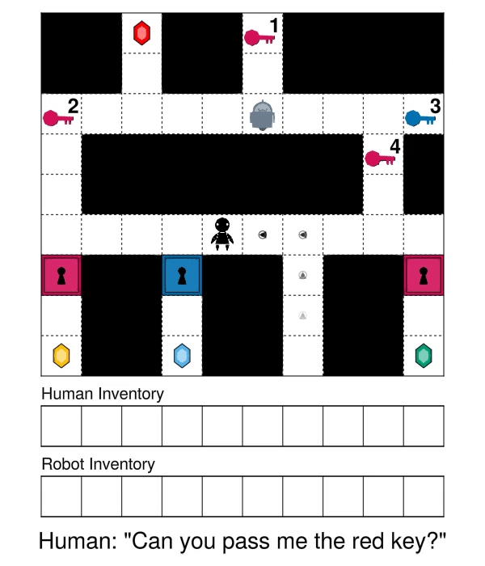

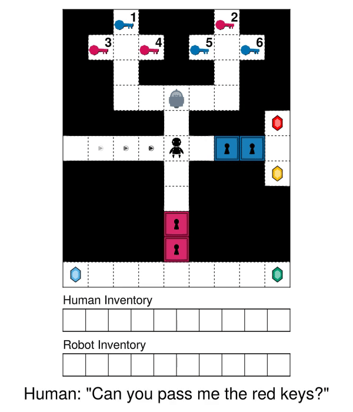

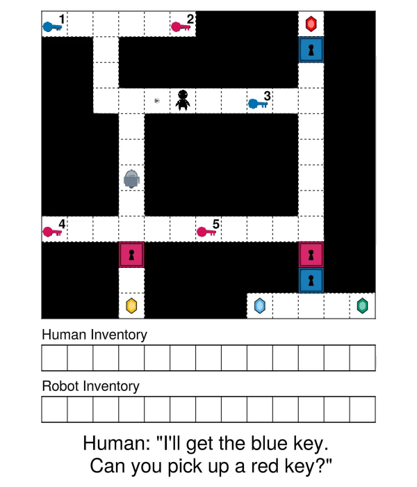

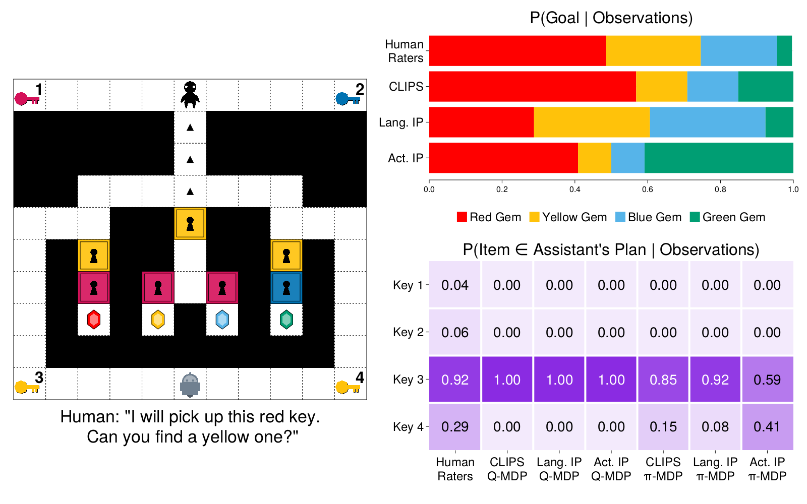

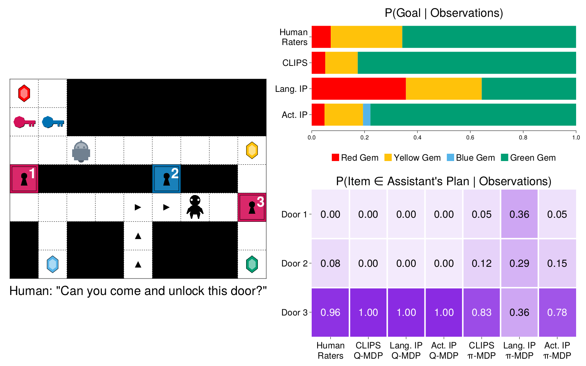

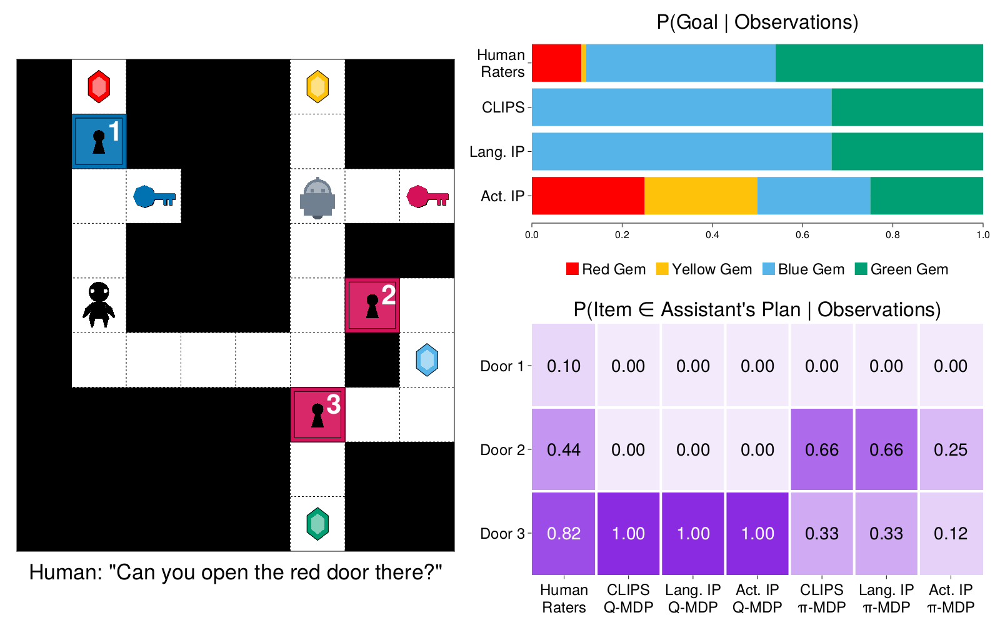

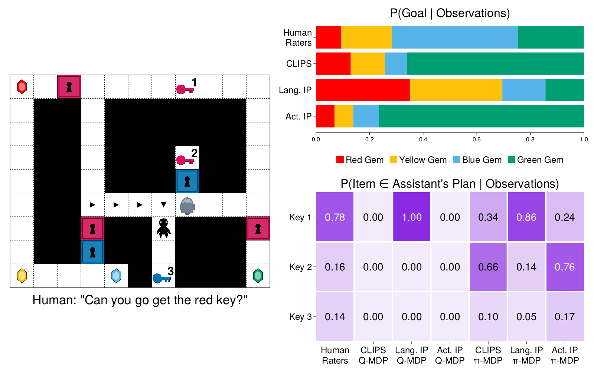

[Arxiv](https://arxiv.org/abs/2402.17930)