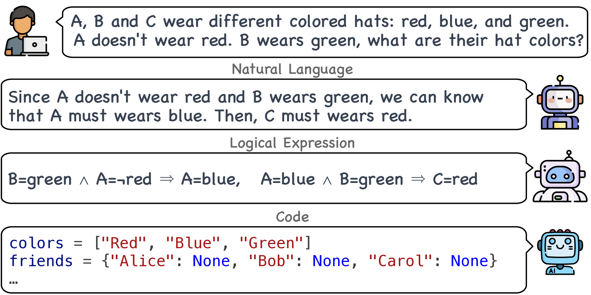
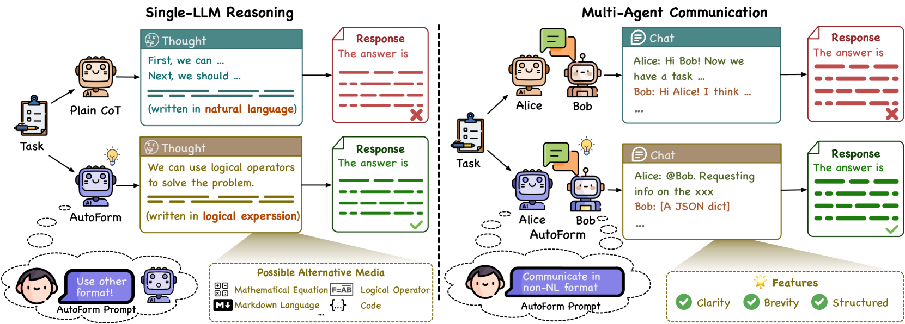
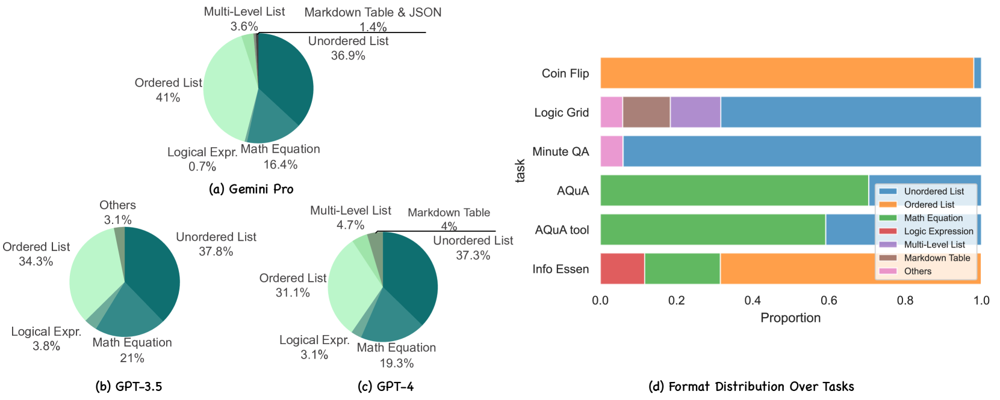
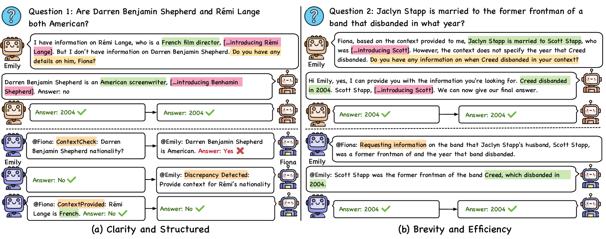

# 不止步于自然语言，LLMs 正探索利用其他格式以提升推理与沟通表现步骤 1 翻译：在自然语言之外：大型语言模型 (LLMs) 利用替代格式来增强推理和交流的能力步骤 2 优化： LLMS 不再局限于自然语言范畴，而是开始借助其他格式资源以提升其推理和沟通效率。

发布时间：2024年02月28日

`Agent`

> Beyond Natural Language: LLMs Leveraging Alternative Formats for Enhanced Reasoning and Communication

# 摘要

> 长久以来，自然语言（NL）作为人类认知与交流的核心载体，对大型语言模型（LLMs）的发展及应用同样至关重要。然而，在预训练过程中，LLMs 面临的不仅仅是 NL，还有诸如代码和逻辑表达等非 NL 格式。特别是在单个 LLM 推理和多智能体交互情境下，NL 是否仍是最适合 LLMs 的格式并未得到充分探讨。本研究打破常规，探究了非 NL 格式在此类情境中的价值。实验结果显示，赋予 LLMs 在推理或交流前自主选择最适宜格式的能力，可使不同 LLMs 的推理效率提高 3.3% 至 5.7%，并且在保证有效沟通的同时，多智能体交互时的令牌使用量最高可减少 72.7%。详尽的分析显示，LLMs 即便面对有限的任务指令也能创造性地设计出适用的格式，且这一自创格式可在不同 LLMs 间成功迁移。引人注目的是，LLMs 自主决定的结构化通信格式与现有的智能体通信语言存在显著相似之处，暗示着智能体通信正在自然而然地向着高效、结构化的方式演进。我们的源代码现已发布于 \url{https://github.com/thunlp/AutoForm}。

> Natural language (NL) has long been the predominant format for human cognition and communication, and by extension, has been similarly pivotal in the development and application of Large Language Models (LLMs). Yet, besides NL, LLMs have seen various non-NL formats during pre-training, such as code and logical expression. NL's status as the optimal format for LLMs, particularly in single-LLM reasoning and multi-agent communication, has not been thoroughly examined. In this work, we challenge the default use of NL by exploring the utility of non-NL formats in these contexts. We show that allowing LLMs to autonomously select the most suitable format before reasoning or communicating leads to a 3.3 to 5.7\% improvement in reasoning efficiency for different LLMs, and up to a 72.7\% reduction in token usage in multi-agent communication, all while maintaining communicative effectiveness. Our comprehensive analysis further reveals that LLMs can devise a format from limited task instructions and that the devised format is effectively transferable across different LLMs. Intriguingly, the structured communication format decided by LLMs exhibits notable parallels with established agent communication languages, suggesting a natural evolution towards efficient, structured communication in agent communication. Our code is released at \url{https://github.com/thunlp/AutoForm}.

[Arxiv](https://arxiv.org/abs/2402.18439)