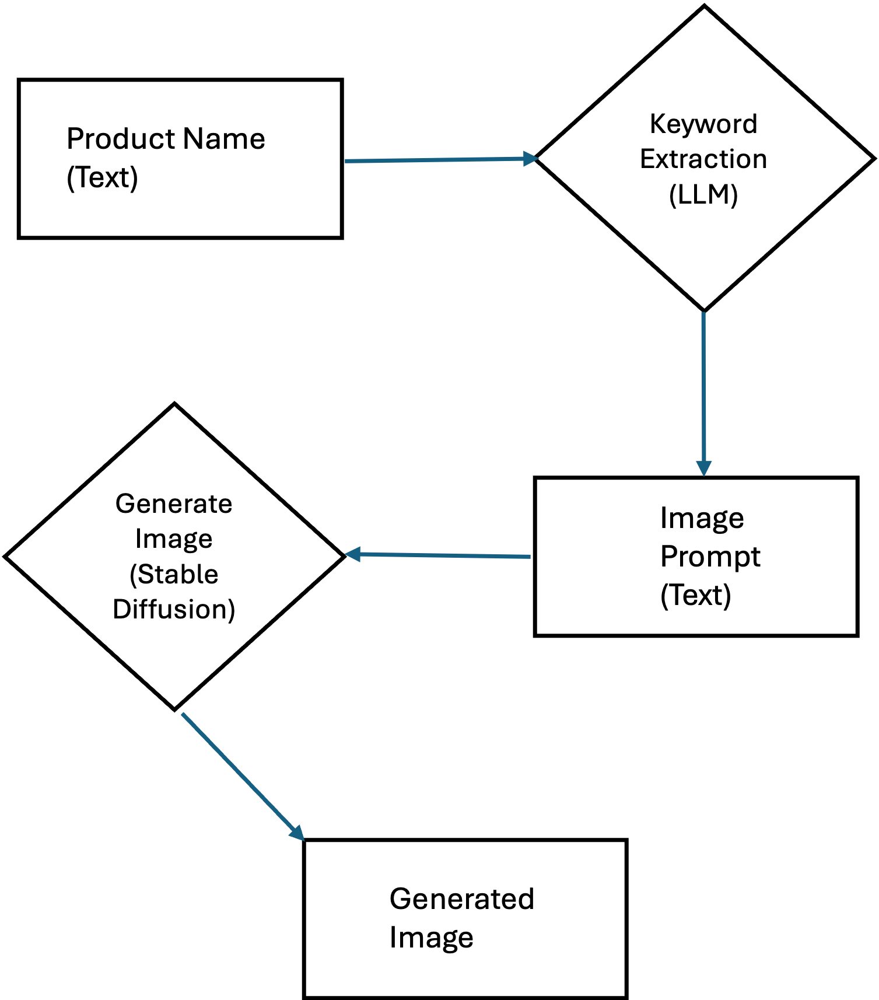
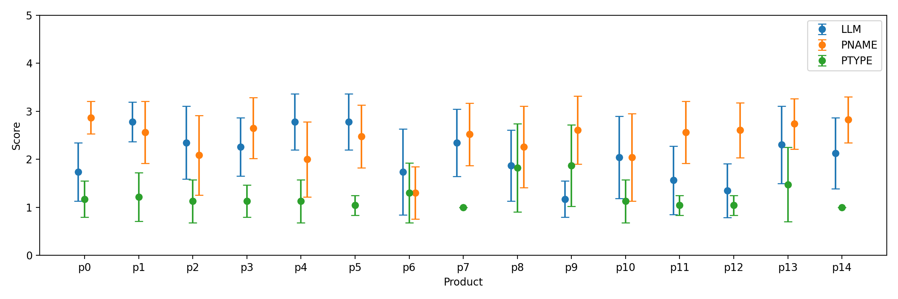

# 结合文本到图像技术与大型语言模型，我们开创了一种新颖的方法，用以生成定制化的电子商务横幅。

发布时间：2024年02月28日

`LLM应用

这篇论文摘要描述了一种利用大型语言模型（LLM）和文本到图像模型（如稳定扩散）来自动化生成个性化网络横幅的方法。这种方法通过自动将用户互动数据转化为有效提示，并利用LLM从商品信息中提取关键属性，进而生成图像。这种应用展示了LLM在实际场景中的应用，特别是在电子商务平台上的创新使用，以提高效率和个性化服务。因此，它属于LLM应用分类。` `电子商务` `艺术创作`

> Chaining text-to-image and large language model: A novel approach for generating personalized e-commerce banners

# 摘要

> 文本到图像模型，如稳定扩散，为艺术创作开辟了新天地。许多电子商务平台仍在手动制作横幅，费时且难以扩展。我们展示了如何利用文本到图像模型，根据用户的互动动态生成个性化网络横幅。这一创新在于自动将用户互动数据转化为有效提示，无需人工介入。我们使用大型语言模型（LLM）从商品信息中提取关键属性，再通过提示工程将其转化为图像。实验证明，这种方法能高效生成满足用户个性化需求的高质量横幅。

> Text-to-image models such as stable diffusion have opened a plethora of opportunities for generating art. Recent literature has surveyed the use of text-to-image models for enhancing the work of many creative artists. Many e-commerce platforms employ a manual process to generate the banners, which is time-consuming and has limitations of scalability. In this work, we demonstrate the use of text-to-image models for generating personalized web banners with dynamic content for online shoppers based on their interactions. The novelty in this approach lies in converting users' interaction data to meaningful prompts without human intervention. To this end, we utilize a large language model (LLM) to systematically extract a tuple of attributes from item meta-information. The attributes are then passed to a text-to-image model via prompt engineering to generate images for the banner. Our results show that the proposed approach can create high-quality personalized banners for users.

[Arxiv](https://arxiv.org/abs/2403.05578)