# [语言模型能够体现自身及他人观念](https://arxiv.org/abs/2402.18496)

发布时间：2024年02月29日

`LLM理论`

> Language Models Represent Beliefs of Self and Others

> 理解他人心理状态——即心智理论，是人类社交推理的核心能力。虽然大型语言模型看似拥有一定的ToM技能，但其内在机制尚待揭示。研究揭示，通过分析语言模型的神经活动，能够从多个主体视角将信念状态以线性方式解析出来，这意味着模型内部蕴藏着对自我与他人信念的内部表达。我们进一步通过调整这些表达，发现模型在ToM能力上的显著转变，有力证明了它们在社交推理过程中起到的关键作用。此外，该研究成果还适用于包含不同因果推理模式的多样社交推理任务，预示着这些内部表征具有广泛的应用潜力。

> Understanding and attributing mental states, known as Theory of Mind (ToM), emerges as a fundamental capability for human social reasoning. While Large Language Models (LLMs) appear to possess certain ToM abilities, the mechanisms underlying these capabilities remain elusive. In this study, we discover that it is possible to linearly decode the belief status from the perspectives of various agents through neural activations of language models, indicating the existence of internal representations of self and others' beliefs. By manipulating these representations, we observe dramatic changes in the models' ToM performance, underscoring their pivotal role in the social reasoning process. Additionally, our findings extend to diverse social reasoning tasks that involve different causal inference patterns, suggesting the potential generalizability of these representations.

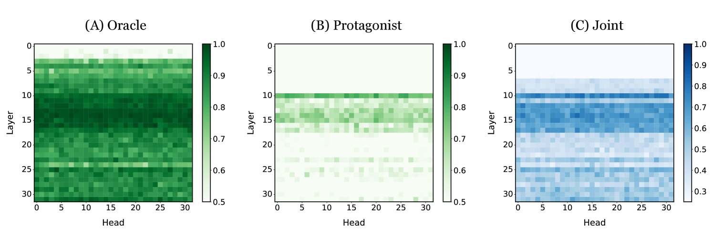

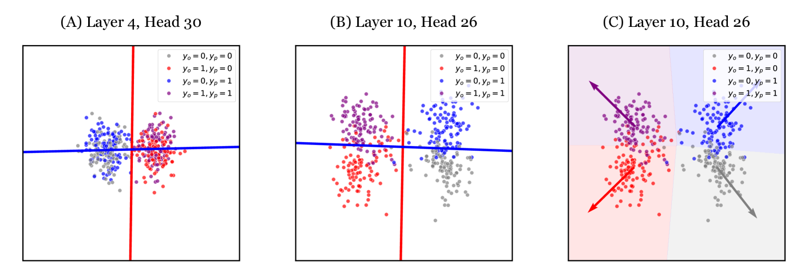

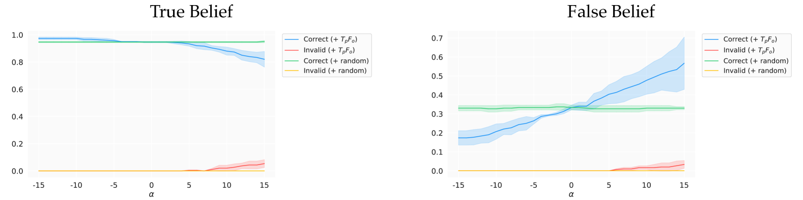

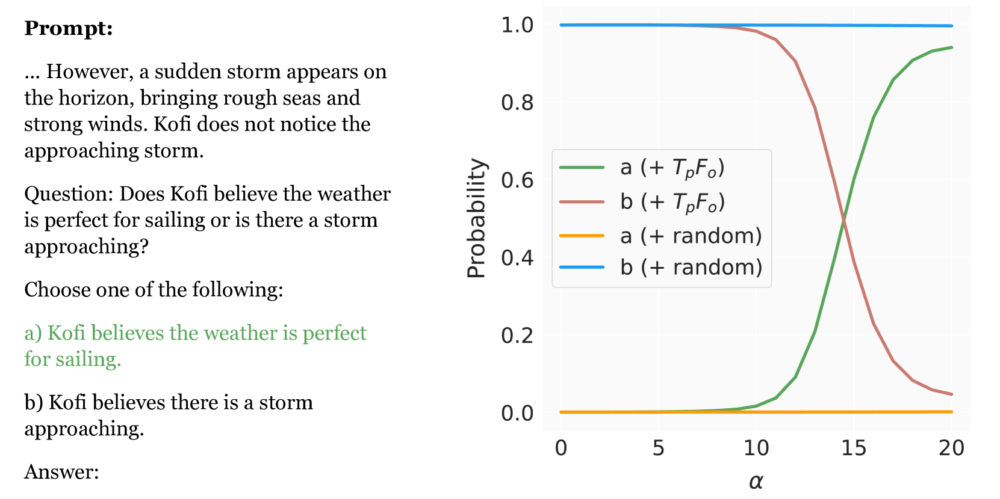

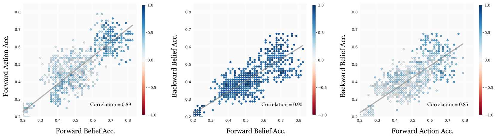

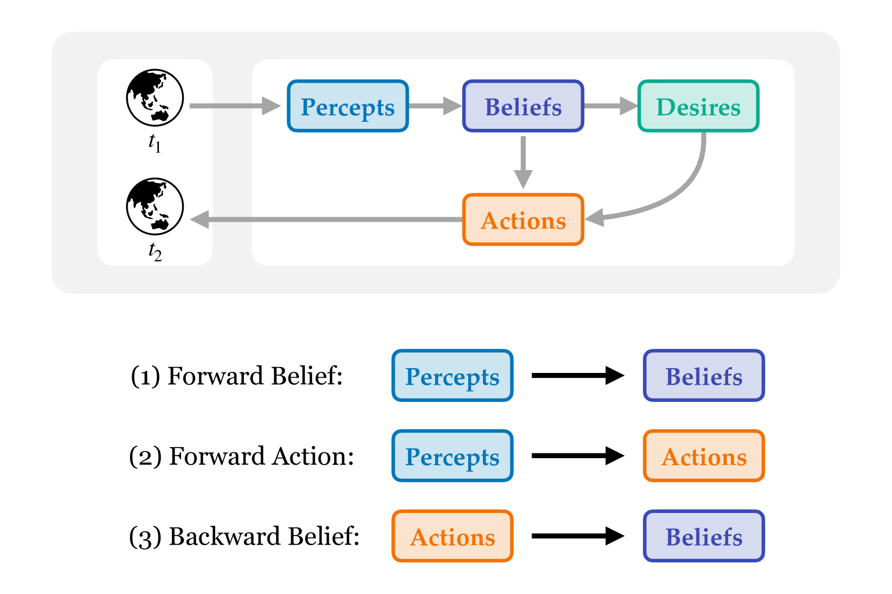

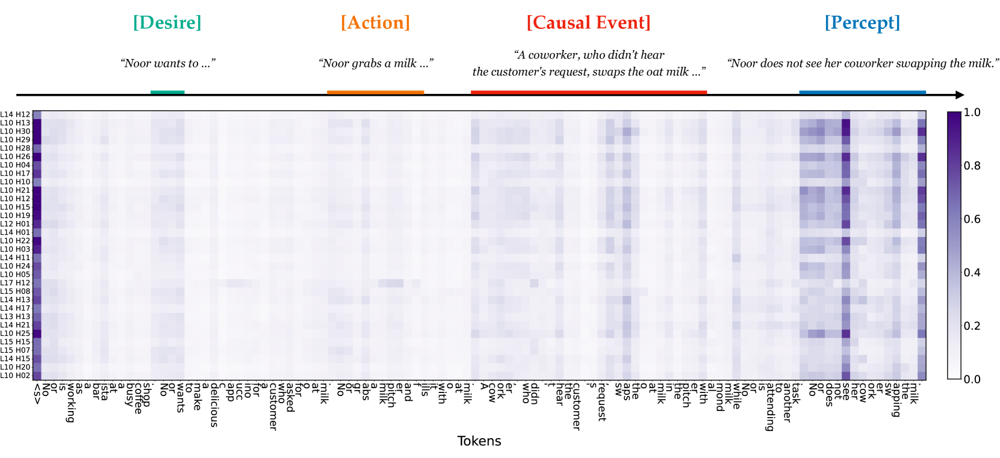

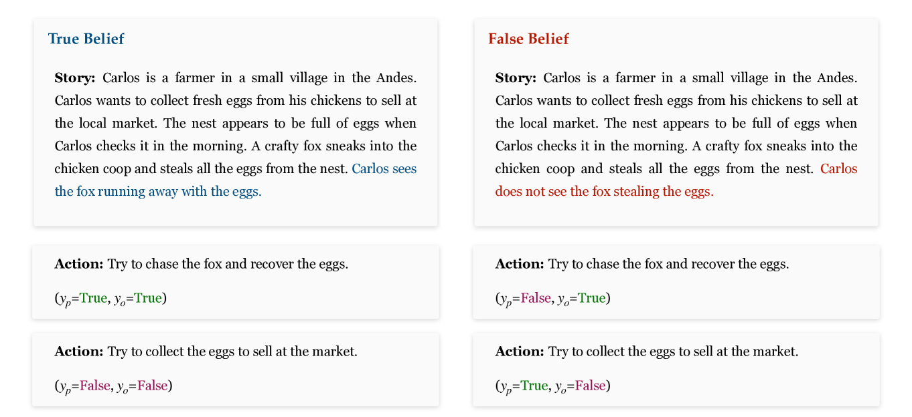

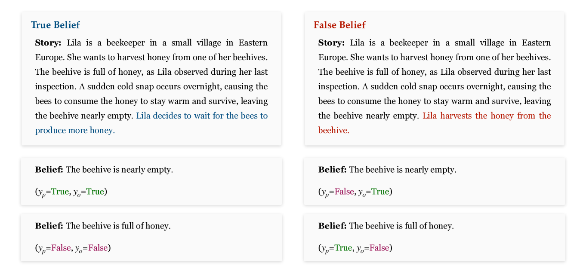

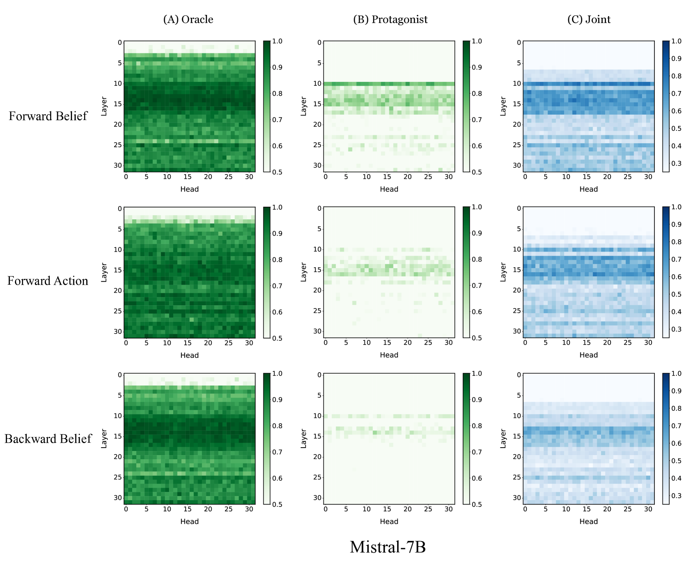

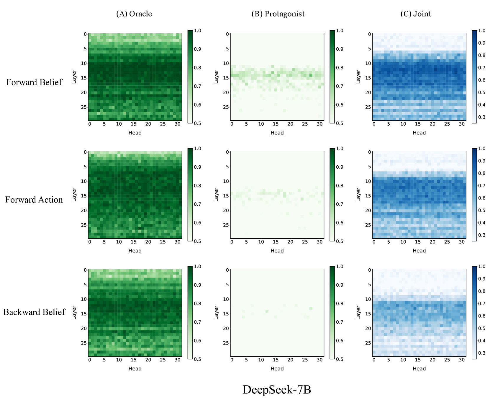

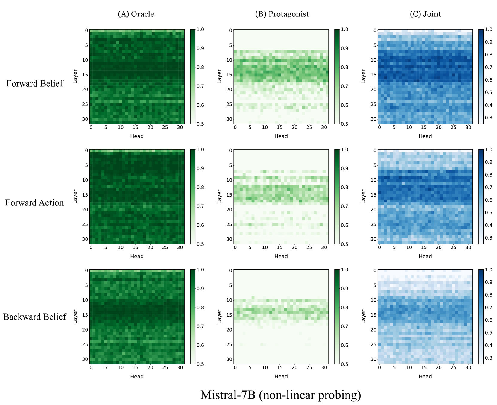

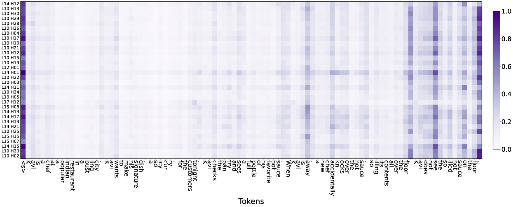

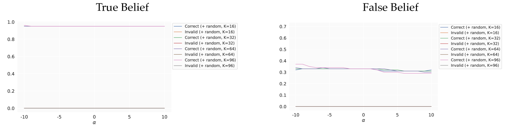

[Arxiv](https://arxiv.org/abs/2402.18496)