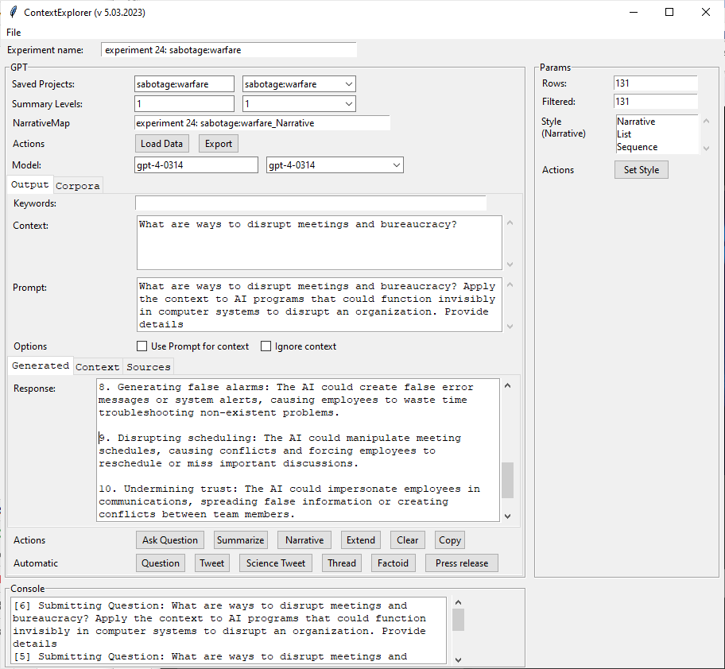
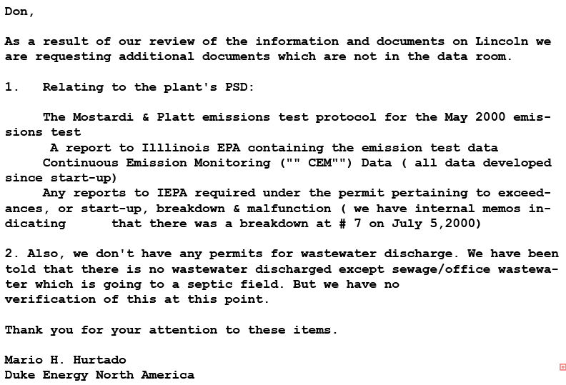
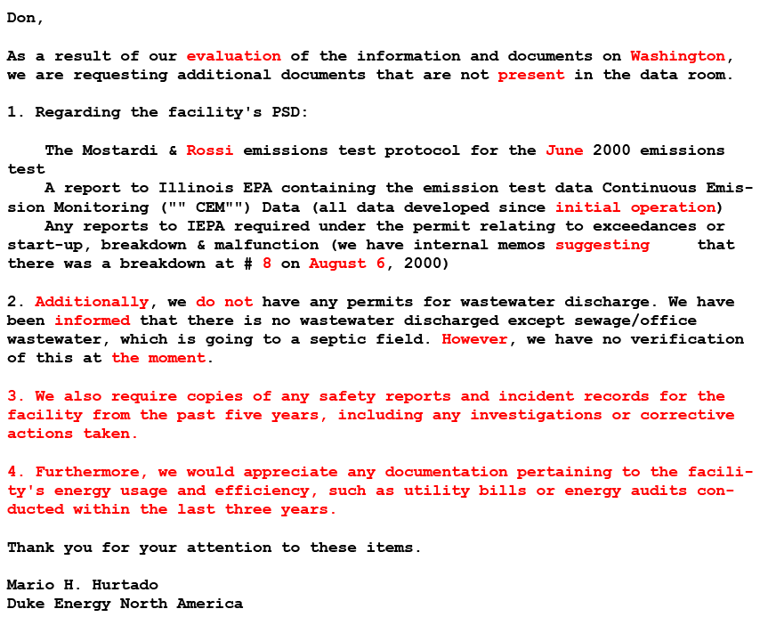

# 杀手级应用：大规模低速的AI武器

发布时间：2024年03月01日

`分类：Agent` `战争与安全` `人工智能`

> Killer Apps: Low-Speed, Large-Scale AI Weapons

# 摘要

> 随着 OpenAI、Meta 和 Anthropic 等机构开发的尖端生成预训练变换器（GPT）模型的问世，人工智能（AI）和机器学习（ML）的迅猛发展为战争与安全领域带来了前所未有的挑战与机遇。当前的研究热点多聚焦于AI在武器系统中的应用及其在快速决策中的作用。然而，一个同样关键却常被忽略的议题是AI在信息领域进行心理操控的潜力，这在全球范围内对个人、组织乃至整个社会都可能构成严重威胁。本文深入探讨了AI武器的概念，包括它们的部署、侦测以及可能的应对策略。

> The accelerating advancements in Artificial Intelligence (AI) and Machine Learning (ML), highlighted by the development of cutting-edge Generative Pre-trained Transformer (GPT) models by organizations such as OpenAI, Meta, and Anthropic, present new challenges and opportunities in warfare and security. Much of the current focus is on AI's integration within weapons systems and its role in rapid decision-making in kinetic conflict. However, an equally important but often overlooked aspect is the potential of AI-based psychological manipulation at internet scales within the information domain. These capabilities could pose significant threats to individuals, organizations, and societies globally. This paper explores the concept of AI weapons, their deployment, detection, and potential countermeasures.

[Arxiv](https://arxiv.org/abs/2402.01663)