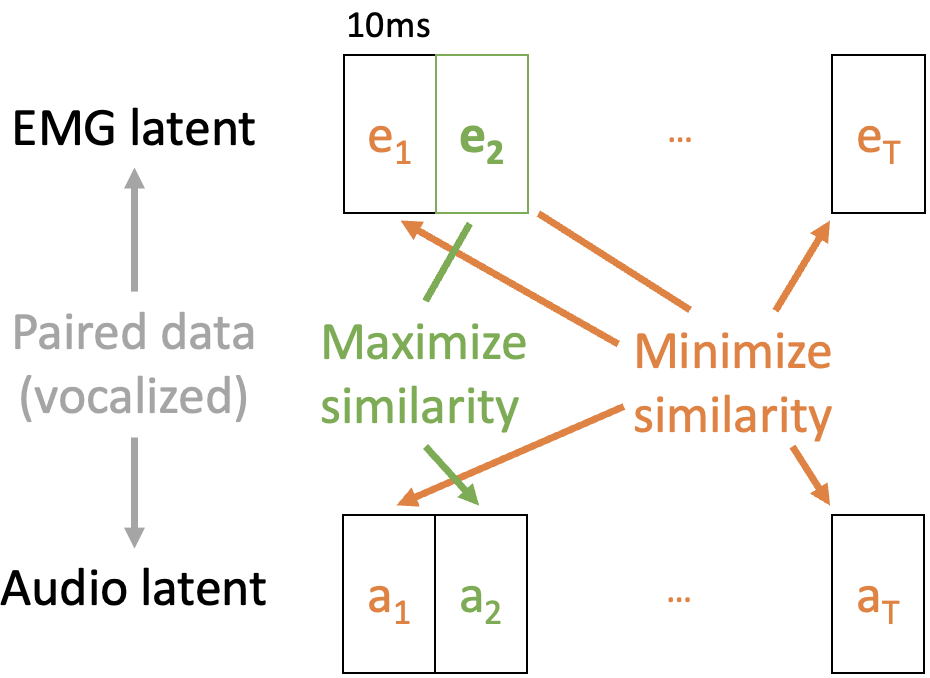
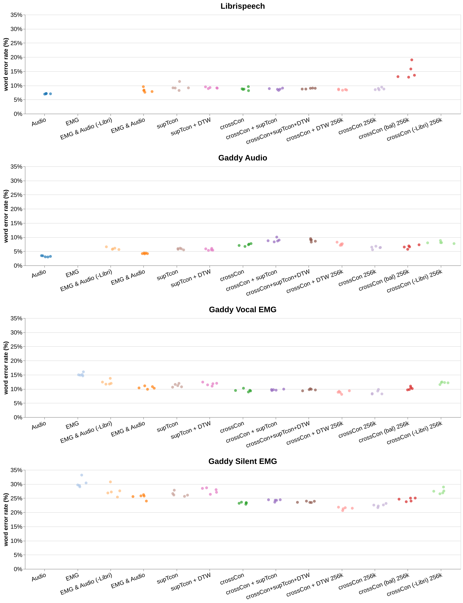
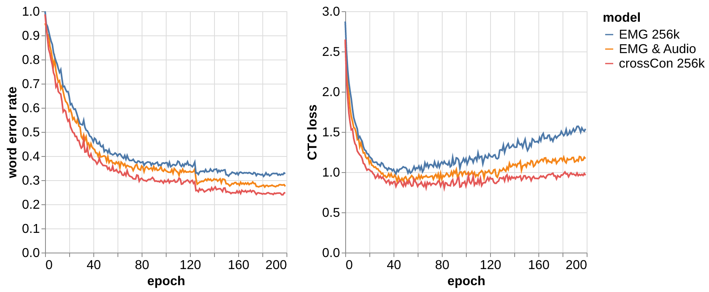

# [我们提出了一种创新的跨模态方法，借助 LLM 强化技术来提升无声语音的识别能力。](https://arxiv.org/abs/2403.05583)

发布时间：2024年03月02日

`Agent` `人机交互` `语音识别`

> A Cross-Modal Approach to Silent Speech with LLM-Enhanced Recognition

> 无声语音界面技术（SSIs）为无需声音的口头交流提供了一种无需侵入的替代方案。我们推出的MONA系统，创造性地运用跨模态对齐策略，采用新颖的crossCon和supTcon损失函数，构建了一个能够融合多种模态信息并共享隐层表示的模型。这一独特设计使得我们可以借助如LibriSpeech等纯音频数据集来提升无声语音识别效果。同时，我们还引进了大型语言模型集成得分调整技术LISA，大大提升了识别精确度。MONA LISA联袂出击，在Gaddy (2020)无声语音基准数据集上，将前沿的词错误率(WER)由原来的28.8%锐减至12.2%，而对于声带肌电信号记录，更将WER纪录从23.3%一举优化至3.7%。在2024年Brain-to-Text大赛中，LISA技压群雄，将最高WER成绩从9.8%进一步降至8.9%。值得一提的是，据我们了解，本研究是首例在开放词汇表环境下，非侵入式无声语音识别WER突破15%阈值的研究，有力证明了SSIs作为自动语音识别(ASR)替代方案的实际可行性。这项工作不仅拉近了无声与有声言语识别的性能距离，更为人机交互带来了全新可能，生动展示了跨模态方法在嘈杂环境和有限数据条件下展现的巨大潜力。

> Silent Speech Interfaces (SSIs) offer a noninvasive alternative to brain-computer interfaces for soundless verbal communication. We introduce Multimodal Orofacial Neural Audio (MONA), a system that leverages cross-modal alignment through novel loss functions--cross-contrast (crossCon) and supervised temporal contrast (supTcon)--to train a multimodal model with a shared latent representation. This architecture enables the use of audio-only datasets like LibriSpeech to improve silent speech recognition. Additionally, our introduction of Large Language Model (LLM) Integrated Scoring Adjustment (LISA) significantly improves recognition accuracy. Together, MONA LISA reduces the state-of-the-art word error rate (WER) from 28.8% to 12.2% in the Gaddy (2020) benchmark dataset for silent speech on an open vocabulary. For vocal EMG recordings, our method improves the state-of-the-art from 23.3% to 3.7% WER. In the Brain-to-Text 2024 competition, LISA performs best, improving the top WER from 9.8% to 8.9%. To the best of our knowledge, this work represents the first instance where noninvasive silent speech recognition on an open vocabulary has cleared the threshold of 15% WER, demonstrating that SSIs can be a viable alternative to automatic speech recognition (ASR). Our work not only narrows the performance gap between silent and vocalized speech but also opens new possibilities in human-computer interaction, demonstrating the potential of cross-modal approaches in noisy and data-limited regimes.

[Arxiv](https://arxiv.org/abs/2403.05583)