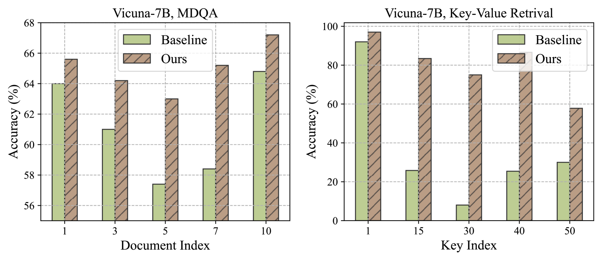
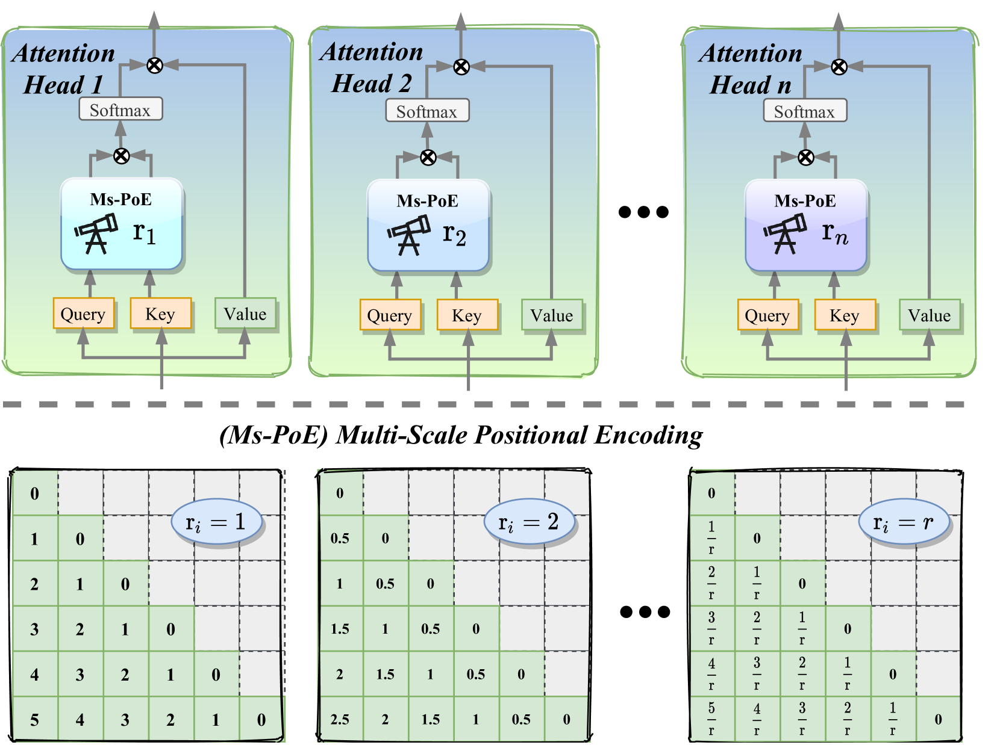
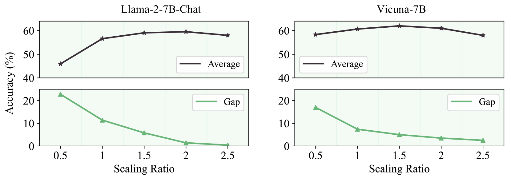
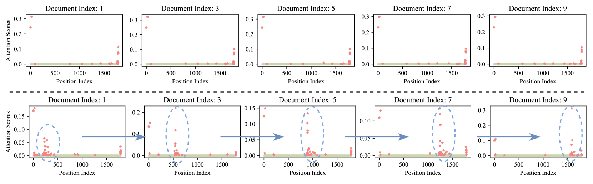
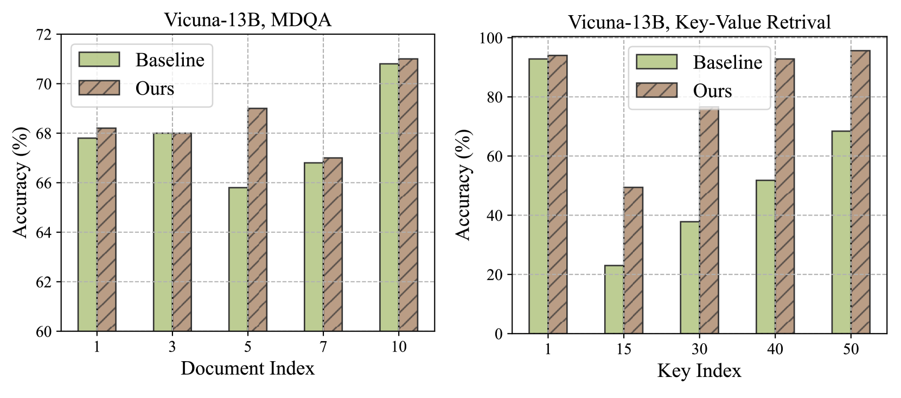
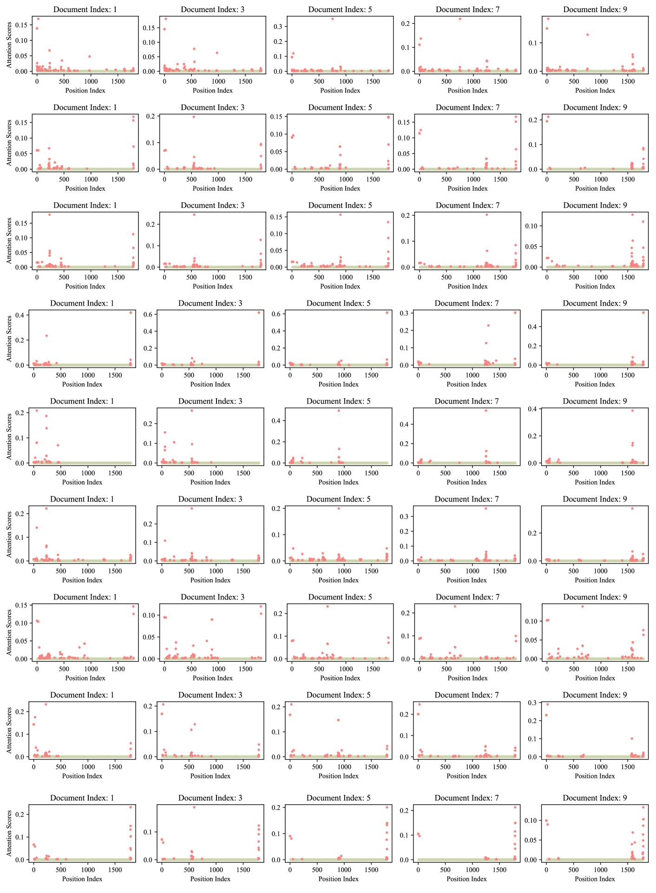

# 研究揭示，借助“即插即用”位置编码，语言模型能够更有效地利用长篇幅的上下文信息。

发布时间：2024年03月04日

`LLM理论`

> Found in the Middle: How Language Models Use Long Contexts Better via Plug-and-Play Positional Encoding

> 面对大型语言模型（LLMs）在处理长文本时难以捕捉中间重要信息的问题，本文提出了一项创新解决方案——多尺度位置编码（Ms-PoE）。该技术无需微调模型或增加额外成本，只需轻松插入，即可显著增强LLMs对位于上下文中部关键信息的理解能力。Ms-PoE通过重新调整位置索引，有效减轻了RoPE导致的长期衰减问题，并巧妙地为不同注意力头分配特定的缩放比率，以便保留预训练阶段学到的重要知识，进而实现从短距到长距的多层次上下文融合。广泛应用于各类LLMs的实验显示，Ms-PoE在Zero-SCROLLS基准测试中取得了最高达3.8个百分点的平均精度提升，相关代码已开源，访问地址为https://github.com/VITA-Group/Ms-PoE。

> This paper aims to overcome the "lost-in-the-middle" challenge of large language models (LLMs). While recent advancements have successfully enabled LLMs to perform stable language modeling with up to 4 million tokens, the persistent difficulty faced by most LLMs in identifying relevant information situated in the middle of the context has not been adequately tackled. To address this problem, this paper introduces Multi-scale Positional Encoding (Ms-PoE) which is a simple yet effective plug-and-play approach to enhance the capacity of LLMs to handle the relevant information located in the middle of the context, without fine-tuning or introducing any additional overhead. Ms-PoE leverages the position indice rescaling to relieve the long-term decay effect introduced by RoPE, while meticulously assigning distinct scaling ratios to different attention heads to preserve essential knowledge learned during the pre-training step, forming a multi-scale context fusion from short to long distance. Extensive experiments with a wide range of LLMs demonstrate the efficacy of our approach. Notably, Ms-PoE achieves an average accuracy gain of up to 3.8 on the Zero-SCROLLS benchmark over the original LLMs. Code are available at https://github.com/VITA-Group/Ms-PoE.

[Arxiv](https://arxiv.org/abs/2403.04797)