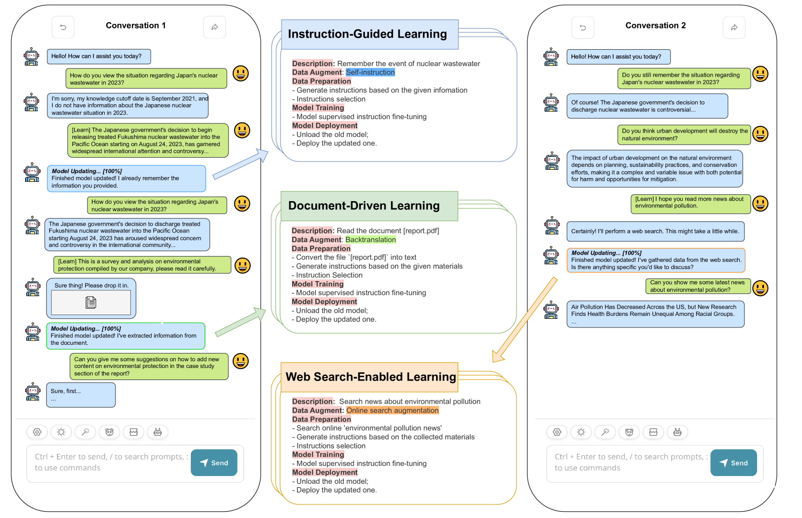
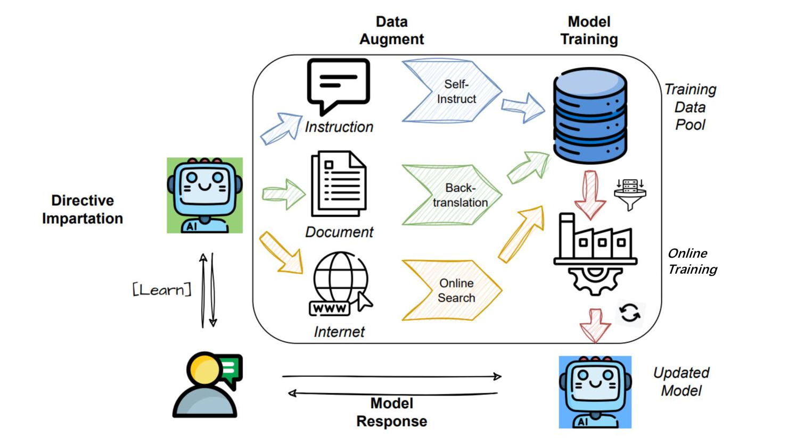
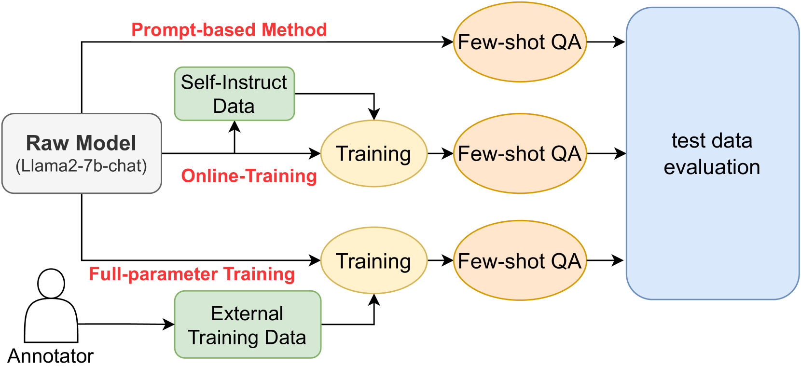
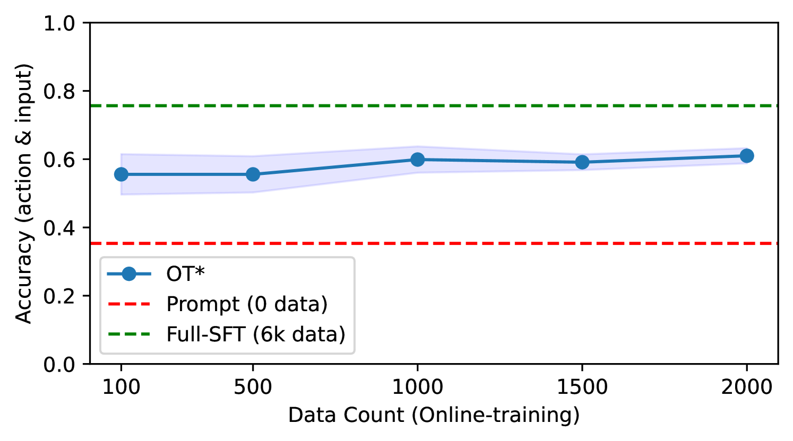

# [大型语言模型的在线训练技术，让模型在互动聊天中实时学习与成长。]

发布时间：2024年03月04日

`Agent`

> Online Training of Large Language Models: Learn while chatting

> LLMs的出现有力推动了NLP领域的变革，凭借卓越功能获得广泛应用，但现有LLMs与用户的交互方式受限于不够灵活、定制化不足或缺乏持续学习机制。特别是在非程序员用户群体中，这一问题尤为突出，他们难以有效改进或个性化模型。另外，现有框架因计算效率低且缺乏直观易用的界面，使得模型训练和部署过程更为复杂。为此，本文提出一种创新的交互模式——“利用外部交互进行在线训练”，它巧妙融合了实时持续更新模型的优点，以及通过AI代理或在线/离线知识库等方式实现个性化定制的灵活性，以期解决上述难题。

> Large Language Models(LLMs) have dramatically revolutionized the field of Natural Language Processing(NLP), offering remarkable capabilities that have garnered widespread usage. However, existing interaction paradigms between LLMs and users are constrained by either inflexibility, limitations in customization, or a lack of persistent learning. This inflexibility is particularly evident as users, especially those without programming skills, have restricted avenues to enhance or personalize the model. Existing frameworks further complicate the model training and deployment process due to their computational inefficiencies and lack of user-friendly interfaces. To overcome these challenges, this paper introduces a novel interaction paradigm-'Online Training using External Interactions'-that merges the benefits of persistent, real-time model updates with the flexibility for individual customization through external interactions such as AI agents or online/offline knowledge bases.

[Arxiv](https://arxiv.org/abs/2403.04790)