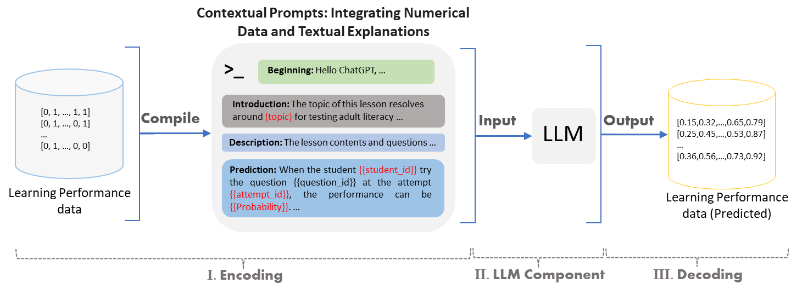

# 本研究利用大型语言模型探索预测成人识字学习表现的可能性，深入探究其在识字教育领域的应用潜力。

发布时间：2024年03月04日

`LLM应用` `成人教育` `智能辅导系统`

> Predicting Learning Performance with Large Language Models: A Study in Adult Literacy

> 智能辅导系统（ITSs）有力地推动了成人读写能力的提升，这一能力关乎社会融入、职业发展和终身学习。本研究聚焦于如何将GPT-4等先进大型语言模型(LLMs)应用于ITSs中的成人读写项目，以预测学习成效。受LLMs凭借其内在推理与计算优势进行学习表现预测的潜能启发，我们利用AutoTutor ITS的数据集，通过五折交叉验证比较了GPT-4与传统机器学习模型（例如贝叶斯知识追踪、绩效因子分析、SPARFA-Lite、张量分解和XGBoost）的预测效能。实验表明，GPT-4在预测精准度上可与上述传统方法一较高下。尽管在单机训练下的XGBoost在预测准确性上超过了GPT-4，但经过GPT-4平台优选及优化后的XGBoost相较于单机运行展现出了更为优秀的性能。另外，在针对XGBoost的超参数调优方面，我们发现GPT-4的自动调优虽在稳定性上稍逊于网格搜索法，但二者性能仍不相上下。本研究通过揭示LLMs与传统机器学习模型融合以增强预测准确性和个性化成人读写教育的可能性，为今后在ITSs中深入应用LLMs的研究打下了坚实的基础。

> Intelligent Tutoring Systems (ITSs) have significantly enhanced adult literacy training, a key factor for societal participation, employment opportunities, and lifelong learning. Our study investigates the application of advanced AI models, including Large Language Models (LLMs) like GPT-4, for predicting learning performance in adult literacy programs in ITSs. This research is motivated by the potential of LLMs to predict learning performance based on its inherent reasoning and computational capabilities. By using reading comprehension datasets from the ITS, AutoTutor, we evaluate the predictive capabilities of GPT-4 versus traditional machine learning methods in predicting learning performance through five-fold cross-validation techniques. Our findings show that the GPT-4 presents the competitive predictive abilities with traditional machine learning methods such as Bayesian Knowledge Tracing, Performance Factor Analysis, Sparse Factor Analysis Lite (SPARFA-Lite), tensor factorization and eXtreme Gradient Boosting (XGBoost). While XGBoost (trained on local machine) outperforms GPT-4 in predictive accuracy, GPT-4-selected XGBoost and its subsequent tuning on the GPT-4 platform demonstrates superior performance compared to local machine execution. Moreover, our investigation into hyper-parameter tuning by GPT-4 versus grid-search suggests comparable performance, albeit with less stability in the automated approach, using XGBoost as the case study. Our study contributes to the field by highlighting the potential of integrating LLMs with traditional machine learning models to enhance predictive accuracy and personalize adult literacy education, setting a foundation for future research in applying LLMs within ITSs.

[Arxiv](https://arxiv.org/abs/2403.14668)