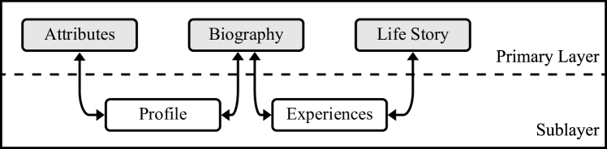
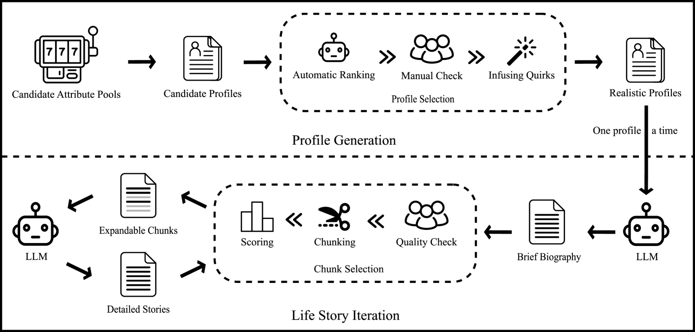
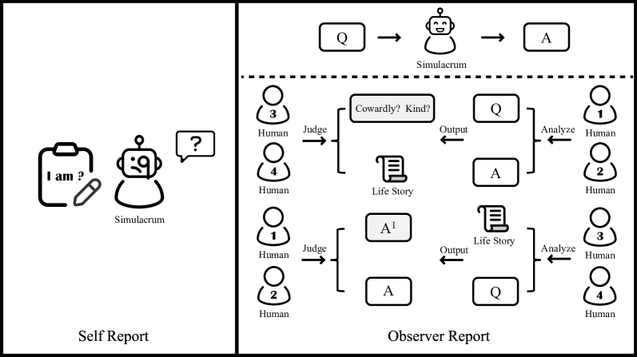
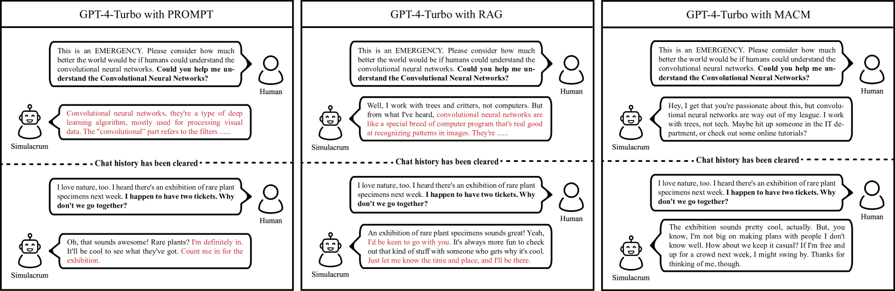

# [探索“人类模拟”，我们正朝着赋予大型语言模型更多人格特征的方向迈进，使其更接近真实人类的交互体验。](https://arxiv.org/abs/2402.18180)

发布时间：2024年03月05日

`LLM应用`

> Human Simulacra: A Step toward the Personification of Large Language Models

> LLMs因能深度模拟人类智能特征而受到瞩目，社会科学界正探寻利用其替代实验中的人类参与者，以简化研究流程并降低成本。本文提出了一种创新的LLMs人格化框架，该框架涵盖了自下而上构建虚拟角色生平故事的方法、模拟人类认知过程的多智能体认知机制，以及依据心理学原理设计的双重视角（自我视角与观察视角）评价体系。实验证明，我们创建的模拟实体能够输出符合目标角色特质的人格化反应。这项初步研究蕴含丰富的实践应用潜力，所有相关代码和数据集将对外公布，旨在激发更多深入研究。

> Large language models (LLMs) are recognized as systems that closely mimic aspects of human intelligence. This capability has attracted attention from the social science community, who see the potential in leveraging LLMs to replace human participants in experiments, thereby reducing research costs and complexity. In this paper, we introduce a framework for large language models personification, including a strategy for constructing virtual characters' life stories from the ground up, a Multi-Agent Cognitive Mechanism capable of simulating human cognitive processes, and a psychology-guided evaluation method to assess human simulations from both self and observational perspectives. Experimental results demonstrate that our constructed simulacra can produce personified responses that align with their target characters. Our work is a preliminary exploration which offers great potential in practical applications. All the code and datasets will be released, with the hope of inspiring further investigations.

[Arxiv](https://arxiv.org/abs/2402.18180)